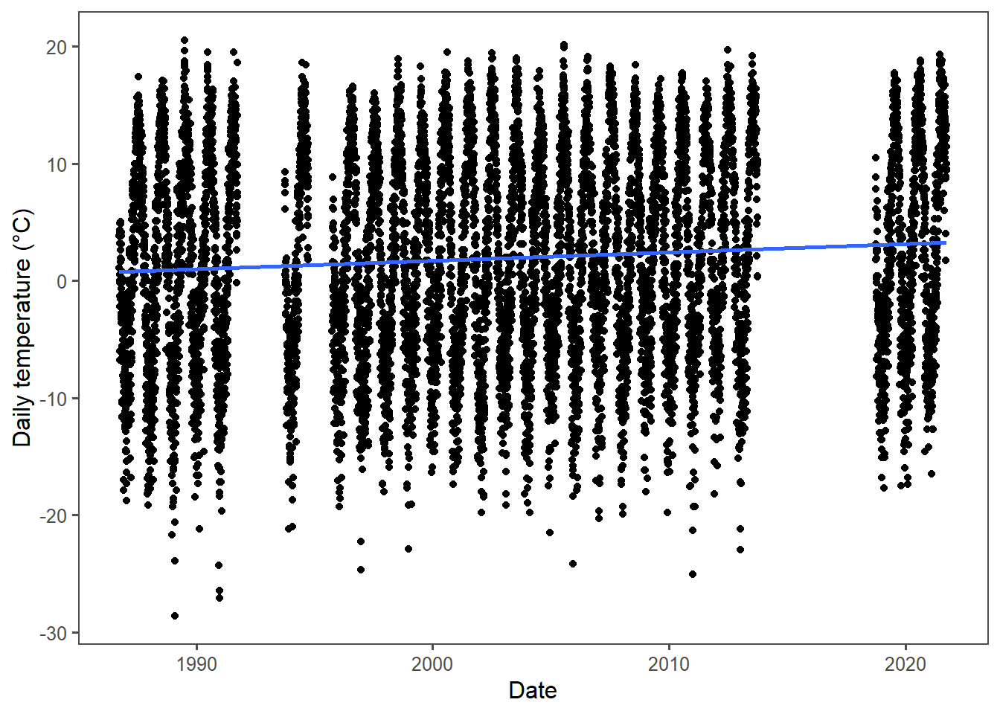
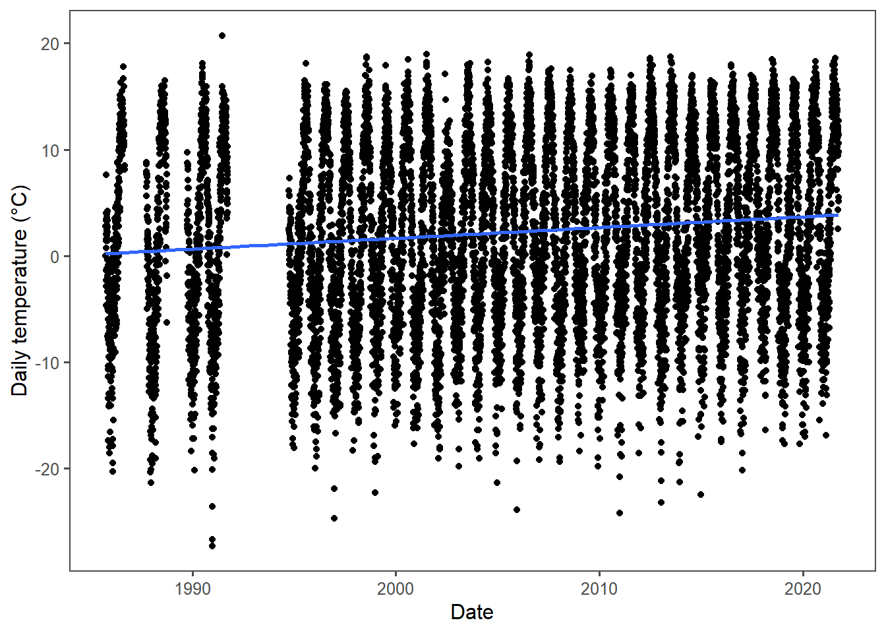
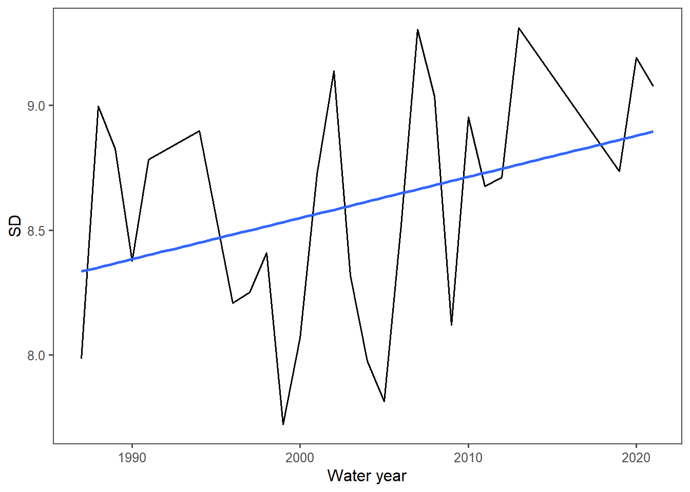

# Disclaimer 

*This work is very preliminary as I get back into the coding swing of things. Data wrangling and figure generation will be done via R, but the rest of the project will be done using good ol' microsoft products. This is just an entry point into data crunching and should by no means be considered a final product.*

# Notes from SF 12/8


Find a station where there is an obvious change using Morrisey, run the time series with what I have, then do it with the Morrisey and compare the two in a figure. Find the equation of the lines, r^2, etc. 

H1 is the Morrisey method, H2 is the Oiler. 

Update your amounts of stations with a buffered layer in ArcGIS. 

Rabbit Ears 709 (Morrisey), Dry Lake 457 (Oiler), Columbine 408 (Morrisey).


```r
SNOTEL_StudyArea <- read.csv("C:/Users/bsteen/OneDrive - Colostate/Documents/MS_Research/Research_via_campus/data_raw/SNOTEL_StudyArea.csv", header = TRUE)

snotel_709 <- SNOTEL_StudyArea %>% 
  filter(site_id == "709")

# trying to determine what is an outlier vs an extreme, comparing to neighboring SNOTEL
snotel_457 <- SNOTEL_StudyArea %>% 
  filter(site_id == "457")

# waiting for input. Columbine 408 is not in the area (part of the 16 stations inside the basin, likely needs to be included in the buffer.)

snotel_408 <- snotel_download(site_id = 408, path = tempdir('../data'), internal = TRUE)
```

Trying to figure out what anomalies are there. 98 Celsius seems hot. 
Checking against NRCS, these values are in Celsius. 

# Data Cleaning

### Rabbit Ears 709


```r
head(snotel_709) # check the date, usually a character.  
```

<div data-pagedtable="false">
  <script data-pagedtable-source type="application/json">
{"columns":[{"label":[""],"name":["_rn_"],"type":[""],"align":["left"]},{"label":["network"],"name":[1],"type":["chr"],"align":["left"]},{"label":["state"],"name":[2],"type":["chr"],"align":["left"]},{"label":["site_name"],"name":[3],"type":["chr"],"align":["left"]},{"label":["description"],"name":[4],"type":["chr"],"align":["left"]},{"label":["start"],"name":[5],"type":["chr"],"align":["left"]},{"label":["end"],"name":[6],"type":["chr"],"align":["left"]},{"label":["latitude"],"name":[7],"type":["dbl"],"align":["right"]},{"label":["longitude"],"name":[8],"type":["dbl"],"align":["right"]},{"label":["elev"],"name":[9],"type":["int"],"align":["right"]},{"label":["county"],"name":[10],"type":["chr"],"align":["left"]},{"label":["site_id"],"name":[11],"type":["int"],"align":["right"]},{"label":["date"],"name":[12],"type":["chr"],"align":["left"]},{"label":["snow_water_equivalent"],"name":[13],"type":["int"],"align":["right"]},{"label":["precipitation_cumulative"],"name":[14],"type":["int"],"align":["right"]},{"label":["temperature_max"],"name":[15],"type":["dbl"],"align":["right"]},{"label":["temperature_min"],"name":[16],"type":["dbl"],"align":["right"]},{"label":["temperature_mean"],"name":[17],"type":["dbl"],"align":["right"]},{"label":["precipitation"],"name":[18],"type":["int"],"align":["right"]}],"data":[{"1":"SNTL","2":"CO","3":"rabbit ears","4":"Harrison Creek (140500010402)","5":"1985-10-01","6":"2022-08-23","7":"40.37","8":"-106.74","9":"2868","10":"Routt","11":"709","12":"1986-09-18","13":"NA","14":"NA","15":"-51.3","16":"-51.3","17":"-51.3","18":"NA","_rn_":"1"},{"1":"SNTL","2":"CO","3":"rabbit ears","4":"Harrison Creek (140500010402)","5":"1985-10-01","6":"2022-08-23","7":"40.37","8":"-106.74","9":"2868","10":"Routt","11":"709","12":"1986-09-19","13":"0","14":"NA","15":"NA","16":"NA","17":"NA","18":"NA","_rn_":"2"},{"1":"SNTL","2":"CO","3":"rabbit ears","4":"Harrison Creek (140500010402)","5":"1985-10-01","6":"2022-08-23","7":"40.37","8":"-106.74","9":"2868","10":"Routt","11":"709","12":"1986-09-20","13":"0","14":"NA","15":"14.7","16":"6.4","17":"9.8","18":"NA","_rn_":"3"},{"1":"SNTL","2":"CO","3":"rabbit ears","4":"Harrison Creek (140500010402)","5":"1985-10-01","6":"2022-08-23","7":"40.37","8":"-106.74","9":"2868","10":"Routt","11":"709","12":"1986-09-21","13":"0","14":"NA","15":"11.3","16":"4.8","17":"7.2","18":"NA","_rn_":"4"},{"1":"SNTL","2":"CO","3":"rabbit ears","4":"Harrison Creek (140500010402)","5":"1985-10-01","6":"2022-08-23","7":"40.37","8":"-106.74","9":"2868","10":"Routt","11":"709","12":"1986-09-22","13":"0","14":"NA","15":"10.5","16":"0.9","17":"5.4","18":"NA","_rn_":"5"},{"1":"SNTL","2":"CO","3":"rabbit ears","4":"Harrison Creek (140500010402)","5":"1985-10-01","6":"2022-08-23","7":"40.37","8":"-106.74","9":"2868","10":"Routt","11":"709","12":"1986-09-23","13":"3","14":"NA","15":"10.4","16":"1.3","17":"4.9","18":"NA","_rn_":"6"}],"options":{"columns":{"min":{},"max":[10]},"rows":{"min":[10],"max":[10]},"pages":{}}}
  </script>
</div>

```r
snotel_709$Date <- as.Date(snotel_709$date) #change date from character to date format, capitalize to work with Water year functon from NWIS.

snotel_709_clean <- snotel_709 %>% # filter for the timeframe
  filter(Date >= "1986-09-19" & Date <= "2021-09-30") %>%
  #filter(temperature_mean >= -30 & temperature_mean <= 20) %>% # removing outliers   
  addWaterYear() %>% 
  mutate(daymonth = format(as.Date(Date), "%d-%m")) %>% 
  na.omit()

#adding water day using difftime (SUPER COOL. example from [this](https://stackoverflow.com/questions/48123049/create-day-index-based-on-water-year))

snotel_709_clean <- snotel_709_clean %>% 
  group_by(waterYear)%>% 
  mutate(waterDay = (as.integer(difftime(Date, ymd(paste0(waterYear - 1 ,'-09-30')), units = "days"))))
```


```r
snotel_709_clean <- snotel_709_clean %>% 
  mutate(temp_diff = abs(temperature_min - temperature_max)) %>% 
  filter(temperature_min <= 20)

# Still too many. Going to have to cull a lot of years. 
```


```r
ggplot(snotel_709_clean, aes(x = Date, y = temperature_mean)) +
  geom_point() + #lwd = 2) +
  theme_few() +
  geom_smooth(method = "lm", se=FALSE) +
  ylab('Daily temperature (°C)') + 
  xlab('Date')
```

<!-- -->


```r
ggplot(snotel_709_clean, aes(x = Date, y = temp_diff)) + 
  geom_point() + #lwd = 2) +
  theme_few() +
  #geom_smooth(method = "lm", se=FALSE) +
  ylab('Daily temperature varience (°C)') + 
  xlab('Date')
```

<!-- -->

Need to figure out the outlier issue. 


Per Steven's advice: :If there are more than 15 missing days, then...remove that year"


```r
# filtering for temperature anomalies
snotel_709_cull_count <- snotel_709_clean %>% 
  filter(temperature_min < -30) %>% 
  count(waterYear)

snotel_709_cull_count
```

<div data-pagedtable="false">
  <script data-pagedtable-source type="application/json">
{"columns":[{"label":["waterYear"],"name":[1],"type":["dbl"],"align":["right"]},{"label":["n"],"name":[2],"type":["int"],"align":["right"]}],"data":[{"1":"1989","2":"2"},{"1":"1991","2":"2"},{"1":"1992","2":"61"},{"1":"1993","2":"74"},{"1":"1994","2":"1"},{"1":"2007","2":"2"}],"options":{"columns":{"min":{},"max":[10]},"rows":{"min":[10],"max":[10]},"pages":{}}}
  </script>
</div>

```r
# filtering for too few observations in a year
snotel_709_cull_count_days <- snotel_709_clean %>% 
  group_by(waterYear) %>% 
  count(waterYear)

snotel_709_cull_count_days
```

<div data-pagedtable="false">
  <script data-pagedtable-source type="application/json">
{"columns":[{"label":["waterYear"],"name":[1],"type":["dbl"],"align":["right"]},{"label":["n"],"name":[2],"type":["int"],"align":["right"]}],"data":[{"1":"1987","2":"359"},{"1":"1988","2":"366"},{"1":"1989","2":"364"},{"1":"1990","2":"365"},{"1":"1991","2":"365"},{"1":"1992","2":"346"},{"1":"1993","2":"344"},{"1":"1994","2":"333"},{"1":"1995","2":"169"},{"1":"1996","2":"361"},{"1":"1997","2":"361"},{"1":"1998","2":"365"},{"1":"1999","2":"360"},{"1":"2000","2":"365"},{"1":"2001","2":"364"},{"1":"2002","2":"363"},{"1":"2003","2":"364"},{"1":"2004","2":"364"},{"1":"2005","2":"364"},{"1":"2006","2":"348"},{"1":"2007","2":"311"},{"1":"2008","2":"364"},{"1":"2009","2":"362"},{"1":"2010","2":"363"},{"1":"2011","2":"292"},{"1":"2012","2":"308"},{"1":"2013","2":"300"},{"1":"2014","2":"283"},{"1":"2015","2":"44"},{"1":"2016","2":"18"},{"1":"2017","2":"34"},{"1":"2018","2":"147"},{"1":"2019","2":"364"},{"1":"2020","2":"364"},{"1":"2021","2":"363"}],"options":{"columns":{"min":{},"max":[10]},"rows":{"min":[10],"max":[10]},"pages":{}}}
  </script>
</div>

```r
# For export for SF:

# write.csv(snotel_709_cull_count_days,"C:/Users/bsteen/OneDrive - Colostate/Documents/MS_Research/research_morrisey_method/data_clean/snotel_709_cull_count_days.csv", row.names = FALSE)
```

1992 and 1993 have more than 15 days of outlier temperatures less than -50°C and will be culled.
1995, 2014, 2015, 2016, 2017, 2018 all have too few observations. (Others may be too low as well.)


```r
snotel_709_clean_culled <- snotel_709_clean %>% 
  filter(waterYear != "1992" & waterYear != "1993" & waterYear != "1995" & waterYear != "2014" & waterYear != "2015"& waterYear != "2016" & waterYear != "2017" & waterYear != "2018") %>% 
  filter(temperature_mean > -49)
```


```r
ggplot(snotel_709_clean_culled, aes(x = Date, y = temperature_mean)) + 
  geom_point() + #lwd = 2) +
  theme_few() +
  geom_smooth(method = "lm", se=FALSE) +
  ylab('Daily temperature (°C)') + 
  xlab('Date')
```

<!-- -->

Much better. Changing the minimum temperature within a range of -30 to -40°C did not affect which years were culled. 

Due to the trials of the above cleaning, I tried some neighboring stations below:

### Dry Lake 457


```r
head(snotel_457) # check the date, usually a character.  
```

<div data-pagedtable="false">
  <script data-pagedtable-source type="application/json">
{"columns":[{"label":[""],"name":["_rn_"],"type":[""],"align":["left"]},{"label":["network"],"name":[1],"type":["chr"],"align":["left"]},{"label":["state"],"name":[2],"type":["chr"],"align":["left"]},{"label":["site_name"],"name":[3],"type":["chr"],"align":["left"]},{"label":["description"],"name":[4],"type":["chr"],"align":["left"]},{"label":["start"],"name":[5],"type":["chr"],"align":["left"]},{"label":["end"],"name":[6],"type":["chr"],"align":["left"]},{"label":["latitude"],"name":[7],"type":["dbl"],"align":["right"]},{"label":["longitude"],"name":[8],"type":["dbl"],"align":["right"]},{"label":["elev"],"name":[9],"type":["int"],"align":["right"]},{"label":["county"],"name":[10],"type":["chr"],"align":["left"]},{"label":["site_id"],"name":[11],"type":["int"],"align":["right"]},{"label":["date"],"name":[12],"type":["chr"],"align":["left"]},{"label":["snow_water_equivalent"],"name":[13],"type":["int"],"align":["right"]},{"label":["precipitation_cumulative"],"name":[14],"type":["int"],"align":["right"]},{"label":["temperature_max"],"name":[15],"type":["dbl"],"align":["right"]},{"label":["temperature_min"],"name":[16],"type":["dbl"],"align":["right"]},{"label":["temperature_mean"],"name":[17],"type":["dbl"],"align":["right"]},{"label":["precipitation"],"name":[18],"type":["int"],"align":["right"]}],"data":[{"1":"SNTL","2":"CO","3":"dry lake","4":"City of Steamboat Springs-Yampa River (140500010409)","5":"1979-10-01","6":"2022-08-23","7":"40.53","8":"-106.78","9":"2521","10":"Routt","11":"457","12":"1980-10-01","13":"0","14":"0","15":"NA","16":"NA","17":"NA","18":"0","_rn_":"1"},{"1":"SNTL","2":"CO","3":"dry lake","4":"City of Steamboat Springs-Yampa River (140500010409)","5":"1979-10-01","6":"2022-08-23","7":"40.53","8":"-106.78","9":"2521","10":"Routt","11":"457","12":"1980-10-02","13":"0","14":"0","15":"NA","16":"NA","17":"NA","18":"0","_rn_":"2"},{"1":"SNTL","2":"CO","3":"dry lake","4":"City of Steamboat Springs-Yampa River (140500010409)","5":"1979-10-01","6":"2022-08-23","7":"40.53","8":"-106.78","9":"2521","10":"Routt","11":"457","12":"1980-10-03","13":"0","14":"0","15":"NA","16":"NA","17":"NA","18":"0","_rn_":"3"},{"1":"SNTL","2":"CO","3":"dry lake","4":"City of Steamboat Springs-Yampa River (140500010409)","5":"1979-10-01","6":"2022-08-23","7":"40.53","8":"-106.78","9":"2521","10":"Routt","11":"457","12":"1980-10-04","13":"0","14":"0","15":"NA","16":"NA","17":"NA","18":"0","_rn_":"4"},{"1":"SNTL","2":"CO","3":"dry lake","4":"City of Steamboat Springs-Yampa River (140500010409)","5":"1979-10-01","6":"2022-08-23","7":"40.53","8":"-106.78","9":"2521","10":"Routt","11":"457","12":"1980-10-05","13":"0","14":"0","15":"NA","16":"NA","17":"NA","18":"0","_rn_":"5"},{"1":"SNTL","2":"CO","3":"dry lake","4":"City of Steamboat Springs-Yampa River (140500010409)","5":"1979-10-01","6":"2022-08-23","7":"40.53","8":"-106.78","9":"2521","10":"Routt","11":"457","12":"1980-10-06","13":"0","14":"0","15":"NA","16":"NA","17":"NA","18":"0","_rn_":"6"}],"options":{"columns":{"min":{},"max":[10]},"rows":{"min":[10],"max":[10]},"pages":{}}}
  </script>
</div>

```r
snotel_457$Date <- as.Date(snotel_457$date) #change date from character to date format, capitalize to work with Water year functon from NWIS.

snotel_457_clean <- snotel_457 %>% # filter for the timeframe
  filter(Date >= "1978-09-19" & Date <= "2021-09-30") %>%
  #filter(temperature_mean >= -30 & temperature_mean <= 20) %>% # removing outliers   
  addWaterYear() %>% 
  mutate(daymonth = format(as.Date(Date), "%d-%m")) %>% 
  na.omit()

#adding water day using difftime (SUPER COOL. example from [this](https://stackoverflow.com/questions/48123049/create-day-index-based-on-water-year))

snotel_457_clean <- snotel_457_clean %>% 
  group_by(waterYear)%>% 
  mutate(waterDay = (as.integer(difftime(Date, ymd(paste0(waterYear - 1 ,'-09-30')), units = "days")))) %>% 
  filter(temperature_mean >= -40) %>%   # trying to remove outliers
  mutate(temp_diff = abs(temperature_min - temperature_max))
```


```r
ggplot(snotel_457_clean, aes(x = Date, y = temperature_mean)) + 
  geom_point() + #lwd = 2) +
  theme_few() +
  geom_smooth(method = "lm", se=FALSE) +
  ylab('Daily temperature (°C)') + 
  xlab('Date')
```

<!-- -->


```r
ggplot(snotel_457_clean, aes(x = Date, y = temp_diff)) + 
  geom_point() + #lwd = 2) +
  theme_few() +
  #geom_smooth(method = "lm", se=FALSE) +
  ylab('Daily temperature difference (°C)') + 
  xlab('Date')
```

<!-- -->


### Columbine 408


```r
head(snotel_408) # check the date, usually a character.  
```

<div data-pagedtable="false">
  <script data-pagedtable-source type="application/json">
{"columns":[{"label":[""],"name":["_rn_"],"type":[""],"align":["left"]},{"label":["network"],"name":[1],"type":["chr"],"align":["left"]},{"label":["state"],"name":[2],"type":["chr"],"align":["left"]},{"label":["site_name"],"name":[3],"type":["chr"],"align":["left"]},{"label":["description"],"name":[4],"type":["chr"],"align":["left"]},{"label":["start"],"name":[5],"type":["date"],"align":["right"]},{"label":["end"],"name":[6],"type":["date"],"align":["right"]},{"label":["latitude"],"name":[7],"type":["dbl"],"align":["right"]},{"label":["longitude"],"name":[8],"type":["dbl"],"align":["right"]},{"label":["elev"],"name":[9],"type":["dbl"],"align":["right"]},{"label":["county"],"name":[10],"type":["chr"],"align":["left"]},{"label":["site_id"],"name":[11],"type":["dbl"],"align":["right"]},{"label":["date"],"name":[12],"type":["chr"],"align":["left"]},{"label":["snow_water_equivalent"],"name":[13],"type":["int"],"align":["right"]},{"label":["precipitation_cumulative"],"name":[14],"type":["int"],"align":["right"]},{"label":["temperature_max"],"name":[15],"type":["dbl"],"align":["right"]},{"label":["temperature_min"],"name":[16],"type":["dbl"],"align":["right"]},{"label":["temperature_mean"],"name":[17],"type":["dbl"],"align":["right"]},{"label":["precipitation"],"name":[18],"type":["int"],"align":["right"]}],"data":[{"1":"SNTL","2":"CO","3":"columbine","4":"Upper Grizzly Creek (101800010102)","5":"1978-10-01","6":"2022-08-26","7":"40.4","8":"-106.6","9":"2794","10":"Jackson","11":"408","12":"1978-10-01","13":"NA","14":"NA","15":"0","16":"0","17":"0","18":"NA","_rn_":"1"},{"1":"SNTL","2":"CO","3":"columbine","4":"Upper Grizzly Creek (101800010102)","5":"1978-10-01","6":"2022-08-26","7":"40.4","8":"-106.6","9":"2794","10":"Jackson","11":"408","12":"1978-10-02","13":"NA","14":"NA","15":"0","16":"0","17":"0","18":"NA","_rn_":"2"},{"1":"SNTL","2":"CO","3":"columbine","4":"Upper Grizzly Creek (101800010102)","5":"1978-10-01","6":"2022-08-26","7":"40.4","8":"-106.6","9":"2794","10":"Jackson","11":"408","12":"1978-10-03","13":"NA","14":"NA","15":"0","16":"0","17":"0","18":"NA","_rn_":"3"},{"1":"SNTL","2":"CO","3":"columbine","4":"Upper Grizzly Creek (101800010102)","5":"1978-10-01","6":"2022-08-26","7":"40.4","8":"-106.6","9":"2794","10":"Jackson","11":"408","12":"1978-10-04","13":"NA","14":"NA","15":"0","16":"0","17":"0","18":"NA","_rn_":"4"},{"1":"SNTL","2":"CO","3":"columbine","4":"Upper Grizzly Creek (101800010102)","5":"1978-10-01","6":"2022-08-26","7":"40.4","8":"-106.6","9":"2794","10":"Jackson","11":"408","12":"1978-10-05","13":"NA","14":"NA","15":"0","16":"0","17":"0","18":"NA","_rn_":"5"},{"1":"SNTL","2":"CO","3":"columbine","4":"Upper Grizzly Creek (101800010102)","5":"1978-10-01","6":"2022-08-26","7":"40.4","8":"-106.6","9":"2794","10":"Jackson","11":"408","12":"1978-10-06","13":"NA","14":"NA","15":"0","16":"0","17":"0","18":"NA","_rn_":"6"}],"options":{"columns":{"min":{},"max":[10]},"rows":{"min":[10],"max":[10]},"pages":{}}}
  </script>
</div>

```r
snotel_408$Date <- as.Date(snotel_408$date) #change date from character to date format, capitalize to work with Water year functon from NWIS.

snotel_408_clean <- snotel_408 %>% # filter for the timeframe
  filter(Date >= "1982-10-16" & Date <= "2021-09-30") %>%
  #filter(temperature_mean >= -30 & temperature_mean <= 20) %>% # removing outliers   
  addWaterYear() %>% 
  mutate(daymonth = format(as.Date(Date), "%d-%m")) %>% 
  na.omit()

#adding water day using difftime (SUPER COOL. example from [this](https://stackoverflow.com/questions/48123049/create-day-index-based-on-water-year))

snotel_408_clean <- snotel_408_clean %>% 
  group_by(waterYear)%>% 
  mutate(waterDay = (as.integer(difftime(Date, ymd(paste0(waterYear - 1 ,'-09-30')), units = "days")))) %>% 
  #filter(temperature_mean >= -40) %>%   # trying to remove outliers
  mutate(temp_diff = abs(temperature_min - temperature_max))
```


```r
ggplot(snotel_408_clean, aes(x = Date, y = temperature_mean)) + 
  geom_point() + #lwd = 2) +
  theme_few() +
  geom_smooth(method = "lm", se=FALSE) +
  ylab('Daily temperature (°C)') + 
  xlab('Date')
```

<!-- -->


```r
ggplot(snotel_408_clean, aes(x = Date, y = temp_diff)) + 
  geom_point() + #lwd = 2) +
  theme_few() +
  #geom_smooth(method = "lm", se=FALSE) +
  ylab('Daily temperature difference (°C)') + 
  xlab('Date')
```

<!-- -->


```r
snotel_408_cull <- snotel_408_clean %>% 
  filter(temperature_min < -30)

snotel_408_cull
```

<div data-pagedtable="false">
  <script data-pagedtable-source type="application/json">
{"columns":[{"label":["network"],"name":[1],"type":["chr"],"align":["left"]},{"label":["state"],"name":[2],"type":["chr"],"align":["left"]},{"label":["site_name"],"name":[3],"type":["chr"],"align":["left"]},{"label":["description"],"name":[4],"type":["chr"],"align":["left"]},{"label":["start"],"name":[5],"type":["date"],"align":["right"]},{"label":["end"],"name":[6],"type":["date"],"align":["right"]},{"label":["latitude"],"name":[7],"type":["dbl"],"align":["right"]},{"label":["longitude"],"name":[8],"type":["dbl"],"align":["right"]},{"label":["elev"],"name":[9],"type":["dbl"],"align":["right"]},{"label":["county"],"name":[10],"type":["chr"],"align":["left"]},{"label":["site_id"],"name":[11],"type":["dbl"],"align":["right"]},{"label":["date"],"name":[12],"type":["chr"],"align":["left"]},{"label":["snow_water_equivalent"],"name":[13],"type":["int"],"align":["right"]},{"label":["precipitation_cumulative"],"name":[14],"type":["int"],"align":["right"]},{"label":["temperature_max"],"name":[15],"type":["dbl"],"align":["right"]},{"label":["temperature_min"],"name":[16],"type":["dbl"],"align":["right"]},{"label":["temperature_mean"],"name":[17],"type":["dbl"],"align":["right"]},{"label":["precipitation"],"name":[18],"type":["int"],"align":["right"]},{"label":["Date"],"name":[19],"type":["date"],"align":["right"]},{"label":["waterYear"],"name":[20],"type":["dbl"],"align":["right"]},{"label":["daymonth"],"name":[21],"type":["chr"],"align":["left"]},{"label":["waterDay"],"name":[22],"type":["int"],"align":["right"]},{"label":["temp_diff"],"name":[23],"type":["dbl"],"align":["right"]}],"data":[{"1":"SNTL","2":"CO","3":"columbine","4":"Upper Grizzly Creek (101800010102)","5":"1978-10-01","6":"2022-08-26","7":"40.4","8":"-106.6","9":"2794","10":"Jackson","11":"408","12":"1982-11-18","13":"114","14":"150","15":"-0.5","16":"-50.0","17":"-50.0","18":"8","19":"1982-11-18","20":"1983","21":"18-11","22":"49","23":"49.5"},{"1":"SNTL","2":"CO","3":"columbine","4":"Upper Grizzly Creek (101800010102)","5":"1978-10-01","6":"2022-08-26","7":"40.4","8":"-106.6","9":"2794","10":"Jackson","11":"408","12":"1984-01-09","13":"498","14":"536","15":"-0.6","16":"-44.7","17":"-0.9","18":"0","19":"1984-01-09","20":"1984","21":"09-01","22":"101","23":"44.1"},{"1":"SNTL","2":"CO","3":"columbine","4":"Upper Grizzly Creek (101800010102)","5":"1978-10-01","6":"2022-08-26","7":"40.4","8":"-106.6","9":"2794","10":"Jackson","11":"408","12":"1984-01-10","13":"498","14":"536","15":"-0.8","16":"-50.0","17":"-50.0","18":"0","19":"1984-01-10","20":"1984","21":"10-01","22":"102","23":"49.2"},{"1":"SNTL","2":"CO","3":"columbine","4":"Upper Grizzly Creek (101800010102)","5":"1978-10-01","6":"2022-08-26","7":"40.4","8":"-106.6","9":"2794","10":"Jackson","11":"408","12":"1984-01-30","13":"528","14":"541","15":"-0.9","16":"-50.0","17":"-50.0","18":"25","19":"1984-01-30","20":"1984","21":"30-01","22":"122","23":"49.1"},{"1":"SNTL","2":"CO","3":"columbine","4":"Upper Grizzly Creek (101800010102)","5":"1978-10-01","6":"2022-08-26","7":"40.4","8":"-106.6","9":"2794","10":"Jackson","11":"408","12":"1984-03-19","13":"663","14":"696","15":"-0.5","16":"-50.0","17":"-50.0","18":"0","19":"1984-03-19","20":"1984","21":"19-03","22":"171","23":"49.5"},{"1":"SNTL","2":"CO","3":"columbine","4":"Upper Grizzly Creek (101800010102)","5":"1978-10-01","6":"2022-08-26","7":"40.4","8":"-106.6","9":"2794","10":"Jackson","11":"408","12":"1984-07-23","13":"0","14":"1049","15":"-51.3","16":"-50.0","17":"-50.0","18":"5","19":"1984-07-23","20":"1984","21":"23-07","22":"297","23":"1.3"},{"1":"SNTL","2":"CO","3":"columbine","4":"Upper Grizzly Creek (101800010102)","5":"1978-10-01","6":"2022-08-26","7":"40.4","8":"-106.6","9":"2794","10":"Jackson","11":"408","12":"1984-07-24","13":"0","14":"1054","15":"-51.3","16":"-50.0","17":"-50.0","18":"5","19":"1984-07-24","20":"1984","21":"24-07","22":"298","23":"1.3"},{"1":"SNTL","2":"CO","3":"columbine","4":"Upper Grizzly Creek (101800010102)","5":"1978-10-01","6":"2022-08-26","7":"40.4","8":"-106.6","9":"2794","10":"Jackson","11":"408","12":"1984-07-25","13":"0","14":"1059","15":"-51.3","16":"-50.0","17":"-50.0","18":"3","19":"1984-07-25","20":"1984","21":"25-07","22":"299","23":"1.3"},{"1":"SNTL","2":"CO","3":"columbine","4":"Upper Grizzly Creek (101800010102)","5":"1978-10-01","6":"2022-08-26","7":"40.4","8":"-106.6","9":"2794","10":"Jackson","11":"408","12":"1984-07-26","13":"0","14":"1062","15":"-51.3","16":"-50.0","17":"-50.0","18":"5","19":"1984-07-26","20":"1984","21":"26-07","22":"300","23":"1.3"},{"1":"SNTL","2":"CO","3":"columbine","4":"Upper Grizzly Creek (101800010102)","5":"1978-10-01","6":"2022-08-26","7":"40.4","8":"-106.6","9":"2794","10":"Jackson","11":"408","12":"1984-07-27","13":"0","14":"1067","15":"15.6","16":"-48.1","17":"-48.1","18":"43","19":"1984-07-27","20":"1984","21":"27-07","22":"301","23":"63.7"},{"1":"SNTL","2":"CO","3":"columbine","4":"Upper Grizzly Creek (101800010102)","5":"1978-10-01","6":"2022-08-26","7":"40.4","8":"-106.6","9":"2794","10":"Jackson","11":"408","12":"1984-07-28","13":"0","14":"1110","15":"14.3","16":"-48.2","17":"-48.1","18":"0","19":"1984-07-28","20":"1984","21":"28-07","22":"302","23":"62.5"},{"1":"SNTL","2":"CO","3":"columbine","4":"Upper Grizzly Creek (101800010102)","5":"1978-10-01","6":"2022-08-26","7":"40.4","8":"-106.6","9":"2794","10":"Jackson","11":"408","12":"1984-07-29","13":"0","14":"1110","15":"15.4","16":"-48.2","17":"-48.0","18":"3","19":"1984-07-29","20":"1984","21":"29-07","22":"303","23":"63.6"},{"1":"SNTL","2":"CO","3":"columbine","4":"Upper Grizzly Creek (101800010102)","5":"1978-10-01","6":"2022-08-26","7":"40.4","8":"-106.6","9":"2794","10":"Jackson","11":"408","12":"1984-07-30","13":"0","14":"1113","15":"14.7","16":"-48.1","17":"-48.0","18":"5","19":"1984-07-30","20":"1984","21":"30-07","22":"304","23":"62.8"},{"1":"SNTL","2":"CO","3":"columbine","4":"Upper Grizzly Creek (101800010102)","5":"1978-10-01","6":"2022-08-26","7":"40.4","8":"-106.6","9":"2794","10":"Jackson","11":"408","12":"1984-07-31","13":"0","14":"1118","15":"15.3","16":"-48.1","17":"-48.0","18":"3","19":"1984-07-31","20":"1984","21":"31-07","22":"305","23":"63.4"},{"1":"SNTL","2":"CO","3":"columbine","4":"Upper Grizzly Creek (101800010102)","5":"1978-10-01","6":"2022-08-26","7":"40.4","8":"-106.6","9":"2794","10":"Jackson","11":"408","12":"1984-08-01","13":"0","14":"1120","15":"13.7","16":"-48.1","17":"-48.1","18":"3","19":"1984-08-01","20":"1984","21":"01-08","22":"306","23":"61.8"},{"1":"SNTL","2":"CO","3":"columbine","4":"Upper Grizzly Creek (101800010102)","5":"1978-10-01","6":"2022-08-26","7":"40.4","8":"-106.6","9":"2794","10":"Jackson","11":"408","12":"1984-08-02","13":"0","14":"1123","15":"14.5","16":"-48.2","17":"-48.0","18":"3","19":"1984-08-02","20":"1984","21":"02-08","22":"307","23":"62.7"},{"1":"SNTL","2":"CO","3":"columbine","4":"Upper Grizzly Creek (101800010102)","5":"1978-10-01","6":"2022-08-26","7":"40.4","8":"-106.6","9":"2794","10":"Jackson","11":"408","12":"1984-08-03","13":"0","14":"1125","15":"15.7","16":"-48.1","17":"-48.0","18":"3","19":"1984-08-03","20":"1984","21":"03-08","22":"308","23":"63.8"},{"1":"SNTL","2":"CO","3":"columbine","4":"Upper Grizzly Creek (101800010102)","5":"1978-10-01","6":"2022-08-26","7":"40.4","8":"-106.6","9":"2794","10":"Jackson","11":"408","12":"1984-08-04","13":"0","14":"1128","15":"16.3","16":"-48.1","17":"-48.0","18":"0","19":"1984-08-04","20":"1984","21":"04-08","22":"309","23":"64.4"},{"1":"SNTL","2":"CO","3":"columbine","4":"Upper Grizzly Creek (101800010102)","5":"1978-10-01","6":"2022-08-26","7":"40.4","8":"-106.6","9":"2794","10":"Jackson","11":"408","12":"1984-08-05","13":"0","14":"1128","15":"16.0","16":"-48.1","17":"-48.0","18":"0","19":"1984-08-05","20":"1984","21":"05-08","22":"310","23":"64.1"},{"1":"SNTL","2":"CO","3":"columbine","4":"Upper Grizzly Creek (101800010102)","5":"1978-10-01","6":"2022-08-26","7":"40.4","8":"-106.6","9":"2794","10":"Jackson","11":"408","12":"1984-08-06","13":"0","14":"1128","15":"13.7","16":"-48.1","17":"-48.0","18":"0","19":"1984-08-06","20":"1984","21":"06-08","22":"311","23":"61.8"},{"1":"SNTL","2":"CO","3":"columbine","4":"Upper Grizzly Creek (101800010102)","5":"1978-10-01","6":"2022-08-26","7":"40.4","8":"-106.6","9":"2794","10":"Jackson","11":"408","12":"1984-08-07","13":"0","14":"1128","15":"14.2","16":"-48.1","17":"-48.0","18":"5","19":"1984-08-07","20":"1984","21":"07-08","22":"312","23":"62.3"},{"1":"SNTL","2":"CO","3":"columbine","4":"Upper Grizzly Creek (101800010102)","5":"1978-10-01","6":"2022-08-26","7":"40.4","8":"-106.6","9":"2794","10":"Jackson","11":"408","12":"1984-08-08","13":"0","14":"1133","15":"15.7","16":"-48.1","17":"-48.0","18":"0","19":"1984-08-08","20":"1984","21":"08-08","22":"313","23":"63.8"},{"1":"SNTL","2":"CO","3":"columbine","4":"Upper Grizzly Creek (101800010102)","5":"1978-10-01","6":"2022-08-26","7":"40.4","8":"-106.6","9":"2794","10":"Jackson","11":"408","12":"1984-08-09","13":"0","14":"1133","15":"14.6","16":"-48.1","17":"-48.0","18":"0","19":"1984-08-09","20":"1984","21":"09-08","22":"314","23":"62.7"},{"1":"SNTL","2":"CO","3":"columbine","4":"Upper Grizzly Creek (101800010102)","5":"1978-10-01","6":"2022-08-26","7":"40.4","8":"-106.6","9":"2794","10":"Jackson","11":"408","12":"1984-08-10","13":"0","14":"1133","15":"15.6","16":"-48.1","17":"-48.0","18":"0","19":"1984-08-10","20":"1984","21":"10-08","22":"315","23":"63.7"},{"1":"SNTL","2":"CO","3":"columbine","4":"Upper Grizzly Creek (101800010102)","5":"1978-10-01","6":"2022-08-26","7":"40.4","8":"-106.6","9":"2794","10":"Jackson","11":"408","12":"1984-08-11","13":"0","14":"1133","15":"16.6","16":"-48.1","17":"-48.0","18":"0","19":"1984-08-11","20":"1984","21":"11-08","22":"316","23":"64.7"},{"1":"SNTL","2":"CO","3":"columbine","4":"Upper Grizzly Creek (101800010102)","5":"1978-10-01","6":"2022-08-26","7":"40.4","8":"-106.6","9":"2794","10":"Jackson","11":"408","12":"1984-08-12","13":"0","14":"1133","15":"15.3","16":"-48.1","17":"-48.0","18":"0","19":"1984-08-12","20":"1984","21":"12-08","22":"317","23":"63.4"},{"1":"SNTL","2":"CO","3":"columbine","4":"Upper Grizzly Creek (101800010102)","5":"1978-10-01","6":"2022-08-26","7":"40.4","8":"-106.6","9":"2794","10":"Jackson","11":"408","12":"1984-08-13","13":"0","14":"1133","15":"16.6","16":"-48.1","17":"-48.0","18":"0","19":"1984-08-13","20":"1984","21":"13-08","22":"318","23":"64.7"},{"1":"SNTL","2":"CO","3":"columbine","4":"Upper Grizzly Creek (101800010102)","5":"1978-10-01","6":"2022-08-26","7":"40.4","8":"-106.6","9":"2794","10":"Jackson","11":"408","12":"1984-08-14","13":"0","14":"1133","15":"16.9","16":"-48.1","17":"-48.0","18":"3","19":"1984-08-14","20":"1984","21":"14-08","22":"319","23":"65.0"},{"1":"SNTL","2":"CO","3":"columbine","4":"Upper Grizzly Creek (101800010102)","5":"1978-10-01","6":"2022-08-26","7":"40.4","8":"-106.6","9":"2794","10":"Jackson","11":"408","12":"1984-08-15","13":"0","14":"1135","15":"16.6","16":"-48.1","17":"-48.0","18":"3","19":"1984-08-15","20":"1984","21":"15-08","22":"320","23":"64.7"},{"1":"SNTL","2":"CO","3":"columbine","4":"Upper Grizzly Creek (101800010102)","5":"1978-10-01","6":"2022-08-26","7":"40.4","8":"-106.6","9":"2794","10":"Jackson","11":"408","12":"1984-08-16","13":"0","14":"1138","15":"16.0","16":"-48.1","17":"-48.0","18":"0","19":"1984-08-16","20":"1984","21":"16-08","22":"321","23":"64.1"},{"1":"SNTL","2":"CO","3":"columbine","4":"Upper Grizzly Creek (101800010102)","5":"1978-10-01","6":"2022-08-26","7":"40.4","8":"-106.6","9":"2794","10":"Jackson","11":"408","12":"1984-08-17","13":"0","14":"1138","15":"16.9","16":"-48.1","17":"-48.0","18":"5","19":"1984-08-17","20":"1984","21":"17-08","22":"322","23":"65.0"},{"1":"SNTL","2":"CO","3":"columbine","4":"Upper Grizzly Creek (101800010102)","5":"1978-10-01","6":"2022-08-26","7":"40.4","8":"-106.6","9":"2794","10":"Jackson","11":"408","12":"1984-08-18","13":"0","14":"1143","15":"15.9","16":"-48.1","17":"-48.0","18":"0","19":"1984-08-18","20":"1984","21":"18-08","22":"323","23":"64.0"},{"1":"SNTL","2":"CO","3":"columbine","4":"Upper Grizzly Creek (101800010102)","5":"1978-10-01","6":"2022-08-26","7":"40.4","8":"-106.6","9":"2794","10":"Jackson","11":"408","12":"1984-08-19","13":"0","14":"1143","15":"15.2","16":"-48.1","17":"-48.0","18":"13","19":"1984-08-19","20":"1984","21":"19-08","22":"324","23":"63.3"},{"1":"SNTL","2":"CO","3":"columbine","4":"Upper Grizzly Creek (101800010102)","5":"1978-10-01","6":"2022-08-26","7":"40.4","8":"-106.6","9":"2794","10":"Jackson","11":"408","12":"1984-08-20","13":"0","14":"1156","15":"12.5","16":"-48.1","17":"-48.1","18":"0","19":"1984-08-20","20":"1984","21":"20-08","22":"325","23":"60.6"},{"1":"SNTL","2":"CO","3":"columbine","4":"Upper Grizzly Creek (101800010102)","5":"1978-10-01","6":"2022-08-26","7":"40.4","8":"-106.6","9":"2794","10":"Jackson","11":"408","12":"1984-08-21","13":"0","14":"1156","15":"13.1","16":"-48.4","17":"-48.1","18":"3","19":"1984-08-21","20":"1984","21":"21-08","22":"326","23":"61.5"},{"1":"SNTL","2":"CO","3":"columbine","4":"Upper Grizzly Creek (101800010102)","5":"1978-10-01","6":"2022-08-26","7":"40.4","8":"-106.6","9":"2794","10":"Jackson","11":"408","12":"1984-08-22","13":"0","14":"1158","15":"13.0","16":"-48.1","17":"-48.1","18":"3","19":"1984-08-22","20":"1984","21":"22-08","22":"327","23":"61.1"},{"1":"SNTL","2":"CO","3":"columbine","4":"Upper Grizzly Creek (101800010102)","5":"1978-10-01","6":"2022-08-26","7":"40.4","8":"-106.6","9":"2794","10":"Jackson","11":"408","12":"1984-08-23","13":"0","14":"1161","15":"13.1","16":"-48.2","17":"-48.1","18":"3","19":"1984-08-23","20":"1984","21":"23-08","22":"328","23":"61.3"},{"1":"SNTL","2":"CO","3":"columbine","4":"Upper Grizzly Creek (101800010102)","5":"1978-10-01","6":"2022-08-26","7":"40.4","8":"-106.6","9":"2794","10":"Jackson","11":"408","12":"1984-08-24","13":"0","14":"1163","15":"12.0","16":"-48.2","17":"-48.1","18":"0","19":"1984-08-24","20":"1984","21":"24-08","22":"329","23":"60.2"},{"1":"SNTL","2":"CO","3":"columbine","4":"Upper Grizzly Creek (101800010102)","5":"1978-10-01","6":"2022-08-26","7":"40.4","8":"-106.6","9":"2794","10":"Jackson","11":"408","12":"1984-08-25","13":"0","14":"1163","15":"11.9","16":"-48.2","17":"-48.1","18":"0","19":"1984-08-25","20":"1984","21":"25-08","22":"330","23":"60.1"},{"1":"SNTL","2":"CO","3":"columbine","4":"Upper Grizzly Creek (101800010102)","5":"1978-10-01","6":"2022-08-26","7":"40.4","8":"-106.6","9":"2794","10":"Jackson","11":"408","12":"1984-08-26","13":"0","14":"1163","15":"12.5","16":"-48.2","17":"-48.0","18":"3","19":"1984-08-26","20":"1984","21":"26-08","22":"331","23":"60.7"},{"1":"SNTL","2":"CO","3":"columbine","4":"Upper Grizzly Creek (101800010102)","5":"1978-10-01","6":"2022-08-26","7":"40.4","8":"-106.6","9":"2794","10":"Jackson","11":"408","12":"1984-08-27","13":"0","14":"1166","15":"13.4","16":"-48.2","17":"-48.0","18":"0","19":"1984-08-27","20":"1984","21":"27-08","22":"332","23":"61.6"},{"1":"SNTL","2":"CO","3":"columbine","4":"Upper Grizzly Creek (101800010102)","5":"1978-10-01","6":"2022-08-26","7":"40.4","8":"-106.6","9":"2794","10":"Jackson","11":"408","12":"1984-08-28","13":"0","14":"1166","15":"13.4","16":"-48.1","17":"-48.0","18":"0","19":"1984-08-28","20":"1984","21":"28-08","22":"333","23":"61.5"},{"1":"SNTL","2":"CO","3":"columbine","4":"Upper Grizzly Creek (101800010102)","5":"1978-10-01","6":"2022-08-26","7":"40.4","8":"-106.6","9":"2794","10":"Jackson","11":"408","12":"1984-08-29","13":"0","14":"1166","15":"13.4","16":"-48.1","17":"-48.0","18":"0","19":"1984-08-29","20":"1984","21":"29-08","22":"334","23":"61.5"},{"1":"SNTL","2":"CO","3":"columbine","4":"Upper Grizzly Creek (101800010102)","5":"1978-10-01","6":"2022-08-26","7":"40.4","8":"-106.6","9":"2794","10":"Jackson","11":"408","12":"1984-08-30","13":"0","14":"1166","15":"14.2","16":"-48.1","17":"-48.0","18":"3","19":"1984-08-30","20":"1984","21":"30-08","22":"335","23":"62.3"},{"1":"SNTL","2":"CO","3":"columbine","4":"Upper Grizzly Creek (101800010102)","5":"1978-10-01","6":"2022-08-26","7":"40.4","8":"-106.6","9":"2794","10":"Jackson","11":"408","12":"1984-08-31","13":"0","14":"1168","15":"13.8","16":"-48.1","17":"-48.0","18":"13","19":"1984-08-31","20":"1984","21":"31-08","22":"336","23":"61.9"},{"1":"SNTL","2":"CO","3":"columbine","4":"Upper Grizzly Creek (101800010102)","5":"1978-10-01","6":"2022-08-26","7":"40.4","8":"-106.6","9":"2794","10":"Jackson","11":"408","12":"1984-09-01","13":"0","14":"1181","15":"10.0","16":"-48.1","17":"-48.1","18":"0","19":"1984-09-01","20":"1984","21":"01-09","22":"337","23":"58.1"},{"1":"SNTL","2":"CO","3":"columbine","4":"Upper Grizzly Creek (101800010102)","5":"1978-10-01","6":"2022-08-26","7":"40.4","8":"-106.6","9":"2794","10":"Jackson","11":"408","12":"1984-09-02","13":"0","14":"1181","15":"10.1","16":"-48.2","17":"-48.0","18":"0","19":"1984-09-02","20":"1984","21":"02-09","22":"338","23":"58.3"},{"1":"SNTL","2":"CO","3":"columbine","4":"Upper Grizzly Creek (101800010102)","5":"1978-10-01","6":"2022-08-26","7":"40.4","8":"-106.6","9":"2794","10":"Jackson","11":"408","12":"1984-09-03","13":"0","14":"1181","15":"10.8","16":"-48.1","17":"-48.0","18":"0","19":"1984-09-03","20":"1984","21":"03-09","22":"339","23":"58.9"},{"1":"SNTL","2":"CO","3":"columbine","4":"Upper Grizzly Creek (101800010102)","5":"1978-10-01","6":"2022-08-26","7":"40.4","8":"-106.6","9":"2794","10":"Jackson","11":"408","12":"1984-09-04","13":"0","14":"1181","15":"11.8","16":"-48.1","17":"-48.0","18":"3","19":"1984-09-04","20":"1984","21":"04-09","22":"340","23":"59.9"},{"1":"SNTL","2":"CO","3":"columbine","4":"Upper Grizzly Creek (101800010102)","5":"1978-10-01","6":"2022-08-26","7":"40.4","8":"-106.6","9":"2794","10":"Jackson","11":"408","12":"1984-09-05","13":"0","14":"1184","15":"13.2","16":"-48.1","17":"-48.0","18":"3","19":"1984-09-05","20":"1984","21":"05-09","22":"341","23":"61.3"},{"1":"SNTL","2":"CO","3":"columbine","4":"Upper Grizzly Creek (101800010102)","5":"1978-10-01","6":"2022-08-26","7":"40.4","8":"-106.6","9":"2794","10":"Jackson","11":"408","12":"1984-09-06","13":"0","14":"1186","15":"14.1","16":"-48.1","17":"-48.0","18":"0","19":"1984-09-06","20":"1984","21":"06-09","22":"342","23":"62.2"},{"1":"SNTL","2":"CO","3":"columbine","4":"Upper Grizzly Creek (101800010102)","5":"1978-10-01","6":"2022-08-26","7":"40.4","8":"-106.6","9":"2794","10":"Jackson","11":"408","12":"1984-09-08","13":"0","14":"1186","15":"9.4","16":"-48.2","17":"-48.0","18":"15","19":"1984-09-08","20":"1984","21":"08-09","22":"344","23":"57.6"},{"1":"SNTL","2":"CO","3":"columbine","4":"Upper Grizzly Creek (101800010102)","5":"1978-10-01","6":"2022-08-26","7":"40.4","8":"-106.6","9":"2794","10":"Jackson","11":"408","12":"1984-09-09","13":"0","14":"1201","15":"11.4","16":"-48.1","17":"-48.0","18":"0","19":"1984-09-09","20":"1984","21":"09-09","22":"345","23":"59.5"},{"1":"SNTL","2":"CO","3":"columbine","4":"Upper Grizzly Creek (101800010102)","5":"1978-10-01","6":"2022-08-26","7":"40.4","8":"-106.6","9":"2794","10":"Jackson","11":"408","12":"1984-09-10","13":"0","14":"1201","15":"12.7","16":"-48.1","17":"-48.0","18":"3","19":"1984-09-10","20":"1984","21":"10-09","22":"346","23":"60.8"},{"1":"SNTL","2":"CO","3":"columbine","4":"Upper Grizzly Creek (101800010102)","5":"1978-10-01","6":"2022-08-26","7":"40.4","8":"-106.6","9":"2794","10":"Jackson","11":"408","12":"1984-09-11","13":"0","14":"1204","15":"10.5","16":"-48.1","17":"-48.1","18":"5","19":"1984-09-11","20":"1984","21":"11-09","22":"347","23":"58.6"},{"1":"SNTL","2":"CO","3":"columbine","4":"Upper Grizzly Creek (101800010102)","5":"1978-10-01","6":"2022-08-26","7":"40.4","8":"-106.6","9":"2794","10":"Jackson","11":"408","12":"1984-09-12","13":"0","14":"1209","15":"10.7","16":"-48.1","17":"-48.1","18":"0","19":"1984-09-12","20":"1984","21":"12-09","22":"348","23":"58.8"},{"1":"SNTL","2":"CO","3":"columbine","4":"Upper Grizzly Creek (101800010102)","5":"1978-10-01","6":"2022-08-26","7":"40.4","8":"-106.6","9":"2794","10":"Jackson","11":"408","12":"1984-09-13","13":"0","14":"1209","15":"10.8","16":"-48.1","17":"-48.0","18":"5","19":"1984-09-13","20":"1984","21":"13-09","22":"349","23":"58.9"},{"1":"SNTL","2":"CO","3":"columbine","4":"Upper Grizzly Creek (101800010102)","5":"1978-10-01","6":"2022-08-26","7":"40.4","8":"-106.6","9":"2794","10":"Jackson","11":"408","12":"1984-09-14","13":"0","14":"1214","15":"10.8","16":"-48.2","17":"-48.0","18":"0","19":"1984-09-14","20":"1984","21":"14-09","22":"350","23":"59.0"},{"1":"SNTL","2":"CO","3":"columbine","4":"Upper Grizzly Creek (101800010102)","5":"1978-10-01","6":"2022-08-26","7":"40.4","8":"-106.6","9":"2794","10":"Jackson","11":"408","12":"1984-09-15","13":"0","14":"1214","15":"10.9","16":"-48.1","17":"-48.0","18":"3","19":"1984-09-15","20":"1984","21":"15-09","22":"351","23":"59.0"},{"1":"SNTL","2":"CO","3":"columbine","4":"Upper Grizzly Creek (101800010102)","5":"1978-10-01","6":"2022-08-26","7":"40.4","8":"-106.6","9":"2794","10":"Jackson","11":"408","12":"1984-09-16","13":"0","14":"1217","15":"8.5","16":"-48.1","17":"-48.1","18":"8","19":"1984-09-16","20":"1984","21":"16-09","22":"352","23":"56.6"},{"1":"SNTL","2":"CO","3":"columbine","4":"Upper Grizzly Creek (101800010102)","5":"1978-10-01","6":"2022-08-26","7":"40.4","8":"-106.6","9":"2794","10":"Jackson","11":"408","12":"1984-09-17","13":"0","14":"1224","15":"9.9","16":"-48.2","17":"-48.0","18":"3","19":"1984-09-17","20":"1984","21":"17-09","22":"353","23":"58.1"},{"1":"SNTL","2":"CO","3":"columbine","4":"Upper Grizzly Creek (101800010102)","5":"1978-10-01","6":"2022-08-26","7":"40.4","8":"-106.6","9":"2794","10":"Jackson","11":"408","12":"1984-09-18","13":"0","14":"1227","15":"11.4","16":"-48.2","17":"-48.0","18":"3","19":"1984-09-18","20":"1984","21":"18-09","22":"354","23":"59.6"},{"1":"SNTL","2":"CO","3":"columbine","4":"Upper Grizzly Creek (101800010102)","5":"1978-10-01","6":"2022-08-26","7":"40.4","8":"-106.6","9":"2794","10":"Jackson","11":"408","12":"1984-09-19","13":"0","14":"1229","15":"10.9","16":"-48.1","17":"-48.0","18":"3","19":"1984-09-19","20":"1984","21":"19-09","22":"355","23":"59.0"},{"1":"SNTL","2":"CO","3":"columbine","4":"Upper Grizzly Creek (101800010102)","5":"1978-10-01","6":"2022-08-26","7":"40.4","8":"-106.6","9":"2794","10":"Jackson","11":"408","12":"1984-09-20","13":"0","14":"1232","15":"10.4","16":"-48.1","17":"-48.0","18":"0","19":"1984-09-20","20":"1984","21":"20-09","22":"356","23":"58.5"},{"1":"SNTL","2":"CO","3":"columbine","4":"Upper Grizzly Creek (101800010102)","5":"1978-10-01","6":"2022-08-26","7":"40.4","8":"-106.6","9":"2794","10":"Jackson","11":"408","12":"1984-09-21","13":"0","14":"1232","15":"8.4","16":"-48.1","17":"-48.1","18":"0","19":"1984-09-21","20":"1984","21":"21-09","22":"357","23":"56.5"},{"1":"SNTL","2":"CO","3":"columbine","4":"Upper Grizzly Creek (101800010102)","5":"1978-10-01","6":"2022-08-26","7":"40.4","8":"-106.6","9":"2794","10":"Jackson","11":"408","12":"1984-09-22","13":"0","14":"1232","15":"8.9","16":"-48.2","17":"-48.0","18":"3","19":"1984-09-22","20":"1984","21":"22-09","22":"358","23":"57.1"},{"1":"SNTL","2":"CO","3":"columbine","4":"Upper Grizzly Creek (101800010102)","5":"1978-10-01","6":"2022-08-26","7":"40.4","8":"-106.6","9":"2794","10":"Jackson","11":"408","12":"1984-09-23","13":"0","14":"1234","15":"10.3","16":"-48.1","17":"-48.0","18":"3","19":"1984-09-23","20":"1984","21":"23-09","22":"359","23":"58.4"},{"1":"SNTL","2":"CO","3":"columbine","4":"Upper Grizzly Creek (101800010102)","5":"1978-10-01","6":"2022-08-26","7":"40.4","8":"-106.6","9":"2794","10":"Jackson","11":"408","12":"1984-09-24","13":"0","14":"1237","15":"5.7","16":"-48.1","17":"-48.0","18":"0","19":"1984-09-24","20":"1984","21":"24-09","22":"360","23":"53.8"},{"1":"SNTL","2":"CO","3":"columbine","4":"Upper Grizzly Creek (101800010102)","5":"1978-10-01","6":"2022-08-26","7":"40.4","8":"-106.6","9":"2794","10":"Jackson","11":"408","12":"1984-09-25","13":"0","14":"1237","15":"4.5","16":"-48.1","17":"-48.0","18":"0","19":"1984-09-25","20":"1984","21":"25-09","22":"361","23":"52.6"},{"1":"SNTL","2":"CO","3":"columbine","4":"Upper Grizzly Creek (101800010102)","5":"1978-10-01","6":"2022-08-26","7":"40.4","8":"-106.6","9":"2794","10":"Jackson","11":"408","12":"1984-09-26","13":"0","14":"1237","15":"5.6","16":"-48.1","17":"-48.0","18":"8","19":"1984-09-26","20":"1984","21":"26-09","22":"362","23":"53.7"},{"1":"SNTL","2":"CO","3":"columbine","4":"Upper Grizzly Creek (101800010102)","5":"1978-10-01","6":"2022-08-26","7":"40.4","8":"-106.6","9":"2794","10":"Jackson","11":"408","12":"1984-09-27","13":"0","14":"1245","15":"3.4","16":"-48.1","17":"-48.0","18":"0","19":"1984-09-27","20":"1984","21":"27-09","22":"363","23":"51.5"},{"1":"SNTL","2":"CO","3":"columbine","4":"Upper Grizzly Creek (101800010102)","5":"1978-10-01","6":"2022-08-26","7":"40.4","8":"-106.6","9":"2794","10":"Jackson","11":"408","12":"1984-09-28","13":"0","14":"1245","15":"-1.5","16":"-48.1","17":"-48.1","18":"0","19":"1984-09-28","20":"1984","21":"28-09","22":"364","23":"46.6"},{"1":"SNTL","2":"CO","3":"columbine","4":"Upper Grizzly Creek (101800010102)","5":"1978-10-01","6":"2022-08-26","7":"40.4","8":"-106.6","9":"2794","10":"Jackson","11":"408","12":"1984-09-29","13":"0","14":"1245","15":"0.0","16":"-48.1","17":"-48.0","18":"0","19":"1984-09-29","20":"1984","21":"29-09","22":"365","23":"48.1"},{"1":"SNTL","2":"CO","3":"columbine","4":"Upper Grizzly Creek (101800010102)","5":"1978-10-01","6":"2022-08-26","7":"40.4","8":"-106.6","9":"2794","10":"Jackson","11":"408","12":"1984-09-30","13":"0","14":"1245","15":"3.6","16":"-48.1","17":"-47.9","18":"0","19":"1984-09-30","20":"1984","21":"30-09","22":"366","23":"51.7"},{"1":"SNTL","2":"CO","3":"columbine","4":"Upper Grizzly Creek (101800010102)","5":"1978-10-01","6":"2022-08-26","7":"40.4","8":"-106.6","9":"2794","10":"Jackson","11":"408","12":"1984-10-01","13":"0","14":"0","15":"4.7","16":"-48.1","17":"-48.0","18":"10","19":"1984-10-01","20":"1985","21":"01-10","22":"1","23":"52.8"},{"1":"SNTL","2":"CO","3":"columbine","4":"Upper Grizzly Creek (101800010102)","5":"1978-10-01","6":"2022-08-26","7":"40.4","8":"-106.6","9":"2794","10":"Jackson","11":"408","12":"1984-10-02","13":"0","14":"10","15":"5.4","16":"-48.1","17":"-48.0","18":"0","19":"1984-10-02","20":"1985","21":"02-10","22":"2","23":"53.5"},{"1":"SNTL","2":"CO","3":"columbine","4":"Upper Grizzly Creek (101800010102)","5":"1978-10-01","6":"2022-08-26","7":"40.4","8":"-106.6","9":"2794","10":"Jackson","11":"408","12":"1984-10-03","13":"0","14":"10","15":"6.9","16":"-48.1","17":"-48.0","18":"8","19":"1984-10-03","20":"1985","21":"03-10","22":"3","23":"55.0"},{"1":"SNTL","2":"CO","3":"columbine","4":"Upper Grizzly Creek (101800010102)","5":"1978-10-01","6":"2022-08-26","7":"40.4","8":"-106.6","9":"2794","10":"Jackson","11":"408","12":"1984-10-04","13":"0","14":"18","15":"6.5","16":"-48.1","17":"-48.1","18":"3","19":"1984-10-04","20":"1985","21":"04-10","22":"4","23":"54.6"},{"1":"SNTL","2":"CO","3":"columbine","4":"Upper Grizzly Creek (101800010102)","5":"1978-10-01","6":"2022-08-26","7":"40.4","8":"-106.6","9":"2794","10":"Jackson","11":"408","12":"1984-10-05","13":"0","14":"20","15":"3.4","16":"-48.1","17":"-48.1","18":"0","19":"1984-10-05","20":"1985","21":"05-10","22":"5","23":"51.5"},{"1":"SNTL","2":"CO","3":"columbine","4":"Upper Grizzly Creek (101800010102)","5":"1978-10-01","6":"2022-08-26","7":"40.4","8":"-106.6","9":"2794","10":"Jackson","11":"408","12":"1984-10-06","13":"0","14":"20","15":"2.3","16":"-48.1","17":"-48.0","18":"0","19":"1984-10-06","20":"1985","21":"06-10","22":"6","23":"50.4"},{"1":"SNTL","2":"CO","3":"columbine","4":"Upper Grizzly Creek (101800010102)","5":"1978-10-01","6":"2022-08-26","7":"40.4","8":"-106.6","9":"2794","10":"Jackson","11":"408","12":"1984-10-07","13":"0","14":"20","15":"2.8","16":"-48.1","17":"-48.0","18":"0","19":"1984-10-07","20":"1985","21":"07-10","22":"7","23":"50.9"},{"1":"SNTL","2":"CO","3":"columbine","4":"Upper Grizzly Creek (101800010102)","5":"1978-10-01","6":"2022-08-26","7":"40.4","8":"-106.6","9":"2794","10":"Jackson","11":"408","12":"1984-10-08","13":"0","14":"20","15":"3.1","16":"-48.1","17":"-48.0","18":"3","19":"1984-10-08","20":"1985","21":"08-10","22":"8","23":"51.2"},{"1":"SNTL","2":"CO","3":"columbine","4":"Upper Grizzly Creek (101800010102)","5":"1978-10-01","6":"2022-08-26","7":"40.4","8":"-106.6","9":"2794","10":"Jackson","11":"408","12":"1984-10-12","13":"0","14":"23","15":"-0.6","16":"-48.1","17":"-48.1","18":"0","19":"1984-10-12","20":"1985","21":"12-10","22":"12","23":"47.5"},{"1":"SNTL","2":"CO","3":"columbine","4":"Upper Grizzly Creek (101800010102)","5":"1978-10-01","6":"2022-08-26","7":"40.4","8":"-106.6","9":"2794","10":"Jackson","11":"408","12":"1984-10-13","13":"0","14":"23","15":"2.1","16":"-48.2","17":"-48.0","18":"3","19":"1984-10-13","20":"1985","21":"13-10","22":"13","23":"50.3"},{"1":"SNTL","2":"CO","3":"columbine","4":"Upper Grizzly Creek (101800010102)","5":"1978-10-01","6":"2022-08-26","7":"40.4","8":"-106.6","9":"2794","10":"Jackson","11":"408","12":"1984-10-14","13":"0","14":"25","15":"-2.8","16":"-48.2","17":"-48.1","18":"0","19":"1984-10-14","20":"1985","21":"14-10","22":"14","23":"45.4"},{"1":"SNTL","2":"CO","3":"columbine","4":"Upper Grizzly Creek (101800010102)","5":"1978-10-01","6":"2022-08-26","7":"40.4","8":"-106.6","9":"2794","10":"Jackson","11":"408","12":"1984-10-15","13":"0","14":"25","15":"-3.8","16":"-48.2","17":"-48.1","18":"8","19":"1984-10-15","20":"1985","21":"15-10","22":"15","23":"44.4"},{"1":"SNTL","2":"CO","3":"columbine","4":"Upper Grizzly Creek (101800010102)","5":"1978-10-01","6":"2022-08-26","7":"40.4","8":"-106.6","9":"2794","10":"Jackson","11":"408","12":"1984-10-16","13":"10","14":"33","15":"-3.3","16":"-48.2","17":"-48.1","18":"5","19":"1984-10-16","20":"1985","21":"16-10","22":"16","23":"44.9"},{"1":"SNTL","2":"CO","3":"columbine","4":"Upper Grizzly Creek (101800010102)","5":"1978-10-01","6":"2022-08-26","7":"40.4","8":"-106.6","9":"2794","10":"Jackson","11":"408","12":"1984-10-17","13":"13","14":"38","15":"-2.8","16":"-48.1","17":"-48.1","18":"18","19":"1984-10-17","20":"1985","21":"17-10","22":"17","23":"45.3"},{"1":"SNTL","2":"CO","3":"columbine","4":"Upper Grizzly Creek (101800010102)","5":"1978-10-01","6":"2022-08-26","7":"40.4","8":"-106.6","9":"2794","10":"Jackson","11":"408","12":"1984-10-18","13":"28","14":"56","15":"-3.2","16":"-48.2","17":"-48.2","18":"13","19":"1984-10-18","20":"1985","21":"18-10","22":"18","23":"45.0"},{"1":"SNTL","2":"CO","3":"columbine","4":"Upper Grizzly Creek (101800010102)","5":"1978-10-01","6":"2022-08-26","7":"40.4","8":"-106.6","9":"2794","10":"Jackson","11":"408","12":"1984-10-19","13":"43","14":"69","15":"-1.2","16":"-48.2","17":"-48.1","18":"20","19":"1984-10-19","20":"1985","21":"19-10","22":"19","23":"47.0"},{"1":"SNTL","2":"CO","3":"columbine","4":"Upper Grizzly Creek (101800010102)","5":"1978-10-01","6":"2022-08-26","7":"40.4","8":"-106.6","9":"2794","10":"Jackson","11":"408","12":"1984-10-21","13":"48","14":"89","15":"-1.7","16":"-48.2","17":"-48.1","18":"0","19":"1984-10-21","20":"1985","21":"21-10","22":"21","23":"46.5"},{"1":"SNTL","2":"CO","3":"columbine","4":"Upper Grizzly Creek (101800010102)","5":"1978-10-01","6":"2022-08-26","7":"40.4","8":"-106.6","9":"2794","10":"Jackson","11":"408","12":"1984-10-22","13":"48","14":"89","15":"-1.3","16":"-48.2","17":"-48.1","18":"0","19":"1984-10-22","20":"1985","21":"22-10","22":"22","23":"46.9"},{"1":"SNTL","2":"CO","3":"columbine","4":"Upper Grizzly Creek (101800010102)","5":"1978-10-01","6":"2022-08-26","7":"40.4","8":"-106.6","9":"2794","10":"Jackson","11":"408","12":"1984-10-23","13":"48","14":"89","15":"-1.2","16":"-48.2","17":"-48.0","18":"0","19":"1984-10-23","20":"1985","21":"23-10","22":"23","23":"47.0"},{"1":"SNTL","2":"CO","3":"columbine","4":"Upper Grizzly Creek (101800010102)","5":"1978-10-01","6":"2022-08-26","7":"40.4","8":"-106.6","9":"2794","10":"Jackson","11":"408","12":"1984-10-24","13":"48","14":"89","15":"-2.8","16":"-48.1","17":"-48.0","18":"0","19":"1984-10-24","20":"1985","21":"24-10","22":"24","23":"45.3"},{"1":"SNTL","2":"CO","3":"columbine","4":"Upper Grizzly Creek (101800010102)","5":"1978-10-01","6":"2022-08-26","7":"40.4","8":"-106.6","9":"2794","10":"Jackson","11":"408","12":"1984-10-25","13":"48","14":"89","15":"-2.6","16":"-48.1","17":"-47.9","18":"0","19":"1984-10-25","20":"1985","21":"25-10","22":"25","23":"45.5"},{"1":"SNTL","2":"CO","3":"columbine","4":"Upper Grizzly Creek (101800010102)","5":"1978-10-01","6":"2022-08-26","7":"40.4","8":"-106.6","9":"2794","10":"Jackson","11":"408","12":"1984-10-26","13":"48","14":"89","15":"1.1","16":"-48.1","17":"-47.9","18":"0","19":"1984-10-26","20":"1985","21":"26-10","22":"26","23":"49.2"},{"1":"SNTL","2":"CO","3":"columbine","4":"Upper Grizzly Creek (101800010102)","5":"1978-10-01","6":"2022-08-26","7":"40.4","8":"-106.6","9":"2794","10":"Jackson","11":"408","12":"1984-10-27","13":"56","14":"89","15":"-3.3","16":"-48.1","17":"-48.0","18":"10","19":"1984-10-27","20":"1985","21":"27-10","22":"27","23":"44.8"},{"1":"SNTL","2":"CO","3":"columbine","4":"Upper Grizzly Creek (101800010102)","5":"1978-10-01","6":"2022-08-26","7":"40.4","8":"-106.6","9":"2794","10":"Jackson","11":"408","12":"1984-10-28","13":"56","14":"99","15":"0.4","16":"-48.1","17":"-47.9","18":"0","19":"1984-10-28","20":"1985","21":"28-10","22":"28","23":"48.5"},{"1":"SNTL","2":"CO","3":"columbine","4":"Upper Grizzly Creek (101800010102)","5":"1978-10-01","6":"2022-08-26","7":"40.4","8":"-106.6","9":"2794","10":"Jackson","11":"408","12":"1984-10-29","13":"58","14":"99","15":"0.7","16":"-48.1","17":"-48.0","18":"5","19":"1984-10-29","20":"1985","21":"29-10","22":"29","23":"48.8"},{"1":"SNTL","2":"CO","3":"columbine","4":"Upper Grizzly Creek (101800010102)","5":"1978-10-01","6":"2022-08-26","7":"40.4","8":"-106.6","9":"2794","10":"Jackson","11":"408","12":"1984-10-30","13":"58","14":"104","15":"2.0","16":"-48.1","17":"-48.0","18":"3","19":"1984-10-30","20":"1985","21":"30-10","22":"30","23":"50.1"},{"1":"SNTL","2":"CO","3":"columbine","4":"Upper Grizzly Creek (101800010102)","5":"1978-10-01","6":"2022-08-26","7":"40.4","8":"-106.6","9":"2794","10":"Jackson","11":"408","12":"1984-10-31","13":"58","14":"107","15":"-0.3","16":"-48.1","17":"-48.1","18":"0","19":"1984-10-31","20":"1985","21":"31-10","22":"31","23":"47.8"},{"1":"SNTL","2":"CO","3":"columbine","4":"Upper Grizzly Creek (101800010102)","5":"1978-10-01","6":"2022-08-26","7":"40.4","8":"-106.6","9":"2794","10":"Jackson","11":"408","12":"1984-11-01","13":"58","14":"107","15":"-1.2","16":"-48.2","17":"-48.0","18":"0","19":"1984-11-01","20":"1985","21":"01-11","22":"32","23":"47.0"},{"1":"SNTL","2":"CO","3":"columbine","4":"Upper Grizzly Creek (101800010102)","5":"1978-10-01","6":"2022-08-26","7":"40.4","8":"-106.6","9":"2794","10":"Jackson","11":"408","12":"1984-11-02","13":"58","14":"107","15":"2.8","16":"-48.1","17":"-47.9","18":"10","19":"1984-11-02","20":"1985","21":"02-11","22":"33","23":"50.9"},{"1":"SNTL","2":"CO","3":"columbine","4":"Upper Grizzly Creek (101800010102)","5":"1978-10-01","6":"2022-08-26","7":"40.4","8":"-106.6","9":"2794","10":"Jackson","11":"408","12":"1984-11-03","13":"61","14":"117","15":"-1.0","16":"-48.1","17":"-48.1","18":"5","19":"1984-11-03","20":"1985","21":"03-11","22":"34","23":"47.1"},{"1":"SNTL","2":"CO","3":"columbine","4":"Upper Grizzly Creek (101800010102)","5":"1978-10-01","6":"2022-08-26","7":"40.4","8":"-106.6","9":"2794","10":"Jackson","11":"408","12":"1984-11-04","13":"76","14":"122","15":"-2.1","16":"-48.1","17":"-48.1","18":"0","19":"1984-11-04","20":"1985","21":"04-11","22":"35","23":"46.0"},{"1":"SNTL","2":"CO","3":"columbine","4":"Upper Grizzly Creek (101800010102)","5":"1978-10-01","6":"2022-08-26","7":"40.4","8":"-106.6","9":"2794","10":"Jackson","11":"408","12":"1984-11-05","13":"76","14":"122","15":"0.3","16":"-48.1","17":"-48.0","18":"8","19":"1984-11-05","20":"1985","21":"05-11","22":"36","23":"48.4"},{"1":"SNTL","2":"CO","3":"columbine","4":"Upper Grizzly Creek (101800010102)","5":"1978-10-01","6":"2022-08-26","7":"40.4","8":"-106.6","9":"2794","10":"Jackson","11":"408","12":"1984-11-06","13":"76","14":"130","15":"0.6","16":"-48.1","17":"-48.1","18":"0","19":"1984-11-06","20":"1985","21":"06-11","22":"37","23":"48.7"},{"1":"SNTL","2":"CO","3":"columbine","4":"Upper Grizzly Creek (101800010102)","5":"1978-10-01","6":"2022-08-26","7":"40.4","8":"-106.6","9":"2794","10":"Jackson","11":"408","12":"1984-11-07","13":"76","14":"130","15":"0.3","16":"-48.1","17":"-48.1","18":"0","19":"1984-11-07","20":"1985","21":"07-11","22":"38","23":"48.4"},{"1":"SNTL","2":"CO","3":"columbine","4":"Upper Grizzly Creek (101800010102)","5":"1978-10-01","6":"2022-08-26","7":"40.4","8":"-106.6","9":"2794","10":"Jackson","11":"408","12":"1984-11-08","13":"76","14":"130","15":"-1.3","16":"-48.2","17":"-48.1","18":"25","19":"1984-11-08","20":"1985","21":"08-11","22":"39","23":"46.9"},{"1":"SNTL","2":"CO","3":"columbine","4":"Upper Grizzly Creek (101800010102)","5":"1978-10-01","6":"2022-08-26","7":"40.4","8":"-106.6","9":"2794","10":"Jackson","11":"408","12":"1984-11-09","13":"104","14":"155","15":"-2.2","16":"-48.2","17":"-48.1","18":"20","19":"1984-11-09","20":"1985","21":"09-11","22":"40","23":"46.0"},{"1":"SNTL","2":"CO","3":"columbine","4":"Upper Grizzly Creek (101800010102)","5":"1978-10-01","6":"2022-08-26","7":"40.4","8":"-106.6","9":"2794","10":"Jackson","11":"408","12":"1984-11-10","13":"132","14":"175","15":"-0.5","16":"-48.2","17":"-48.0","18":"8","19":"1984-11-10","20":"1985","21":"10-11","22":"41","23":"47.7"},{"1":"SNTL","2":"CO","3":"columbine","4":"Upper Grizzly Creek (101800010102)","5":"1978-10-01","6":"2022-08-26","7":"40.4","8":"-106.6","9":"2794","10":"Jackson","11":"408","12":"1984-11-11","13":"135","14":"183","15":"-0.7","16":"-48.2","17":"-48.1","18":"0","19":"1984-11-11","20":"1985","21":"11-11","22":"42","23":"47.5"},{"1":"SNTL","2":"CO","3":"columbine","4":"Upper Grizzly Creek (101800010102)","5":"1978-10-01","6":"2022-08-26","7":"40.4","8":"-106.6","9":"2794","10":"Jackson","11":"408","12":"1984-11-12","13":"135","14":"183","15":"0.0","16":"-48.2","17":"-48.0","18":"5","19":"1984-11-12","20":"1985","21":"12-11","22":"43","23":"48.2"},{"1":"SNTL","2":"CO","3":"columbine","4":"Upper Grizzly Creek (101800010102)","5":"1978-10-01","6":"2022-08-26","7":"40.4","8":"-106.6","9":"2794","10":"Jackson","11":"408","12":"1984-11-13","13":"135","14":"188","15":"0.0","16":"-48.1","17":"-48.0","18":"20","19":"1984-11-13","20":"1985","21":"13-11","22":"44","23":"48.1"},{"1":"SNTL","2":"CO","3":"columbine","4":"Upper Grizzly Creek (101800010102)","5":"1978-10-01","6":"2022-08-26","7":"40.4","8":"-106.6","9":"2794","10":"Jackson","11":"408","12":"1984-11-14","13":"155","14":"208","15":"-1.3","16":"-48.2","17":"-48.1","18":"3","19":"1984-11-14","20":"1985","21":"14-11","22":"45","23":"46.9"},{"1":"SNTL","2":"CO","3":"columbine","4":"Upper Grizzly Creek (101800010102)","5":"1978-10-01","6":"2022-08-26","7":"40.4","8":"-106.6","9":"2794","10":"Jackson","11":"408","12":"1984-11-15","13":"168","14":"211","15":"-1.7","16":"-48.2","17":"-48.0","18":"0","19":"1984-11-15","20":"1985","21":"15-11","22":"46","23":"46.5"},{"1":"SNTL","2":"CO","3":"columbine","4":"Upper Grizzly Creek (101800010102)","5":"1978-10-01","6":"2022-08-26","7":"40.4","8":"-106.6","9":"2794","10":"Jackson","11":"408","12":"1984-11-16","13":"168","14":"211","15":"-1.0","16":"-48.2","17":"-48.0","18":"0","19":"1984-11-16","20":"1985","21":"16-11","22":"47","23":"47.2"},{"1":"SNTL","2":"CO","3":"columbine","4":"Upper Grizzly Creek (101800010102)","5":"1978-10-01","6":"2022-08-26","7":"40.4","8":"-106.6","9":"2794","10":"Jackson","11":"408","12":"1984-11-17","13":"168","14":"211","15":"-2.3","16":"-48.2","17":"-48.0","18":"3","19":"1984-11-17","20":"1985","21":"17-11","22":"48","23":"45.9"},{"1":"SNTL","2":"CO","3":"columbine","4":"Upper Grizzly Creek (101800010102)","5":"1978-10-01","6":"2022-08-26","7":"40.4","8":"-106.6","9":"2794","10":"Jackson","11":"408","12":"1984-11-18","13":"168","14":"213","15":"-2.9","16":"-48.1","17":"-48.0","18":"0","19":"1984-11-18","20":"1985","21":"18-11","22":"49","23":"45.2"},{"1":"SNTL","2":"CO","3":"columbine","4":"Upper Grizzly Creek (101800010102)","5":"1978-10-01","6":"2022-08-26","7":"40.4","8":"-106.6","9":"2794","10":"Jackson","11":"408","12":"1984-11-19","13":"168","14":"213","15":"-3.3","16":"-48.0","17":"-48.0","18":"0","19":"1984-11-19","20":"1985","21":"19-11","22":"50","23":"44.7"},{"1":"SNTL","2":"CO","3":"columbine","4":"Upper Grizzly Creek (101800010102)","5":"1978-10-01","6":"2022-08-26","7":"40.4","8":"-106.6","9":"2794","10":"Jackson","11":"408","12":"1984-11-20","13":"168","14":"213","15":"-2.9","16":"-48.1","17":"-48.0","18":"0","19":"1984-11-20","20":"1985","21":"20-11","22":"51","23":"45.2"},{"1":"SNTL","2":"CO","3":"columbine","4":"Upper Grizzly Creek (101800010102)","5":"1978-10-01","6":"2022-08-26","7":"40.4","8":"-106.6","9":"2794","10":"Jackson","11":"408","12":"1984-11-21","13":"168","14":"213","15":"-1.9","16":"-48.1","17":"-48.0","18":"3","19":"1984-11-21","20":"1985","21":"21-11","22":"52","23":"46.2"},{"1":"SNTL","2":"CO","3":"columbine","4":"Upper Grizzly Creek (101800010102)","5":"1978-10-01","6":"2022-08-26","7":"40.4","8":"-106.6","9":"2794","10":"Jackson","11":"408","12":"1984-11-22","13":"168","14":"216","15":"-1.8","16":"-48.1","17":"-48.0","18":"0","19":"1984-11-22","20":"1985","21":"22-11","22":"53","23":"46.3"},{"1":"SNTL","2":"CO","3":"columbine","4":"Upper Grizzly Creek (101800010102)","5":"1978-10-01","6":"2022-08-26","7":"40.4","8":"-106.6","9":"2794","10":"Jackson","11":"408","12":"1984-11-23","13":"168","14":"216","15":"-0.6","16":"-48.1","17":"-48.0","18":"5","19":"1984-11-23","20":"1985","21":"23-11","22":"54","23":"47.5"},{"1":"SNTL","2":"CO","3":"columbine","4":"Upper Grizzly Creek (101800010102)","5":"1978-10-01","6":"2022-08-26","7":"40.4","8":"-106.6","9":"2794","10":"Jackson","11":"408","12":"1984-11-24","13":"168","14":"221","15":"-0.6","16":"-48.2","17":"-48.0","18":"5","19":"1984-11-24","20":"1985","21":"24-11","22":"55","23":"47.6"},{"1":"SNTL","2":"CO","3":"columbine","4":"Upper Grizzly Creek (101800010102)","5":"1978-10-01","6":"2022-08-26","7":"40.4","8":"-106.6","9":"2794","10":"Jackson","11":"408","12":"1984-11-25","13":"183","14":"226","15":"-1.9","16":"-48.2","17":"-48.1","18":"0","19":"1984-11-25","20":"1985","21":"25-11","22":"56","23":"46.3"},{"1":"SNTL","2":"CO","3":"columbine","4":"Upper Grizzly Creek (101800010102)","5":"1978-10-01","6":"2022-08-26","7":"40.4","8":"-106.6","9":"2794","10":"Jackson","11":"408","12":"1984-11-26","13":"183","14":"226","15":"-3.3","16":"-48.2","17":"-48.1","18":"3","19":"1984-11-26","20":"1985","21":"26-11","22":"57","23":"44.9"},{"1":"SNTL","2":"CO","3":"columbine","4":"Upper Grizzly Creek (101800010102)","5":"1978-10-01","6":"2022-08-26","7":"40.4","8":"-106.6","9":"2794","10":"Jackson","11":"408","12":"1984-11-27","13":"188","14":"229","15":"-2.4","16":"-48.2","17":"-48.1","18":"5","19":"1984-11-27","20":"1985","21":"27-11","22":"58","23":"45.8"},{"1":"SNTL","2":"CO","3":"columbine","4":"Upper Grizzly Creek (101800010102)","5":"1978-10-01","6":"2022-08-26","7":"40.4","8":"-106.6","9":"2794","10":"Jackson","11":"408","12":"1984-11-28","13":"188","14":"234","15":"-2.3","16":"-48.2","17":"-48.2","18":"18","19":"1984-11-28","20":"1985","21":"28-11","22":"59","23":"45.9"},{"1":"SNTL","2":"CO","3":"columbine","4":"Upper Grizzly Creek (101800010102)","5":"1978-10-01","6":"2022-08-26","7":"40.4","8":"-106.6","9":"2794","10":"Jackson","11":"408","12":"1984-11-29","13":"206","14":"251","15":"-2.1","16":"-48.2","17":"-48.2","18":"10","19":"1984-11-29","20":"1985","21":"29-11","22":"60","23":"46.1"},{"1":"SNTL","2":"CO","3":"columbine","4":"Upper Grizzly Creek (101800010102)","5":"1978-10-01","6":"2022-08-26","7":"40.4","8":"-106.6","9":"2794","10":"Jackson","11":"408","12":"1984-11-30","13":"224","14":"262","15":"-1.5","16":"-48.2","17":"-48.2","18":"10","19":"1984-11-30","20":"1985","21":"30-11","22":"61","23":"46.7"},{"1":"SNTL","2":"CO","3":"columbine","4":"Upper Grizzly Creek (101800010102)","5":"1978-10-01","6":"2022-08-26","7":"40.4","8":"-106.6","9":"2794","10":"Jackson","11":"408","12":"1984-12-01","13":"229","14":"272","15":"-2.1","16":"-48.2","17":"-48.2","18":"0","19":"1984-12-01","20":"1985","21":"01-12","22":"62","23":"46.1"},{"1":"SNTL","2":"CO","3":"columbine","4":"Upper Grizzly Creek (101800010102)","5":"1978-10-01","6":"2022-08-26","7":"40.4","8":"-106.6","9":"2794","10":"Jackson","11":"408","12":"1984-12-02","13":"236","14":"272","15":"-2.4","16":"-48.2","17":"-48.2","18":"0","19":"1984-12-02","20":"1985","21":"02-12","22":"63","23":"45.8"},{"1":"SNTL","2":"CO","3":"columbine","4":"Upper Grizzly Creek (101800010102)","5":"1978-10-01","6":"2022-08-26","7":"40.4","8":"-106.6","9":"2794","10":"Jackson","11":"408","12":"1984-12-03","13":"239","14":"272","15":"-2.1","16":"-48.2","17":"-48.1","18":"3","19":"1984-12-03","20":"1985","21":"03-12","22":"64","23":"46.1"},{"1":"SNTL","2":"CO","3":"columbine","4":"Upper Grizzly Creek (101800010102)","5":"1978-10-01","6":"2022-08-26","7":"40.4","8":"-106.6","9":"2794","10":"Jackson","11":"408","12":"1984-12-04","13":"239","14":"274","15":"-2.3","16":"-48.2","17":"-48.0","18":"0","19":"1984-12-04","20":"1985","21":"04-12","22":"65","23":"45.9"},{"1":"SNTL","2":"CO","3":"columbine","4":"Upper Grizzly Creek (101800010102)","5":"1978-10-01","6":"2022-08-26","7":"40.4","8":"-106.6","9":"2794","10":"Jackson","11":"408","12":"1984-12-05","13":"239","14":"274","15":"-2.7","16":"-48.0","17":"-48.0","18":"3","19":"1984-12-05","20":"1985","21":"05-12","22":"66","23":"45.3"},{"1":"SNTL","2":"CO","3":"columbine","4":"Upper Grizzly Creek (101800010102)","5":"1978-10-01","6":"2022-08-26","7":"40.4","8":"-106.6","9":"2794","10":"Jackson","11":"408","12":"1984-12-06","13":"239","14":"277","15":"-2.3","16":"-48.1","17":"-48.0","18":"5","19":"1984-12-06","20":"1985","21":"06-12","22":"67","23":"45.8"},{"1":"SNTL","2":"CO","3":"columbine","4":"Upper Grizzly Creek (101800010102)","5":"1978-10-01","6":"2022-08-26","7":"40.4","8":"-106.6","9":"2794","10":"Jackson","11":"408","12":"1984-12-07","13":"239","14":"282","15":"-1.3","16":"-48.1","17":"-48.0","18":"3","19":"1984-12-07","20":"1985","21":"07-12","22":"68","23":"46.8"},{"1":"SNTL","2":"CO","3":"columbine","4":"Upper Grizzly Creek (101800010102)","5":"1978-10-01","6":"2022-08-26","7":"40.4","8":"-106.6","9":"2794","10":"Jackson","11":"408","12":"1984-12-08","13":"239","14":"284","15":"-0.6","16":"-48.1","17":"-48.1","18":"0","19":"1984-12-08","20":"1985","21":"08-12","22":"69","23":"47.5"},{"1":"SNTL","2":"CO","3":"columbine","4":"Upper Grizzly Creek (101800010102)","5":"1978-10-01","6":"2022-08-26","7":"40.4","8":"-106.6","9":"2794","10":"Jackson","11":"408","12":"1984-12-09","13":"246","14":"284","15":"-0.7","16":"-48.1","17":"-48.1","18":"3","19":"1984-12-09","20":"1985","21":"09-12","22":"70","23":"47.4"},{"1":"SNTL","2":"CO","3":"columbine","4":"Upper Grizzly Creek (101800010102)","5":"1978-10-01","6":"2022-08-26","7":"40.4","8":"-106.6","9":"2794","10":"Jackson","11":"408","12":"1984-12-10","13":"246","14":"287","15":"-0.2","16":"-48.2","17":"-48.1","18":"15","19":"1984-12-10","20":"1985","21":"10-12","22":"71","23":"48.0"},{"1":"SNTL","2":"CO","3":"columbine","4":"Upper Grizzly Creek (101800010102)","5":"1978-10-01","6":"2022-08-26","7":"40.4","8":"-106.6","9":"2794","10":"Jackson","11":"408","12":"1984-12-11","13":"254","14":"302","15":"-1.2","16":"-48.2","17":"-48.1","18":"5","19":"1984-12-11","20":"1985","21":"11-12","22":"72","23":"47.0"},{"1":"SNTL","2":"CO","3":"columbine","4":"Upper Grizzly Creek (101800010102)","5":"1978-10-01","6":"2022-08-26","7":"40.4","8":"-106.6","9":"2794","10":"Jackson","11":"408","12":"1984-12-12","13":"267","14":"307","15":"-1.5","16":"-48.2","17":"-48.2","18":"3","19":"1984-12-12","20":"1985","21":"12-12","22":"73","23":"46.7"},{"1":"SNTL","2":"CO","3":"columbine","4":"Upper Grizzly Creek (101800010102)","5":"1978-10-01","6":"2022-08-26","7":"40.4","8":"-106.6","9":"2794","10":"Jackson","11":"408","12":"1984-12-13","13":"284","14":"310","15":"-1.6","16":"-48.3","17":"-48.2","18":"3","19":"1984-12-13","20":"1985","21":"13-12","22":"74","23":"46.7"},{"1":"SNTL","2":"CO","3":"columbine","4":"Upper Grizzly Creek (101800010102)","5":"1978-10-01","6":"2022-08-26","7":"40.4","8":"-106.6","9":"2794","10":"Jackson","11":"408","12":"1984-12-14","13":"284","14":"312","15":"-1.2","16":"-48.2","17":"-48.1","18":"0","19":"1984-12-14","20":"1985","21":"14-12","22":"75","23":"47.0"},{"1":"SNTL","2":"CO","3":"columbine","4":"Upper Grizzly Creek (101800010102)","5":"1978-10-01","6":"2022-08-26","7":"40.4","8":"-106.6","9":"2794","10":"Jackson","11":"408","12":"1984-12-15","13":"284","14":"312","15":"-0.9","16":"-48.2","17":"-48.1","18":"0","19":"1984-12-15","20":"1985","21":"15-12","22":"76","23":"47.3"},{"1":"SNTL","2":"CO","3":"columbine","4":"Upper Grizzly Creek (101800010102)","5":"1978-10-01","6":"2022-08-26","7":"40.4","8":"-106.6","9":"2794","10":"Jackson","11":"408","12":"1984-12-16","13":"284","14":"312","15":"-1.3","16":"-48.2","17":"-48.1","18":"3","19":"1984-12-16","20":"1985","21":"16-12","22":"77","23":"46.9"},{"1":"SNTL","2":"CO","3":"columbine","4":"Upper Grizzly Creek (101800010102)","5":"1978-10-01","6":"2022-08-26","7":"40.4","8":"-106.6","9":"2794","10":"Jackson","11":"408","12":"1984-12-17","13":"284","14":"315","15":"-1.9","16":"-48.2","17":"-48.1","18":"8","19":"1984-12-17","20":"1985","21":"17-12","22":"78","23":"46.3"},{"1":"SNTL","2":"CO","3":"columbine","4":"Upper Grizzly Creek (101800010102)","5":"1978-10-01","6":"2022-08-26","7":"40.4","8":"-106.6","9":"2794","10":"Jackson","11":"408","12":"1984-12-18","13":"284","14":"323","15":"-1.3","16":"-48.2","17":"-48.1","18":"13","19":"1984-12-18","20":"1985","21":"18-12","22":"79","23":"46.9"},{"1":"SNTL","2":"CO","3":"columbine","4":"Upper Grizzly Creek (101800010102)","5":"1978-10-01","6":"2022-08-26","7":"40.4","8":"-106.6","9":"2794","10":"Jackson","11":"408","12":"1984-12-19","13":"292","14":"335","15":"-0.5","16":"-48.2","17":"-48.1","18":"0","19":"1984-12-19","20":"1985","21":"19-12","22":"80","23":"47.7"},{"1":"SNTL","2":"CO","3":"columbine","4":"Upper Grizzly Creek (101800010102)","5":"1978-10-01","6":"2022-08-26","7":"40.4","8":"-106.6","9":"2794","10":"Jackson","11":"408","12":"1984-12-20","13":"292","14":"335","15":"-1.1","16":"-48.3","17":"-48.2","18":"5","19":"1984-12-20","20":"1985","21":"20-12","22":"81","23":"47.2"},{"1":"SNTL","2":"CO","3":"columbine","4":"Upper Grizzly Creek (101800010102)","5":"1978-10-01","6":"2022-08-26","7":"40.4","8":"-106.6","9":"2794","10":"Jackson","11":"408","12":"1984-12-21","13":"302","14":"340","15":"-1.5","16":"-48.3","17":"-48.3","18":"5","19":"1984-12-21","20":"1985","21":"21-12","22":"82","23":"46.8"},{"1":"SNTL","2":"CO","3":"columbine","4":"Upper Grizzly Creek (101800010102)","5":"1978-10-01","6":"2022-08-26","7":"40.4","8":"-106.6","9":"2794","10":"Jackson","11":"408","12":"1984-12-22","13":"312","14":"345","15":"-1.8","16":"-48.3","17":"-48.2","18":"0","19":"1984-12-22","20":"1985","21":"22-12","22":"83","23":"46.5"},{"1":"SNTL","2":"CO","3":"columbine","4":"Upper Grizzly Creek (101800010102)","5":"1978-10-01","6":"2022-08-26","7":"40.4","8":"-106.6","9":"2794","10":"Jackson","11":"408","12":"1984-12-23","13":"315","14":"345","15":"-1.3","16":"-48.3","17":"-48.2","18":"0","19":"1984-12-23","20":"1985","21":"23-12","22":"84","23":"47.0"},{"1":"SNTL","2":"CO","3":"columbine","4":"Upper Grizzly Creek (101800010102)","5":"1978-10-01","6":"2022-08-26","7":"40.4","8":"-106.6","9":"2794","10":"Jackson","11":"408","12":"1984-12-24","13":"320","14":"345","15":"-1.6","16":"-48.3","17":"-48.2","18":"0","19":"1984-12-24","20":"1985","21":"24-12","22":"85","23":"46.7"},{"1":"SNTL","2":"CO","3":"columbine","4":"Upper Grizzly Creek (101800010102)","5":"1978-10-01","6":"2022-08-26","7":"40.4","8":"-106.6","9":"2794","10":"Jackson","11":"408","12":"1984-12-25","13":"320","14":"345","15":"-1.6","16":"-48.3","17":"-48.2","18":"5","19":"1984-12-25","20":"1985","21":"25-12","22":"86","23":"46.7"},{"1":"SNTL","2":"CO","3":"columbine","4":"Upper Grizzly Creek (101800010102)","5":"1978-10-01","6":"2022-08-26","7":"40.4","8":"-106.6","9":"2794","10":"Jackson","11":"408","12":"1984-12-26","13":"320","14":"351","15":"-0.5","16":"-48.3","17":"-48.1","18":"15","19":"1984-12-26","20":"1985","21":"26-12","22":"87","23":"47.8"},{"1":"SNTL","2":"CO","3":"columbine","4":"Upper Grizzly Creek (101800010102)","5":"1978-10-01","6":"2022-08-26","7":"40.4","8":"-106.6","9":"2794","10":"Jackson","11":"408","12":"1984-12-27","13":"323","14":"366","15":"0.1","16":"-48.2","17":"-48.1","18":"0","19":"1984-12-27","20":"1985","21":"27-12","22":"88","23":"48.3"},{"1":"SNTL","2":"CO","3":"columbine","4":"Upper Grizzly Creek (101800010102)","5":"1978-10-01","6":"2022-08-26","7":"40.4","8":"-106.6","9":"2794","10":"Jackson","11":"408","12":"1984-12-28","13":"325","14":"366","15":"0.2","16":"-48.2","17":"-48.2","18":"0","19":"1984-12-28","20":"1985","21":"28-12","22":"89","23":"48.4"},{"1":"SNTL","2":"CO","3":"columbine","4":"Upper Grizzly Creek (101800010102)","5":"1978-10-01","6":"2022-08-26","7":"40.4","8":"-106.6","9":"2794","10":"Jackson","11":"408","12":"1984-12-29","13":"328","14":"366","15":"-0.4","16":"-48.2","17":"-48.2","18":"3","19":"1984-12-29","20":"1985","21":"29-12","22":"90","23":"47.8"},{"1":"SNTL","2":"CO","3":"columbine","4":"Upper Grizzly Creek (101800010102)","5":"1978-10-01","6":"2022-08-26","7":"40.4","8":"-106.6","9":"2794","10":"Jackson","11":"408","12":"1984-12-30","13":"335","14":"368","15":"-0.9","16":"-48.3","17":"-48.2","18":"0","19":"1984-12-30","20":"1985","21":"30-12","22":"91","23":"47.4"},{"1":"SNTL","2":"CO","3":"columbine","4":"Upper Grizzly Creek (101800010102)","5":"1978-10-01","6":"2022-08-26","7":"40.4","8":"-106.6","9":"2794","10":"Jackson","11":"408","12":"1984-12-31","13":"335","14":"368","15":"-1.0","16":"-48.3","17":"-48.2","18":"0","19":"1984-12-31","20":"1985","21":"31-12","22":"92","23":"47.3"},{"1":"SNTL","2":"CO","3":"columbine","4":"Upper Grizzly Creek (101800010102)","5":"1978-10-01","6":"2022-08-26","7":"40.4","8":"-106.6","9":"2794","10":"Jackson","11":"408","12":"1985-01-01","13":"335","14":"368","15":"-2.1","16":"-48.3","17":"-48.2","18":"0","19":"1985-01-01","20":"1985","21":"01-01","22":"93","23":"46.2"},{"1":"SNTL","2":"CO","3":"columbine","4":"Upper Grizzly Creek (101800010102)","5":"1978-10-01","6":"2022-08-26","7":"40.4","8":"-106.6","9":"2794","10":"Jackson","11":"408","12":"1985-01-02","13":"335","14":"368","15":"-2.4","16":"-48.1","17":"-48.0","18":"3","19":"1985-01-02","20":"1985","21":"02-01","22":"94","23":"45.7"},{"1":"SNTL","2":"CO","3":"columbine","4":"Upper Grizzly Creek (101800010102)","5":"1978-10-01","6":"2022-08-26","7":"40.4","8":"-106.6","9":"2794","10":"Jackson","11":"408","12":"1985-01-03","13":"340","14":"371","15":"-2.1","16":"-48.2","17":"-48.1","18":"0","19":"1985-01-03","20":"1985","21":"03-01","22":"95","23":"46.1"},{"1":"SNTL","2":"CO","3":"columbine","4":"Upper Grizzly Creek (101800010102)","5":"1978-10-01","6":"2022-08-26","7":"40.4","8":"-106.6","9":"2794","10":"Jackson","11":"408","12":"1985-01-04","13":"340","14":"371","15":"-1.7","16":"-48.2","17":"-48.1","18":"0","19":"1985-01-04","20":"1985","21":"04-01","22":"96","23":"46.5"},{"1":"SNTL","2":"CO","3":"columbine","4":"Upper Grizzly Creek (101800010102)","5":"1978-10-01","6":"2022-08-26","7":"40.4","8":"-106.6","9":"2794","10":"Jackson","11":"408","12":"1985-01-05","13":"340","14":"371","15":"-1.7","16":"-48.2","17":"-48.1","18":"3","19":"1985-01-05","20":"1985","21":"05-01","22":"97","23":"46.5"},{"1":"SNTL","2":"CO","3":"columbine","4":"Upper Grizzly Creek (101800010102)","5":"1978-10-01","6":"2022-08-26","7":"40.4","8":"-106.6","9":"2794","10":"Jackson","11":"408","12":"1985-01-06","13":"340","14":"373","15":"-1.6","16":"-48.2","17":"-48.1","18":"5","19":"1985-01-06","20":"1985","21":"06-01","22":"98","23":"46.6"},{"1":"SNTL","2":"CO","3":"columbine","4":"Upper Grizzly Creek (101800010102)","5":"1978-10-01","6":"2022-08-26","7":"40.4","8":"-106.6","9":"2794","10":"Jackson","11":"408","12":"1985-01-07","13":"340","14":"378","15":"-1.0","16":"-48.2","17":"-48.1","18":"10","19":"1985-01-07","20":"1985","21":"07-01","22":"99","23":"47.2"},{"1":"SNTL","2":"CO","3":"columbine","4":"Upper Grizzly Creek (101800010102)","5":"1978-10-01","6":"2022-08-26","7":"40.4","8":"-106.6","9":"2794","10":"Jackson","11":"408","12":"1985-01-08","13":"345","14":"389","15":"-0.7","16":"-48.2","17":"-48.2","18":"0","19":"1985-01-08","20":"1985","21":"08-01","22":"100","23":"47.5"},{"1":"SNTL","2":"CO","3":"columbine","4":"Upper Grizzly Creek (101800010102)","5":"1978-10-01","6":"2022-08-26","7":"40.4","8":"-106.6","9":"2794","10":"Jackson","11":"408","12":"1985-01-09","13":"353","14":"389","15":"-1.2","16":"-48.3","17":"-48.2","18":"0","19":"1985-01-09","20":"1985","21":"09-01","22":"101","23":"47.1"},{"1":"SNTL","2":"CO","3":"columbine","4":"Upper Grizzly Creek (101800010102)","5":"1978-10-01","6":"2022-08-26","7":"40.4","8":"-106.6","9":"2794","10":"Jackson","11":"408","12":"1985-01-10","13":"356","14":"389","15":"-1.5","16":"-48.2","17":"-48.2","18":"0","19":"1985-01-10","20":"1985","21":"10-01","22":"102","23":"46.7"},{"1":"SNTL","2":"CO","3":"columbine","4":"Upper Grizzly Creek (101800010102)","5":"1978-10-01","6":"2022-08-26","7":"40.4","8":"-106.6","9":"2794","10":"Jackson","11":"408","12":"1985-01-11","13":"363","14":"389","15":"-1.5","16":"-48.3","17":"-48.2","18":"0","19":"1985-01-11","20":"1985","21":"11-01","22":"103","23":"46.8"},{"1":"SNTL","2":"CO","3":"columbine","4":"Upper Grizzly Creek (101800010102)","5":"1978-10-01","6":"2022-08-26","7":"40.4","8":"-106.6","9":"2794","10":"Jackson","11":"408","12":"1985-01-12","13":"366","14":"389","15":"-2.0","16":"-48.2","17":"-48.1","18":"0","19":"1985-01-12","20":"1985","21":"12-01","22":"104","23":"46.2"},{"1":"SNTL","2":"CO","3":"columbine","4":"Upper Grizzly Creek (101800010102)","5":"1978-10-01","6":"2022-08-26","7":"40.4","8":"-106.6","9":"2794","10":"Jackson","11":"408","12":"1985-01-13","13":"366","14":"389","15":"-1.9","16":"-48.1","17":"-48.0","18":"3","19":"1985-01-13","20":"1985","21":"13-01","22":"105","23":"46.2"},{"1":"SNTL","2":"CO","3":"columbine","4":"Upper Grizzly Creek (101800010102)","5":"1978-10-01","6":"2022-08-26","7":"40.4","8":"-106.6","9":"2794","10":"Jackson","11":"408","12":"1985-01-14","13":"366","14":"391","15":"-1.6","16":"-48.1","17":"-48.0","18":"3","19":"1985-01-14","20":"1985","21":"14-01","22":"106","23":"46.5"},{"1":"SNTL","2":"CO","3":"columbine","4":"Upper Grizzly Creek (101800010102)","5":"1978-10-01","6":"2022-08-26","7":"40.4","8":"-106.6","9":"2794","10":"Jackson","11":"408","12":"1985-01-15","13":"366","14":"394","15":"-2.0","16":"-48.2","17":"-48.1","18":"5","19":"1985-01-15","20":"1985","21":"15-01","22":"107","23":"46.2"},{"1":"SNTL","2":"CO","3":"columbine","4":"Upper Grizzly Creek (101800010102)","5":"1978-10-01","6":"2022-08-26","7":"40.4","8":"-106.6","9":"2794","10":"Jackson","11":"408","12":"1985-01-16","13":"373","14":"399","15":"-1.7","16":"-48.2","17":"-48.1","18":"0","19":"1985-01-16","20":"1985","21":"16-01","22":"108","23":"46.5"},{"1":"SNTL","2":"CO","3":"columbine","4":"Upper Grizzly Creek (101800010102)","5":"1978-10-01","6":"2022-08-26","7":"40.4","8":"-106.6","9":"2794","10":"Jackson","11":"408","12":"1985-01-17","13":"373","14":"399","15":"-1.3","16":"-48.1","17":"-48.0","18":"10","19":"1985-01-17","20":"1985","21":"17-01","22":"109","23":"46.8"},{"1":"SNTL","2":"CO","3":"columbine","4":"Upper Grizzly Creek (101800010102)","5":"1978-10-01","6":"2022-08-26","7":"40.4","8":"-106.6","9":"2794","10":"Jackson","11":"408","12":"1985-01-18","13":"373","14":"409","15":"-0.8","16":"-48.1","17":"-48.0","18":"5","19":"1985-01-18","20":"1985","21":"18-01","22":"110","23":"47.3"},{"1":"SNTL","2":"CO","3":"columbine","4":"Upper Grizzly Creek (101800010102)","5":"1978-10-01","6":"2022-08-26","7":"40.4","8":"-106.6","9":"2794","10":"Jackson","11":"408","12":"1985-01-19","13":"376","14":"414","15":"-1.1","16":"-48.2","17":"-48.1","18":"8","19":"1985-01-19","20":"1985","21":"19-01","22":"111","23":"47.1"},{"1":"SNTL","2":"CO","3":"columbine","4":"Upper Grizzly Creek (101800010102)","5":"1978-10-01","6":"2022-08-26","7":"40.4","8":"-106.6","9":"2794","10":"Jackson","11":"408","12":"1985-01-20","13":"391","14":"422","15":"-1.4","16":"-48.2","17":"-48.1","18":"13","19":"1985-01-20","20":"1985","21":"20-01","22":"112","23":"46.8"},{"1":"SNTL","2":"CO","3":"columbine","4":"Upper Grizzly Creek (101800010102)","5":"1978-10-01","6":"2022-08-26","7":"40.4","8":"-106.6","9":"2794","10":"Jackson","11":"408","12":"1985-01-21","13":"404","14":"434","15":"-1.0","16":"-48.3","17":"-48.2","18":"0","19":"1985-01-21","20":"1985","21":"21-01","22":"113","23":"47.3"},{"1":"SNTL","2":"CO","3":"columbine","4":"Upper Grizzly Creek (101800010102)","5":"1978-10-01","6":"2022-08-26","7":"40.4","8":"-106.6","9":"2794","10":"Jackson","11":"408","12":"1985-01-22","13":"414","14":"434","15":"-1.1","16":"-48.3","17":"-48.2","18":"5","19":"1985-01-22","20":"1985","21":"22-01","22":"114","23":"47.2"},{"1":"SNTL","2":"CO","3":"columbine","4":"Upper Grizzly Creek (101800010102)","5":"1978-10-01","6":"2022-08-26","7":"40.4","8":"-106.6","9":"2794","10":"Jackson","11":"408","12":"1985-01-23","13":"414","14":"439","15":"-1.3","16":"-48.2","17":"-48.1","18":"0","19":"1985-01-23","20":"1985","21":"23-01","22":"115","23":"46.9"},{"1":"SNTL","2":"CO","3":"columbine","4":"Upper Grizzly Creek (101800010102)","5":"1978-10-01","6":"2022-08-26","7":"40.4","8":"-106.6","9":"2794","10":"Jackson","11":"408","12":"1985-01-24","13":"419","14":"439","15":"-1.3","16":"-48.1","17":"-48.0","18":"5","19":"1985-01-24","20":"1985","21":"24-01","22":"116","23":"46.8"},{"1":"SNTL","2":"CO","3":"columbine","4":"Upper Grizzly Creek (101800010102)","5":"1978-10-01","6":"2022-08-26","7":"40.4","8":"-106.6","9":"2794","10":"Jackson","11":"408","12":"1985-01-25","13":"419","14":"444","15":"-1.1","16":"-48.1","17":"-48.0","18":"0","19":"1985-01-25","20":"1985","21":"25-01","22":"117","23":"47.0"},{"1":"SNTL","2":"CO","3":"columbine","4":"Upper Grizzly Creek (101800010102)","5":"1978-10-01","6":"2022-08-26","7":"40.4","8":"-106.6","9":"2794","10":"Jackson","11":"408","12":"1985-01-26","13":"419","14":"444","15":"-0.8","16":"-48.1","17":"-48.0","18":"0","19":"1985-01-26","20":"1985","21":"26-01","22":"118","23":"47.3"},{"1":"SNTL","2":"CO","3":"columbine","4":"Upper Grizzly Creek (101800010102)","5":"1978-10-01","6":"2022-08-26","7":"40.4","8":"-106.6","9":"2794","10":"Jackson","11":"408","12":"1985-01-27","13":"419","14":"444","15":"-1.0","16":"-48.2","17":"-48.1","18":"3","19":"1985-01-27","20":"1985","21":"27-01","22":"119","23":"47.2"},{"1":"SNTL","2":"CO","3":"columbine","4":"Upper Grizzly Creek (101800010102)","5":"1978-10-01","6":"2022-08-26","7":"40.4","8":"-106.6","9":"2794","10":"Jackson","11":"408","12":"1985-01-28","13":"419","14":"447","15":"-1.1","16":"-48.2","17":"-48.1","18":"10","19":"1985-01-28","20":"1985","21":"28-01","22":"120","23":"47.1"},{"1":"SNTL","2":"CO","3":"columbine","4":"Upper Grizzly Creek (101800010102)","5":"1978-10-01","6":"2022-08-26","7":"40.4","8":"-106.6","9":"2794","10":"Jackson","11":"408","12":"1985-01-29","13":"427","14":"457","15":"-1.2","16":"-48.2","17":"-48.2","18":"0","19":"1985-01-29","20":"1985","21":"29-01","22":"121","23":"47.0"},{"1":"SNTL","2":"CO","3":"columbine","4":"Upper Grizzly Creek (101800010102)","5":"1978-10-01","6":"2022-08-26","7":"40.4","8":"-106.6","9":"2794","10":"Jackson","11":"408","12":"1985-01-30","13":"434","14":"457","15":"-1.9","16":"-48.2","17":"-48.2","18":"0","19":"1985-01-30","20":"1985","21":"30-01","22":"122","23":"46.3"},{"1":"SNTL","2":"CO","3":"columbine","4":"Upper Grizzly Creek (101800010102)","5":"1978-10-01","6":"2022-08-26","7":"40.4","8":"-106.6","9":"2794","10":"Jackson","11":"408","12":"1985-01-31","13":"439","14":"457","15":"-2.8","16":"-48.2","17":"-48.0","18":"0","19":"1985-01-31","20":"1985","21":"31-01","22":"123","23":"45.4"},{"1":"SNTL","2":"CO","3":"columbine","4":"Upper Grizzly Creek (101800010102)","5":"1978-10-01","6":"2022-08-26","7":"40.4","8":"-106.6","9":"2794","10":"Jackson","11":"408","12":"1985-02-01","13":"439","14":"457","15":"-3.5","16":"-48.0","17":"-47.9","18":"0","19":"1985-02-01","20":"1985","21":"01-02","22":"124","23":"44.5"},{"1":"SNTL","2":"CO","3":"columbine","4":"Upper Grizzly Creek (101800010102)","5":"1978-10-01","6":"2022-08-26","7":"40.4","8":"-106.6","9":"2794","10":"Jackson","11":"408","12":"1985-02-02","13":"439","14":"457","15":"-3.6","16":"-48.2","17":"-48.0","18":"3","19":"1985-02-02","20":"1985","21":"02-02","22":"125","23":"44.6"},{"1":"SNTL","2":"CO","3":"columbine","4":"Upper Grizzly Creek (101800010102)","5":"1978-10-01","6":"2022-08-26","7":"40.4","8":"-106.6","9":"2794","10":"Jackson","11":"408","12":"1985-02-03","13":"439","14":"460","15":"-3.1","16":"-48.2","17":"-48.1","18":"0","19":"1985-02-03","20":"1985","21":"03-02","22":"126","23":"45.1"},{"1":"SNTL","2":"CO","3":"columbine","4":"Upper Grizzly Creek (101800010102)","5":"1978-10-01","6":"2022-08-26","7":"40.4","8":"-106.6","9":"2794","10":"Jackson","11":"408","12":"1985-02-04","13":"439","14":"460","15":"-3.3","16":"-48.2","17":"-48.2","18":"0","19":"1985-02-04","20":"1985","21":"04-02","22":"127","23":"44.9"},{"1":"SNTL","2":"CO","3":"columbine","4":"Upper Grizzly Creek (101800010102)","5":"1978-10-01","6":"2022-08-26","7":"40.4","8":"-106.6","9":"2794","10":"Jackson","11":"408","12":"1985-02-05","13":"439","14":"460","15":"-3.3","16":"-48.2","17":"-48.1","18":"5","19":"1985-02-05","20":"1985","21":"05-02","22":"128","23":"44.9"},{"1":"SNTL","2":"CO","3":"columbine","4":"Upper Grizzly Creek (101800010102)","5":"1978-10-01","6":"2022-08-26","7":"40.4","8":"-106.6","9":"2794","10":"Jackson","11":"408","12":"1985-02-06","13":"439","14":"465","15":"-3.3","16":"-48.2","17":"-48.2","18":"0","19":"1985-02-06","20":"1985","21":"06-02","22":"129","23":"44.9"},{"1":"SNTL","2":"CO","3":"columbine","4":"Upper Grizzly Creek (101800010102)","5":"1978-10-01","6":"2022-08-26","7":"40.4","8":"-106.6","9":"2794","10":"Jackson","11":"408","12":"1985-02-07","13":"444","14":"465","15":"-2.7","16":"-48.3","17":"-48.1","18":"18","19":"1985-02-07","20":"1985","21":"07-02","22":"130","23":"45.6"},{"1":"SNTL","2":"CO","3":"columbine","4":"Upper Grizzly Creek (101800010102)","5":"1978-10-01","6":"2022-08-26","7":"40.4","8":"-106.6","9":"2794","10":"Jackson","11":"408","12":"1985-02-08","13":"444","14":"483","15":"-2.0","16":"-48.2","17":"-48.1","18":"3","19":"1985-02-08","20":"1985","21":"08-02","22":"131","23":"46.2"},{"1":"SNTL","2":"CO","3":"columbine","4":"Upper Grizzly Creek (101800010102)","5":"1978-10-01","6":"2022-08-26","7":"40.4","8":"-106.6","9":"2794","10":"Jackson","11":"408","12":"1985-02-09","13":"444","14":"485","15":"-2.1","16":"-48.2","17":"-48.1","18":"0","19":"1985-02-09","20":"1985","21":"09-02","22":"132","23":"46.1"},{"1":"SNTL","2":"CO","3":"columbine","4":"Upper Grizzly Creek (101800010102)","5":"1978-10-01","6":"2022-08-26","7":"40.4","8":"-106.6","9":"2794","10":"Jackson","11":"408","12":"1985-02-10","13":"452","14":"485","15":"-2.0","16":"-48.2","17":"-48.2","18":"5","19":"1985-02-10","20":"1985","21":"10-02","22":"133","23":"46.2"},{"1":"SNTL","2":"CO","3":"columbine","4":"Upper Grizzly Creek (101800010102)","5":"1978-10-01","6":"2022-08-26","7":"40.4","8":"-106.6","9":"2794","10":"Jackson","11":"408","12":"1985-02-11","13":"452","14":"490","15":"-2.0","16":"-48.3","17":"-48.1","18":"8","19":"1985-02-11","20":"1985","21":"11-02","22":"134","23":"46.3"},{"1":"SNTL","2":"CO","3":"columbine","4":"Upper Grizzly Creek (101800010102)","5":"1978-10-01","6":"2022-08-26","7":"40.4","8":"-106.6","9":"2794","10":"Jackson","11":"408","12":"1985-02-12","13":"457","14":"498","15":"-1.5","16":"-48.2","17":"-48.1","18":"5","19":"1985-02-12","20":"1985","21":"12-02","22":"135","23":"46.7"},{"1":"SNTL","2":"CO","3":"columbine","4":"Upper Grizzly Creek (101800010102)","5":"1978-10-01","6":"2022-08-26","7":"40.4","8":"-106.6","9":"2794","10":"Jackson","11":"408","12":"1985-02-13","13":"460","14":"503","15":"-1.3","16":"-48.2","17":"-48.1","18":"0","19":"1985-02-13","20":"1985","21":"13-02","22":"136","23":"46.9"},{"1":"SNTL","2":"CO","3":"columbine","4":"Upper Grizzly Creek (101800010102)","5":"1978-10-01","6":"2022-08-26","7":"40.4","8":"-106.6","9":"2794","10":"Jackson","11":"408","12":"1985-02-14","13":"460","14":"503","15":"-1.3","16":"-48.3","17":"-48.1","18":"0","19":"1985-02-14","20":"1985","21":"14-02","22":"137","23":"47.0"},{"1":"SNTL","2":"CO","3":"columbine","4":"Upper Grizzly Creek (101800010102)","5":"1978-10-01","6":"2022-08-26","7":"40.4","8":"-106.6","9":"2794","10":"Jackson","11":"408","12":"1985-02-15","13":"465","14":"503","15":"-1.0","16":"-48.2","17":"-48.0","18":"0","19":"1985-02-15","20":"1985","21":"15-02","22":"138","23":"47.2"},{"1":"SNTL","2":"CO","3":"columbine","4":"Upper Grizzly Creek (101800010102)","5":"1978-10-01","6":"2022-08-26","7":"40.4","8":"-106.6","9":"2794","10":"Jackson","11":"408","12":"1985-02-16","13":"470","14":"503","15":"-0.9","16":"-48.1","17":"-48.0","18":"0","19":"1985-02-16","20":"1985","21":"16-02","22":"139","23":"47.2"},{"1":"SNTL","2":"CO","3":"columbine","4":"Upper Grizzly Creek (101800010102)","5":"1978-10-01","6":"2022-08-26","7":"40.4","8":"-106.6","9":"2794","10":"Jackson","11":"408","12":"1985-02-17","13":"472","14":"503","15":"-1.0","16":"-48.1","17":"-48.1","18":"0","19":"1985-02-17","20":"1985","21":"17-02","22":"140","23":"47.1"},{"1":"SNTL","2":"CO","3":"columbine","4":"Upper Grizzly Creek (101800010102)","5":"1978-10-01","6":"2022-08-26","7":"40.4","8":"-106.6","9":"2794","10":"Jackson","11":"408","12":"1985-02-18","13":"478","14":"503","15":"-1.1","16":"-48.1","17":"-48.0","18":"0","19":"1985-02-18","20":"1985","21":"18-02","22":"141","23":"47.0"},{"1":"SNTL","2":"CO","3":"columbine","4":"Upper Grizzly Creek (101800010102)","5":"1978-10-01","6":"2022-08-26","7":"40.4","8":"-106.6","9":"2794","10":"Jackson","11":"408","12":"1985-02-19","13":"478","14":"503","15":"-0.9","16":"-48.1","17":"-48.0","18":"8","19":"1985-02-19","20":"1985","21":"19-02","22":"142","23":"47.2"},{"1":"SNTL","2":"CO","3":"columbine","4":"Upper Grizzly Creek (101800010102)","5":"1978-10-01","6":"2022-08-26","7":"40.4","8":"-106.6","9":"2794","10":"Jackson","11":"408","12":"1985-02-20","13":"485","14":"511","15":"-0.5","16":"-48.1","17":"-48.0","18":"5","19":"1985-02-20","20":"1985","21":"20-02","22":"143","23":"47.6"},{"1":"SNTL","2":"CO","3":"columbine","4":"Upper Grizzly Creek (101800010102)","5":"1978-10-01","6":"2022-08-26","7":"40.4","8":"-106.6","9":"2794","10":"Jackson","11":"408","12":"1985-02-21","13":"490","14":"516","15":"-0.3","16":"-48.1","17":"-48.0","18":"0","19":"1985-02-21","20":"1985","21":"21-02","22":"144","23":"47.8"},{"1":"SNTL","2":"CO","3":"columbine","4":"Upper Grizzly Creek (101800010102)","5":"1978-10-01","6":"2022-08-26","7":"40.4","8":"-106.6","9":"2794","10":"Jackson","11":"408","12":"1985-02-22","13":"490","14":"516","15":"-0.6","16":"-48.1","17":"-48.1","18":"0","19":"1985-02-22","20":"1985","21":"22-02","22":"145","23":"47.5"},{"1":"SNTL","2":"CO","3":"columbine","4":"Upper Grizzly Creek (101800010102)","5":"1978-10-01","6":"2022-08-26","7":"40.4","8":"-106.6","9":"2794","10":"Jackson","11":"408","12":"1985-02-23","13":"495","14":"516","15":"-0.7","16":"-48.2","17":"-48.0","18":"0","19":"1985-02-23","20":"1985","21":"23-02","22":"146","23":"47.5"},{"1":"SNTL","2":"CO","3":"columbine","4":"Upper Grizzly Creek (101800010102)","5":"1978-10-01","6":"2022-08-26","7":"40.4","8":"-106.6","9":"2794","10":"Jackson","11":"408","12":"1985-02-24","13":"498","14":"516","15":"-0.6","16":"-48.1","17":"-48.0","18":"0","19":"1985-02-24","20":"1985","21":"24-02","22":"147","23":"47.5"},{"1":"SNTL","2":"CO","3":"columbine","4":"Upper Grizzly Creek (101800010102)","5":"1978-10-01","6":"2022-08-26","7":"40.4","8":"-106.6","9":"2794","10":"Jackson","11":"408","12":"1985-02-25","13":"503","14":"516","15":"-0.8","16":"-48.2","17":"-48.1","18":"8","19":"1985-02-25","20":"1985","21":"25-02","22":"148","23":"47.4"},{"1":"SNTL","2":"CO","3":"columbine","4":"Upper Grizzly Creek (101800010102)","5":"1978-10-01","6":"2022-08-26","7":"40.4","8":"-106.6","9":"2794","10":"Jackson","11":"408","12":"1985-02-26","13":"511","14":"523","15":"-0.8","16":"-48.2","17":"-48.0","18":"0","19":"1985-02-26","20":"1985","21":"26-02","22":"149","23":"47.4"},{"1":"SNTL","2":"CO","3":"columbine","4":"Upper Grizzly Creek (101800010102)","5":"1978-10-01","6":"2022-08-26","7":"40.4","8":"-106.6","9":"2794","10":"Jackson","11":"408","12":"1985-02-27","13":"516","14":"523","15":"-0.7","16":"-48.1","17":"-48.0","18":"5","19":"1985-02-27","20":"1985","21":"27-02","22":"150","23":"47.4"},{"1":"SNTL","2":"CO","3":"columbine","4":"Upper Grizzly Creek (101800010102)","5":"1978-10-01","6":"2022-08-26","7":"40.4","8":"-106.6","9":"2794","10":"Jackson","11":"408","12":"1985-02-28","13":"521","14":"528","15":"-0.6","16":"-48.1","17":"-48.0","18":"8","19":"1985-02-28","20":"1985","21":"28-02","22":"151","23":"47.5"},{"1":"SNTL","2":"CO","3":"columbine","4":"Upper Grizzly Creek (101800010102)","5":"1978-10-01","6":"2022-08-26","7":"40.4","8":"-106.6","9":"2794","10":"Jackson","11":"408","12":"1985-03-01","13":"521","14":"536","15":"-0.3","16":"-48.1","17":"-48.0","18":"0","19":"1985-03-01","20":"1985","21":"01-03","22":"152","23":"47.8"},{"1":"SNTL","2":"CO","3":"columbine","4":"Upper Grizzly Creek (101800010102)","5":"1978-10-01","6":"2022-08-26","7":"40.4","8":"-106.6","9":"2794","10":"Jackson","11":"408","12":"1985-03-02","13":"521","14":"536","15":"-0.1","16":"-48.1","17":"-48.0","18":"0","19":"1985-03-02","20":"1985","21":"02-03","22":"153","23":"48.0"},{"1":"SNTL","2":"CO","3":"columbine","4":"Upper Grizzly Creek (101800010102)","5":"1978-10-01","6":"2022-08-26","7":"40.4","8":"-106.6","9":"2794","10":"Jackson","11":"408","12":"1985-03-03","13":"523","14":"536","15":"-0.6","16":"-48.1","17":"-48.0","18":"0","19":"1985-03-03","20":"1985","21":"03-03","22":"154","23":"47.5"},{"1":"SNTL","2":"CO","3":"columbine","4":"Upper Grizzly Creek (101800010102)","5":"1978-10-01","6":"2022-08-26","7":"40.4","8":"-106.6","9":"2794","10":"Jackson","11":"408","12":"1985-03-04","13":"533","14":"536","15":"-1.0","16":"-48.1","17":"-48.0","18":"0","19":"1985-03-04","20":"1985","21":"04-03","22":"155","23":"47.1"},{"1":"SNTL","2":"CO","3":"columbine","4":"Upper Grizzly Creek (101800010102)","5":"1978-10-01","6":"2022-08-26","7":"40.4","8":"-106.6","9":"2794","10":"Jackson","11":"408","12":"1985-03-05","13":"536","14":"536","15":"-0.6","16":"-48.1","17":"-47.9","18":"0","19":"1985-03-05","20":"1985","21":"05-03","22":"156","23":"47.5"},{"1":"SNTL","2":"CO","3":"columbine","4":"Upper Grizzly Creek (101800010102)","5":"1978-10-01","6":"2022-08-26","7":"40.4","8":"-106.6","9":"2794","10":"Jackson","11":"408","12":"1985-03-06","13":"536","14":"536","15":"-0.2","16":"-48.0","17":"-47.9","18":"0","19":"1985-03-06","20":"1985","21":"06-03","22":"157","23":"47.8"},{"1":"SNTL","2":"CO","3":"columbine","4":"Upper Grizzly Creek (101800010102)","5":"1978-10-01","6":"2022-08-26","7":"40.4","8":"-106.6","9":"2794","10":"Jackson","11":"408","12":"1985-03-07","13":"536","14":"536","15":"-0.3","16":"-48.1","17":"-48.0","18":"5","19":"1985-03-07","20":"1985","21":"07-03","22":"158","23":"47.8"},{"1":"SNTL","2":"CO","3":"columbine","4":"Upper Grizzly Creek (101800010102)","5":"1978-10-01","6":"2022-08-26","7":"40.4","8":"-106.6","9":"2794","10":"Jackson","11":"408","12":"1985-03-08","13":"536","14":"541","15":"-0.2","16":"-48.1","17":"-48.0","18":"8","19":"1985-03-08","20":"1985","21":"08-03","22":"159","23":"47.9"},{"1":"SNTL","2":"CO","3":"columbine","4":"Upper Grizzly Creek (101800010102)","5":"1978-10-01","6":"2022-08-26","7":"40.4","8":"-106.6","9":"2794","10":"Jackson","11":"408","12":"1985-03-09","13":"536","14":"549","15":"0.0","16":"-48.1","17":"-47.9","18":"5","19":"1985-03-09","20":"1985","21":"09-03","22":"160","23":"48.1"},{"1":"SNTL","2":"CO","3":"columbine","4":"Upper Grizzly Creek (101800010102)","5":"1978-10-01","6":"2022-08-26","7":"40.4","8":"-106.6","9":"2794","10":"Jackson","11":"408","12":"1985-03-10","13":"536","14":"554","15":"-0.3","16":"-48.1","17":"-48.0","18":"20","19":"1985-03-10","20":"1985","21":"10-03","22":"161","23":"47.8"},{"1":"SNTL","2":"CO","3":"columbine","4":"Upper Grizzly Creek (101800010102)","5":"1978-10-01","6":"2022-08-26","7":"40.4","8":"-106.6","9":"2794","10":"Jackson","11":"408","12":"1985-03-11","13":"566","14":"574","15":"0.1","16":"-48.1","17":"-48.0","18":"5","19":"1985-03-11","20":"1985","21":"11-03","22":"162","23":"48.2"},{"1":"SNTL","2":"CO","3":"columbine","4":"Upper Grizzly Creek (101800010102)","5":"1978-10-01","6":"2022-08-26","7":"40.4","8":"-106.6","9":"2794","10":"Jackson","11":"408","12":"1985-03-12","13":"566","14":"579","15":"0.0","16":"-48.1","17":"-48.1","18":"5","19":"1985-03-12","20":"1985","21":"12-03","22":"163","23":"48.1"},{"1":"SNTL","2":"CO","3":"columbine","4":"Upper Grizzly Creek (101800010102)","5":"1978-10-01","6":"2022-08-26","7":"40.4","8":"-106.6","9":"2794","10":"Jackson","11":"408","12":"1985-03-13","13":"579","14":"584","15":"0.0","16":"-48.1","17":"-48.0","18":"0","19":"1985-03-13","20":"1985","21":"13-03","22":"164","23":"48.1"},{"1":"SNTL","2":"CO","3":"columbine","4":"Upper Grizzly Creek (101800010102)","5":"1978-10-01","6":"2022-08-26","7":"40.4","8":"-106.6","9":"2794","10":"Jackson","11":"408","12":"1985-03-14","13":"579","14":"584","15":"0.0","16":"-48.1","17":"-47.9","18":"0","19":"1985-03-14","20":"1985","21":"14-03","22":"165","23":"48.1"},{"1":"SNTL","2":"CO","3":"columbine","4":"Upper Grizzly Creek (101800010102)","5":"1978-10-01","6":"2022-08-26","7":"40.4","8":"-106.6","9":"2794","10":"Jackson","11":"408","12":"1985-03-15","13":"584","14":"584","15":"0.2","16":"-48.1","17":"-47.9","18":"0","19":"1985-03-15","20":"1985","21":"15-03","22":"166","23":"48.3"},{"1":"SNTL","2":"CO","3":"columbine","4":"Upper Grizzly Creek (101800010102)","5":"1978-10-01","6":"2022-08-26","7":"40.4","8":"-106.6","9":"2794","10":"Jackson","11":"408","12":"1985-03-16","13":"584","14":"584","15":"0.2","16":"-48.1","17":"-47.9","18":"0","19":"1985-03-16","20":"1985","21":"16-03","22":"167","23":"48.3"},{"1":"SNTL","2":"CO","3":"columbine","4":"Upper Grizzly Creek (101800010102)","5":"1978-10-01","6":"2022-08-26","7":"40.4","8":"-106.6","9":"2794","10":"Jackson","11":"408","12":"1985-03-17","13":"584","14":"584","15":"0.2","16":"-48.1","17":"-47.9","18":"3","19":"1985-03-17","20":"1985","21":"17-03","22":"168","23":"48.3"},{"1":"SNTL","2":"CO","3":"columbine","4":"Upper Grizzly Creek (101800010102)","5":"1978-10-01","6":"2022-08-26","7":"40.4","8":"-106.6","9":"2794","10":"Jackson","11":"408","12":"1985-03-18","13":"584","14":"587","15":"0.4","16":"-48.1","17":"-48.0","18":"0","19":"1985-03-18","20":"1985","21":"18-03","22":"169","23":"48.5"},{"1":"SNTL","2":"CO","3":"columbine","4":"Upper Grizzly Creek (101800010102)","5":"1978-10-01","6":"2022-08-26","7":"40.4","8":"-106.6","9":"2794","10":"Jackson","11":"408","12":"1985-03-19","13":"587","14":"587","15":"0.9","16":"-48.1","17":"-47.9","18":"0","19":"1985-03-19","20":"1985","21":"19-03","22":"170","23":"49.0"},{"1":"SNTL","2":"CO","3":"columbine","4":"Upper Grizzly Creek (101800010102)","5":"1978-10-01","6":"2022-08-26","7":"40.4","8":"-106.6","9":"2794","10":"Jackson","11":"408","12":"1987-05-30","13":"0","14":"566","15":"6.1","16":"-49.9","17":"-15.2","18":"0","19":"1987-05-30","20":"1987","21":"30-05","22":"242","23":"56.0"},{"1":"SNTL","2":"CO","3":"columbine","4":"Upper Grizzly Creek (101800010102)","5":"1978-10-01","6":"2022-08-26","7":"40.4","8":"-106.6","9":"2794","10":"Jackson","11":"408","12":"1987-05-31","13":"0","14":"566","15":"8.7","16":"-49.9","17":"5.8","18":"0","19":"1987-05-31","20":"1987","21":"31-05","22":"243","23":"58.6"},{"1":"SNTL","2":"CO","3":"columbine","4":"Upper Grizzly Creek (101800010102)","5":"1978-10-01","6":"2022-08-26","7":"40.4","8":"-106.6","9":"2794","10":"Jackson","11":"408","12":"1987-07-14","13":"0","14":"625","15":"11.1","16":"-42.2","17":"10.7","18":"0","19":"1987-07-14","20":"1987","21":"14-07","22":"287","23":"53.3"},{"1":"SNTL","2":"CO","3":"columbine","4":"Upper Grizzly Creek (101800010102)","5":"1978-10-01","6":"2022-08-26","7":"40.4","8":"-106.6","9":"2794","10":"Jackson","11":"408","12":"1987-08-25","13":"0","14":"729","15":"6.1","16":"-42.1","17":"6.8","18":"5","19":"1987-08-25","20":"1987","21":"25-08","22":"329","23":"48.2"},{"1":"SNTL","2":"CO","3":"columbine","4":"Upper Grizzly Creek (101800010102)","5":"1978-10-01","6":"2022-08-26","7":"40.4","8":"-106.6","9":"2794","10":"Jackson","11":"408","12":"1988-05-30","13":"0","14":"798","15":"4.9","16":"-42.7","17":"1.2","18":"0","19":"1988-05-30","20":"1988","21":"30-05","22":"243","23":"47.6"},{"1":"SNTL","2":"CO","3":"columbine","4":"Upper Grizzly Creek (101800010102)","5":"1978-10-01","6":"2022-08-26","7":"40.4","8":"-106.6","9":"2794","10":"Jackson","11":"408","12":"1988-06-05","13":"0","14":"798","15":"11.5","16":"-42.2","17":"10.8","18":"0","19":"1988-06-05","20":"1988","21":"05-06","22":"249","23":"53.7"},{"1":"SNTL","2":"CO","3":"columbine","4":"Upper Grizzly Creek (101800010102)","5":"1978-10-01","6":"2022-08-26","7":"40.4","8":"-106.6","9":"2794","10":"Jackson","11":"408","12":"1988-06-12","13":"0","14":"798","15":"11.4","16":"-41.6","17":"10.8","18":"0","19":"1988-06-12","20":"1988","21":"12-06","22":"256","23":"53.0"},{"1":"SNTL","2":"CO","3":"columbine","4":"Upper Grizzly Creek (101800010102)","5":"1978-10-01","6":"2022-08-26","7":"40.4","8":"-106.6","9":"2794","10":"Jackson","11":"408","12":"1988-06-18","13":"0","14":"798","15":"14.3","16":"-43.8","17":"12.9","18":"0","19":"1988-06-18","20":"1988","21":"18-06","22":"262","23":"58.1"},{"1":"SNTL","2":"CO","3":"columbine","4":"Upper Grizzly Creek (101800010102)","5":"1978-10-01","6":"2022-08-26","7":"40.4","8":"-106.6","9":"2794","10":"Jackson","11":"408","12":"1988-10-05","13":"0","14":"0","15":"4.1","16":"-42.1","17":"4.0","18":"0","19":"1988-10-05","20":"1989","21":"05-10","22":"5","23":"46.2"},{"1":"SNTL","2":"CO","3":"columbine","4":"Upper Grizzly Creek (101800010102)","5":"1978-10-01","6":"2022-08-26","7":"40.4","8":"-106.6","9":"2794","10":"Jackson","11":"408","12":"1988-10-19","13":"0","14":"5","15":"-0.5","16":"-42.8","17":"1.3","18":"0","19":"1988-10-19","20":"1989","21":"19-10","22":"19","23":"42.3"},{"1":"SNTL","2":"CO","3":"columbine","4":"Upper Grizzly Creek (101800010102)","5":"1978-10-01","6":"2022-08-26","7":"40.4","8":"-106.6","9":"2794","10":"Jackson","11":"408","12":"1988-10-27","13":"0","14":"8","15":"0.6","16":"-41.5","17":"2.8","18":"0","19":"1988-10-27","20":"1989","21":"27-10","22":"27","23":"42.1"},{"1":"SNTL","2":"CO","3":"columbine","4":"Upper Grizzly Creek (101800010102)","5":"1978-10-01","6":"2022-08-26","7":"40.4","8":"-106.6","9":"2794","10":"Jackson","11":"408","12":"1988-10-28","13":"0","14":"8","15":"2.5","16":"-42.1","17":"3.9","18":"0","19":"1988-10-28","20":"1989","21":"28-10","22":"28","23":"44.6"},{"1":"SNTL","2":"CO","3":"columbine","4":"Upper Grizzly Creek (101800010102)","5":"1978-10-01","6":"2022-08-26","7":"40.4","8":"-106.6","9":"2794","10":"Jackson","11":"408","12":"1988-11-02","13":"0","14":"8","15":"1.4","16":"-42.4","17":"1.1","18":"3","19":"1988-11-02","20":"1989","21":"02-11","22":"33","23":"43.8"},{"1":"SNTL","2":"CO","3":"columbine","4":"Upper Grizzly Creek (101800010102)","5":"1978-10-01","6":"2022-08-26","7":"40.4","8":"-106.6","9":"2794","10":"Jackson","11":"408","12":"1988-11-03","13":"0","14":"10","15":"-0.8","16":"-43.0","17":"-2.6","18":"23","19":"1988-11-03","20":"1989","21":"03-11","22":"34","23":"42.2"},{"1":"SNTL","2":"CO","3":"columbine","4":"Upper Grizzly Creek (101800010102)","5":"1978-10-01","6":"2022-08-26","7":"40.4","8":"-106.6","9":"2794","10":"Jackson","11":"408","12":"1988-11-08","13":"23","14":"48","15":"-2.0","16":"-42.8","17":"-2.1","18":"15","19":"1988-11-08","20":"1989","21":"08-11","22":"39","23":"40.8"},{"1":"SNTL","2":"CO","3":"columbine","4":"Upper Grizzly Creek (101800010102)","5":"1978-10-01","6":"2022-08-26","7":"40.4","8":"-106.6","9":"2794","10":"Jackson","11":"408","12":"1988-11-09","13":"38","14":"64","15":"-4.0","16":"-42.8","17":"-10.7","18":"8","19":"1988-11-09","20":"1989","21":"09-11","22":"40","23":"38.8"},{"1":"SNTL","2":"CO","3":"columbine","4":"Upper Grizzly Creek (101800010102)","5":"1978-10-01","6":"2022-08-26","7":"40.4","8":"-106.6","9":"2794","10":"Jackson","11":"408","12":"1988-11-17","13":"91","14":"119","15":"-3.1","16":"-42.4","17":"-9.0","18":"3","19":"1988-11-17","20":"1989","21":"17-11","22":"48","23":"39.3"},{"1":"SNTL","2":"CO","3":"columbine","4":"Upper Grizzly Creek (101800010102)","5":"1978-10-01","6":"2022-08-26","7":"40.4","8":"-106.6","9":"2794","10":"Jackson","11":"408","12":"1988-12-27","13":"290","14":"300","15":"-5.8","16":"-42.6","17":"-22.2","18":"0","19":"1988-12-27","20":"1989","21":"27-12","22":"88","23":"36.8"},{"1":"SNTL","2":"CO","3":"columbine","4":"Upper Grizzly Creek (101800010102)","5":"1978-10-01","6":"2022-08-26","7":"40.4","8":"-106.6","9":"2794","10":"Jackson","11":"408","12":"1989-01-18","13":"371","14":"381","15":"-3.3","16":"-42.6","17":"-8.4","18":"0","19":"1989-01-18","20":"1989","21":"18-01","22":"110","23":"39.3"},{"1":"SNTL","2":"CO","3":"columbine","4":"Upper Grizzly Creek (101800010102)","5":"1978-10-01","6":"2022-08-26","7":"40.4","8":"-106.6","9":"2794","10":"Jackson","11":"408","12":"1989-01-31","13":"384","14":"396","15":"-1.9","16":"-42.3","17":"-3.8","18":"5","19":"1989-01-31","20":"1989","21":"31-01","22":"123","23":"40.4"},{"1":"SNTL","2":"CO","3":"columbine","4":"Upper Grizzly Creek (101800010102)","5":"1978-10-01","6":"2022-08-26","7":"40.4","8":"-106.6","9":"2794","10":"Jackson","11":"408","12":"1989-02-01","13":"386","14":"401","15":"-1.5","16":"-42.8","17":"-4.0","18":"3","19":"1989-02-01","20":"1989","21":"01-02","22":"124","23":"41.3"},{"1":"SNTL","2":"CO","3":"columbine","4":"Upper Grizzly Creek (101800010102)","5":"1978-10-01","6":"2022-08-26","7":"40.4","8":"-106.6","9":"2794","10":"Jackson","11":"408","12":"1989-02-04","13":"409","14":"406","15":"-5.0","16":"-30.8","17":"-15.7","18":"0","19":"1989-02-04","20":"1989","21":"04-02","22":"127","23":"25.8"},{"1":"SNTL","2":"CO","3":"columbine","4":"Upper Grizzly Creek (101800010102)","5":"1978-10-01","6":"2022-08-26","7":"40.4","8":"-106.6","9":"2794","10":"Jackson","11":"408","12":"1989-02-05","13":"422","14":"406","15":"-6.4","16":"-37.4","17":"-31.7","18":"0","19":"1989-02-05","20":"1989","21":"05-02","22":"128","23":"31.0"},{"1":"SNTL","2":"CO","3":"columbine","4":"Upper Grizzly Creek (101800010102)","5":"1978-10-01","6":"2022-08-26","7":"40.4","8":"-106.6","9":"2794","10":"Jackson","11":"408","12":"1989-02-06","13":"422","14":"406","15":"-7.1","16":"-34.0","17":"-26.0","18":"0","19":"1989-02-06","20":"1989","21":"06-02","22":"129","23":"26.9"},{"1":"SNTL","2":"CO","3":"columbine","4":"Upper Grizzly Creek (101800010102)","5":"1978-10-01","6":"2022-08-26","7":"40.4","8":"-106.6","9":"2794","10":"Jackson","11":"408","12":"1989-02-08","13":"427","14":"406","15":"-5.5","16":"-42.9","17":"-17.3","18":"8","19":"1989-02-08","20":"1989","21":"08-02","22":"131","23":"37.4"},{"1":"SNTL","2":"CO","3":"columbine","4":"Upper Grizzly Creek (101800010102)","5":"1978-10-01","6":"2022-08-26","7":"40.4","8":"-106.6","9":"2794","10":"Jackson","11":"408","12":"1989-02-14","13":"439","14":"444","15":"-3.8","16":"-43.2","17":"-16.4","18":"0","19":"1989-02-14","20":"1989","21":"14-02","22":"137","23":"39.4"},{"1":"SNTL","2":"CO","3":"columbine","4":"Upper Grizzly Creek (101800010102)","5":"1978-10-01","6":"2022-08-26","7":"40.4","8":"-106.6","9":"2794","10":"Jackson","11":"408","12":"1989-02-16","13":"447","14":"444","15":"-3.3","16":"-42.7","17":"-12.8","18":"3","19":"1989-02-16","20":"1989","21":"16-02","22":"139","23":"39.4"},{"1":"SNTL","2":"CO","3":"columbine","4":"Upper Grizzly Creek (101800010102)","5":"1978-10-01","6":"2022-08-26","7":"40.4","8":"-106.6","9":"2794","10":"Jackson","11":"408","12":"1989-02-23","13":"511","14":"495","15":"-1.9","16":"-42.9","17":"-9.0","18":"0","19":"1989-02-23","20":"1989","21":"23-02","22":"146","23":"41.0"},{"1":"SNTL","2":"CO","3":"columbine","4":"Upper Grizzly Creek (101800010102)","5":"1978-10-01","6":"2022-08-26","7":"40.4","8":"-106.6","9":"2794","10":"Jackson","11":"408","12":"1989-02-24","13":"511","14":"495","15":"-1.4","16":"-41.7","17":"-1.3","18":"3","19":"1989-02-24","20":"1989","21":"24-02","22":"147","23":"40.3"},{"1":"SNTL","2":"CO","3":"columbine","4":"Upper Grizzly Creek (101800010102)","5":"1978-10-01","6":"2022-08-26","7":"40.4","8":"-106.6","9":"2794","10":"Jackson","11":"408","12":"1989-02-27","13":"541","14":"508","15":"-2.0","16":"-42.5","17":"-10.0","18":"3","19":"1989-02-27","20":"1989","21":"27-02","22":"150","23":"40.5"},{"1":"SNTL","2":"CO","3":"columbine","4":"Upper Grizzly Creek (101800010102)","5":"1978-10-01","6":"2022-08-26","7":"40.4","8":"-106.6","9":"2794","10":"Jackson","11":"408","12":"1989-02-28","13":"541","14":"511","15":"-2.1","16":"-42.3","17":"-9.9","18":"0","19":"1989-02-28","20":"1989","21":"28-02","22":"151","23":"40.2"},{"1":"SNTL","2":"CO","3":"columbine","4":"Upper Grizzly Creek (101800010102)","5":"1978-10-01","6":"2022-08-26","7":"40.4","8":"-106.6","9":"2794","10":"Jackson","11":"408","12":"1989-03-01","13":"541","14":"511","15":"-1.7","16":"-42.1","17":"-5.5","18":"5","19":"1989-03-01","20":"1989","21":"01-03","22":"152","23":"40.4"},{"1":"SNTL","2":"CO","3":"columbine","4":"Upper Grizzly Creek (101800010102)","5":"1978-10-01","6":"2022-08-26","7":"40.4","8":"-106.6","9":"2794","10":"Jackson","11":"408","12":"1989-03-03","13":"554","14":"528","15":"-2.7","16":"-42.5","17":"-12.0","18":"0","19":"1989-03-03","20":"1989","21":"03-03","22":"154","23":"39.8"},{"1":"SNTL","2":"CO","3":"columbine","4":"Upper Grizzly Creek (101800010102)","5":"1978-10-01","6":"2022-08-26","7":"40.4","8":"-106.6","9":"2794","10":"Jackson","11":"408","12":"1989-03-13","13":"516","14":"536","15":"-0.8","16":"-42.9","17":"-6.9","18":"0","19":"1989-03-13","20":"1989","21":"13-03","22":"164","23":"42.1"},{"1":"SNTL","2":"CO","3":"columbine","4":"Upper Grizzly Creek (101800010102)","5":"1978-10-01","6":"2022-08-26","7":"40.4","8":"-106.6","9":"2794","10":"Jackson","11":"408","12":"1989-03-21","13":"541","14":"566","15":"-1.1","16":"-42.0","17":"-5.8","18":"0","19":"1989-03-21","20":"1989","21":"21-03","22":"172","23":"40.9"},{"1":"SNTL","2":"CO","3":"columbine","4":"Upper Grizzly Creek (101800010102)","5":"1978-10-01","6":"2022-08-26","7":"40.4","8":"-106.6","9":"2794","10":"Jackson","11":"408","12":"1989-03-23","13":"541","14":"566","15":"-0.5","16":"-42.4","17":"-1.5","18":"5","19":"1989-03-23","20":"1989","21":"23-03","22":"174","23":"41.9"},{"1":"SNTL","2":"CO","3":"columbine","4":"Upper Grizzly Creek (101800010102)","5":"1978-10-01","6":"2022-08-26","7":"40.4","8":"-106.6","9":"2794","10":"Jackson","11":"408","12":"1989-03-30","13":"536","14":"579","15":"-1.0","16":"-42.3","17":"-9.2","18":"13","19":"1989-03-30","20":"1989","21":"30-03","22":"181","23":"41.3"},{"1":"SNTL","2":"CO","3":"columbine","4":"Upper Grizzly Creek (101800010102)","5":"1978-10-01","6":"2022-08-26","7":"40.4","8":"-106.6","9":"2794","10":"Jackson","11":"408","12":"1989-04-01","13":"561","14":"599","15":"-0.8","16":"-42.2","17":"-3.5","18":"5","19":"1989-04-01","20":"1989","21":"01-04","22":"183","23":"41.4"},{"1":"SNTL","2":"CO","3":"columbine","4":"Upper Grizzly Creek (101800010102)","5":"1978-10-01","6":"2022-08-26","7":"40.4","8":"-106.6","9":"2794","10":"Jackson","11":"408","12":"1989-05-15","13":"0","14":"719","15":"3.1","16":"-41.1","17":"0.8","18":"0","19":"1989-05-15","20":"1989","21":"15-05","22":"227","23":"44.2"},{"1":"SNTL","2":"CO","3":"columbine","4":"Upper Grizzly Creek (101800010102)","5":"1978-10-01","6":"2022-08-26","7":"40.4","8":"-106.6","9":"2794","10":"Jackson","11":"408","12":"1989-05-22","13":"0","14":"719","15":"9.9","16":"-42.0","17":"9.3","18":"0","19":"1989-05-22","20":"1989","21":"22-05","22":"234","23":"51.9"},{"1":"SNTL","2":"CO","3":"columbine","4":"Upper Grizzly Creek (101800010102)","5":"1978-10-01","6":"2022-08-26","7":"40.4","8":"-106.6","9":"2794","10":"Jackson","11":"408","12":"1989-06-20","13":"0","14":"732","15":"14.5","16":"-41.2","17":"15.3","18":"0","19":"1989-06-20","20":"1989","21":"20-06","22":"263","23":"55.7"},{"1":"SNTL","2":"CO","3":"columbine","4":"Upper Grizzly Creek (101800010102)","5":"1978-10-01","6":"2022-08-26","7":"40.4","8":"-106.6","9":"2794","10":"Jackson","11":"408","12":"1989-06-24","13":"0","14":"732","15":"10.7","16":"-41.4","17":"8.0","18":"0","19":"1989-06-24","20":"1989","21":"24-06","22":"267","23":"52.1"},{"1":"SNTL","2":"CO","3":"columbine","4":"Upper Grizzly Creek (101800010102)","5":"1978-10-01","6":"2022-08-26","7":"40.4","8":"-106.6","9":"2794","10":"Jackson","11":"408","12":"1989-07-01","13":"0","14":"732","15":"14.8","16":"-41.4","17":"13.6","18":"0","19":"1989-07-01","20":"1989","21":"01-07","22":"274","23":"56.2"},{"1":"SNTL","2":"CO","3":"columbine","4":"Upper Grizzly Creek (101800010102)","5":"1978-10-01","6":"2022-08-26","7":"40.4","8":"-106.6","9":"2794","10":"Jackson","11":"408","12":"1989-07-17","13":"0","14":"732","15":"15.3","16":"-41.8","17":"13.3","18":"0","19":"1989-07-17","20":"1989","21":"17-07","22":"290","23":"57.1"},{"1":"SNTL","2":"CO","3":"columbine","4":"Upper Grizzly Creek (101800010102)","5":"1978-10-01","6":"2022-08-26","7":"40.4","8":"-106.6","9":"2794","10":"Jackson","11":"408","12":"1989-07-23","13":"0","14":"732","15":"12.8","16":"-41.7","17":"10.9","18":"0","19":"1989-07-23","20":"1989","21":"23-07","22":"296","23":"54.5"},{"1":"SNTL","2":"CO","3":"columbine","4":"Upper Grizzly Creek (101800010102)","5":"1978-10-01","6":"2022-08-26","7":"40.4","8":"-106.6","9":"2794","10":"Jackson","11":"408","12":"1989-07-25","13":"0","14":"732","15":"11.9","16":"-42.9","17":"10.6","18":"0","19":"1989-07-25","20":"1989","21":"25-07","22":"298","23":"54.8"},{"1":"SNTL","2":"CO","3":"columbine","4":"Upper Grizzly Creek (101800010102)","5":"1978-10-01","6":"2022-08-26","7":"40.4","8":"-106.6","9":"2794","10":"Jackson","11":"408","12":"1989-08-18","13":"0","14":"732","15":"11.3","16":"-41.4","17":"9.8","18":"0","19":"1989-08-18","20":"1989","21":"18-08","22":"322","23":"52.7"},{"1":"SNTL","2":"CO","3":"columbine","4":"Upper Grizzly Creek (101800010102)","5":"1978-10-01","6":"2022-08-26","7":"40.4","8":"-106.6","9":"2794","10":"Jackson","11":"408","12":"1990-12-22","13":"175","14":"236","15":"-11.4","16":"-31.1","17":"-26.7","18":"0","19":"1990-12-22","20":"1991","21":"22-12","22":"83","23":"19.7"},{"1":"SNTL","2":"CO","3":"columbine","4":"Upper Grizzly Creek (101800010102)","5":"1978-10-01","6":"2022-08-26","7":"40.4","8":"-106.6","9":"2794","10":"Jackson","11":"408","12":"1990-12-23","13":"175","14":"236","15":"-11.6","16":"-32.2","17":"-27.3","18":"5","19":"1990-12-23","20":"1991","21":"23-12","22":"84","23":"20.6"},{"1":"SNTL","2":"CO","3":"columbine","4":"Upper Grizzly Creek (101800010102)","5":"1978-10-01","6":"2022-08-26","7":"40.4","8":"-106.6","9":"2794","10":"Jackson","11":"408","12":"1992-08-31","13":"0","14":"765","15":"3.8","16":"-51.3","17":"-40.3","18":"0","19":"1992-08-31","20":"1992","21":"31-08","22":"336","23":"55.1"},{"1":"SNTL","2":"CO","3":"columbine","4":"Upper Grizzly Creek (101800010102)","5":"1978-10-01","6":"2022-08-26","7":"40.4","8":"-106.6","9":"2794","10":"Jackson","11":"408","12":"1992-09-01","13":"0","14":"765","15":"2.4","16":"-51.3","17":"-39.9","18":"0","19":"1992-09-01","20":"1992","21":"01-09","22":"337","23":"53.7"},{"1":"SNTL","2":"CO","3":"columbine","4":"Upper Grizzly Creek (101800010102)","5":"1978-10-01","6":"2022-08-26","7":"40.4","8":"-106.6","9":"2794","10":"Jackson","11":"408","12":"1992-09-02","13":"0","14":"765","15":"0.3","16":"-51.3","17":"-36.3","18":"0","19":"1992-09-02","20":"1992","21":"02-09","22":"338","23":"51.6"},{"1":"SNTL","2":"CO","3":"columbine","4":"Upper Grizzly Creek (101800010102)","5":"1978-10-01","6":"2022-08-26","7":"40.4","8":"-106.6","9":"2794","10":"Jackson","11":"408","12":"1992-09-03","13":"0","14":"765","15":"1.6","16":"-51.3","17":"-41.1","18":"0","19":"1992-09-03","20":"1992","21":"03-09","22":"339","23":"52.9"},{"1":"SNTL","2":"CO","3":"columbine","4":"Upper Grizzly Creek (101800010102)","5":"1978-10-01","6":"2022-08-26","7":"40.4","8":"-106.6","9":"2794","10":"Jackson","11":"408","12":"1992-09-04","13":"0","14":"765","15":"1.8","16":"-51.3","17":"-40.7","18":"0","19":"1992-09-04","20":"1992","21":"04-09","22":"340","23":"53.1"},{"1":"SNTL","2":"CO","3":"columbine","4":"Upper Grizzly Creek (101800010102)","5":"1978-10-01","6":"2022-08-26","7":"40.4","8":"-106.6","9":"2794","10":"Jackson","11":"408","12":"1992-09-05","13":"0","14":"765","15":"0.0","16":"-51.3","17":"-41.8","18":"0","19":"1992-09-05","20":"1992","21":"05-09","22":"341","23":"51.3"},{"1":"SNTL","2":"CO","3":"columbine","4":"Upper Grizzly Creek (101800010102)","5":"1978-10-01","6":"2022-08-26","7":"40.4","8":"-106.6","9":"2794","10":"Jackson","11":"408","12":"1992-09-06","13":"0","14":"765","15":"-0.6","16":"-51.3","17":"-43.3","18":"0","19":"1992-09-06","20":"1992","21":"06-09","22":"342","23":"50.7"},{"1":"SNTL","2":"CO","3":"columbine","4":"Upper Grizzly Creek (101800010102)","5":"1978-10-01","6":"2022-08-26","7":"40.4","8":"-106.6","9":"2794","10":"Jackson","11":"408","12":"1992-09-07","13":"0","14":"765","15":"-0.6","16":"-51.3","17":"-36.2","18":"0","19":"1992-09-07","20":"1992","21":"07-09","22":"343","23":"50.7"},{"1":"SNTL","2":"CO","3":"columbine","4":"Upper Grizzly Creek (101800010102)","5":"1978-10-01","6":"2022-08-26","7":"40.4","8":"-106.6","9":"2794","10":"Jackson","11":"408","12":"1992-09-08","13":"0","14":"765","15":"0.5","16":"-51.3","17":"-38.0","18":"0","19":"1992-09-08","20":"1992","21":"08-09","22":"344","23":"51.8"},{"1":"SNTL","2":"CO","3":"columbine","4":"Upper Grizzly Creek (101800010102)","5":"1978-10-01","6":"2022-08-26","7":"40.4","8":"-106.6","9":"2794","10":"Jackson","11":"408","12":"1992-09-09","13":"0","14":"765","15":"3.0","16":"-51.3","17":"-36.1","18":"0","19":"1992-09-09","20":"1992","21":"09-09","22":"345","23":"54.3"},{"1":"SNTL","2":"CO","3":"columbine","4":"Upper Grizzly Creek (101800010102)","5":"1978-10-01","6":"2022-08-26","7":"40.4","8":"-106.6","9":"2794","10":"Jackson","11":"408","12":"1992-09-10","13":"0","14":"765","15":"0.5","16":"-51.3","17":"-36.0","18":"0","19":"1992-09-10","20":"1992","21":"10-09","22":"346","23":"51.8"},{"1":"SNTL","2":"CO","3":"columbine","4":"Upper Grizzly Creek (101800010102)","5":"1978-10-01","6":"2022-08-26","7":"40.4","8":"-106.6","9":"2794","10":"Jackson","11":"408","12":"1992-09-11","13":"0","14":"765","15":"3.3","16":"-51.3","17":"-38.2","18":"0","19":"1992-09-11","20":"1992","21":"11-09","22":"347","23":"54.6"},{"1":"SNTL","2":"CO","3":"columbine","4":"Upper Grizzly Creek (101800010102)","5":"1978-10-01","6":"2022-08-26","7":"40.4","8":"-106.6","9":"2794","10":"Jackson","11":"408","12":"1992-09-12","13":"0","14":"765","15":"5.8","16":"-51.3","17":"-42.4","18":"0","19":"1992-09-12","20":"1992","21":"12-09","22":"348","23":"57.1"},{"1":"SNTL","2":"CO","3":"columbine","4":"Upper Grizzly Creek (101800010102)","5":"1978-10-01","6":"2022-08-26","7":"40.4","8":"-106.6","9":"2794","10":"Jackson","11":"408","12":"1992-09-13","13":"0","14":"765","15":"2.4","16":"-51.3","17":"-36.2","18":"0","19":"1992-09-13","20":"1992","21":"13-09","22":"349","23":"53.7"},{"1":"SNTL","2":"CO","3":"columbine","4":"Upper Grizzly Creek (101800010102)","5":"1978-10-01","6":"2022-08-26","7":"40.4","8":"-106.6","9":"2794","10":"Jackson","11":"408","12":"1992-09-14","13":"0","14":"765","15":"0.6","16":"-51.3","17":"-40.9","18":"0","19":"1992-09-14","20":"1992","21":"14-09","22":"350","23":"51.9"},{"1":"SNTL","2":"CO","3":"columbine","4":"Upper Grizzly Creek (101800010102)","5":"1978-10-01","6":"2022-08-26","7":"40.4","8":"-106.6","9":"2794","10":"Jackson","11":"408","12":"1992-09-15","13":"0","14":"765","15":"3.0","16":"-51.3","17":"-41.5","18":"0","19":"1992-09-15","20":"1992","21":"15-09","22":"351","23":"54.3"},{"1":"SNTL","2":"CO","3":"columbine","4":"Upper Grizzly Creek (101800010102)","5":"1978-10-01","6":"2022-08-26","7":"40.4","8":"-106.6","9":"2794","10":"Jackson","11":"408","12":"1992-09-16","13":"0","14":"765","15":"2.3","16":"-51.3","17":"-38.9","18":"0","19":"1992-09-16","20":"1992","21":"16-09","22":"352","23":"53.6"},{"1":"SNTL","2":"CO","3":"columbine","4":"Upper Grizzly Creek (101800010102)","5":"1978-10-01","6":"2022-08-26","7":"40.4","8":"-106.6","9":"2794","10":"Jackson","11":"408","12":"1992-09-17","13":"0","14":"765","15":"2.8","16":"-51.3","17":"-39.2","18":"8","19":"1992-09-17","20":"1992","21":"17-09","22":"353","23":"54.1"},{"1":"SNTL","2":"CO","3":"columbine","4":"Upper Grizzly Creek (101800010102)","5":"1978-10-01","6":"2022-08-26","7":"40.4","8":"-106.6","9":"2794","10":"Jackson","11":"408","12":"1992-09-18","13":"0","14":"772","15":"1.6","16":"-35.2","17":"-34.0","18":"0","19":"1992-09-18","20":"1992","21":"18-09","22":"354","23":"36.8"},{"1":"SNTL","2":"CO","3":"columbine","4":"Upper Grizzly Creek (101800010102)","5":"1978-10-01","6":"2022-08-26","7":"40.4","8":"-106.6","9":"2794","10":"Jackson","11":"408","12":"1992-09-19","13":"0","14":"772","15":"1.8","16":"-34.3","17":"-33.6","18":"3","19":"1992-09-19","20":"1992","21":"19-09","22":"355","23":"36.1"},{"1":"SNTL","2":"CO","3":"columbine","4":"Upper Grizzly Creek (101800010102)","5":"1978-10-01","6":"2022-08-26","7":"40.4","8":"-106.6","9":"2794","10":"Jackson","11":"408","12":"1992-09-20","13":"0","14":"775","15":"1.3","16":"-34.8","17":"-33.8","18":"0","19":"1992-09-20","20":"1992","21":"20-09","22":"356","23":"36.1"},{"1":"SNTL","2":"CO","3":"columbine","4":"Upper Grizzly Creek (101800010102)","5":"1978-10-01","6":"2022-08-26","7":"40.4","8":"-106.6","9":"2794","10":"Jackson","11":"408","12":"1992-09-21","13":"0","14":"775","15":"1.6","16":"-35.1","17":"-34.0","18":"0","19":"1992-09-21","20":"1992","21":"21-09","22":"357","23":"36.7"},{"1":"SNTL","2":"CO","3":"columbine","4":"Upper Grizzly Creek (101800010102)","5":"1978-10-01","6":"2022-08-26","7":"40.4","8":"-106.6","9":"2794","10":"Jackson","11":"408","12":"1992-09-22","13":"0","14":"775","15":"0.2","16":"-35.2","17":"-33.9","18":"3","19":"1992-09-22","20":"1992","21":"22-09","22":"358","23":"35.4"},{"1":"SNTL","2":"CO","3":"columbine","4":"Upper Grizzly Creek (101800010102)","5":"1978-10-01","6":"2022-08-26","7":"40.4","8":"-106.6","9":"2794","10":"Jackson","11":"408","12":"1992-09-23","13":"0","14":"777","15":"3.4","16":"-35.5","17":"-34.1","18":"0","19":"1992-09-23","20":"1992","21":"23-09","22":"359","23":"38.9"},{"1":"SNTL","2":"CO","3":"columbine","4":"Upper Grizzly Creek (101800010102)","5":"1978-10-01","6":"2022-08-26","7":"40.4","8":"-106.6","9":"2794","10":"Jackson","11":"408","12":"1992-09-24","13":"0","14":"777","15":"3.8","16":"-34.4","17":"-33.9","18":"3","19":"1992-09-24","20":"1992","21":"24-09","22":"360","23":"38.2"},{"1":"SNTL","2":"CO","3":"columbine","4":"Upper Grizzly Creek (101800010102)","5":"1978-10-01","6":"2022-08-26","7":"40.4","8":"-106.6","9":"2794","10":"Jackson","11":"408","12":"1992-09-25","13":"0","14":"780","15":"-3.3","16":"-34.4","17":"-33.6","18":"0","19":"1992-09-25","20":"1992","21":"25-09","22":"361","23":"31.1"},{"1":"SNTL","2":"CO","3":"columbine","4":"Upper Grizzly Creek (101800010102)","5":"1978-10-01","6":"2022-08-26","7":"40.4","8":"-106.6","9":"2794","10":"Jackson","11":"408","12":"1992-09-26","13":"0","14":"780","15":"-6.1","16":"-34.9","17":"-33.6","18":"0","19":"1992-09-26","20":"1992","21":"26-09","22":"362","23":"28.8"},{"1":"SNTL","2":"CO","3":"columbine","4":"Upper Grizzly Creek (101800010102)","5":"1978-10-01","6":"2022-08-26","7":"40.4","8":"-106.6","9":"2794","10":"Jackson","11":"408","12":"1992-09-27","13":"0","14":"780","15":"-2.1","16":"-35.1","17":"-33.8","18":"0","19":"1992-09-27","20":"1992","21":"27-09","22":"363","23":"33.0"},{"1":"SNTL","2":"CO","3":"columbine","4":"Upper Grizzly Creek (101800010102)","5":"1978-10-01","6":"2022-08-26","7":"40.4","8":"-106.6","9":"2794","10":"Jackson","11":"408","12":"1992-09-28","13":"0","14":"780","15":"-0.8","16":"-35.3","17":"-33.9","18":"0","19":"1992-09-28","20":"1992","21":"28-09","22":"364","23":"34.5"},{"1":"SNTL","2":"CO","3":"columbine","4":"Upper Grizzly Creek (101800010102)","5":"1978-10-01","6":"2022-08-26","7":"40.4","8":"-106.6","9":"2794","10":"Jackson","11":"408","12":"1992-09-29","13":"0","14":"780","15":"0.2","16":"-35.4","17":"-34.0","18":"0","19":"1992-09-29","20":"1992","21":"29-09","22":"365","23":"35.6"},{"1":"SNTL","2":"CO","3":"columbine","4":"Upper Grizzly Creek (101800010102)","5":"1978-10-01","6":"2022-08-26","7":"40.4","8":"-106.6","9":"2794","10":"Jackson","11":"408","12":"1993-08-30","13":"0","14":"960","15":"0.4","16":"-35.5","17":"-34.8","18":"0","19":"1993-08-30","20":"1993","21":"30-08","22":"334","23":"35.9"},{"1":"SNTL","2":"CO","3":"columbine","4":"Upper Grizzly Creek (101800010102)","5":"1978-10-01","6":"2022-08-26","7":"40.4","8":"-106.6","9":"2794","10":"Jackson","11":"408","12":"1993-08-31","13":"0","14":"960","15":"0.1","16":"-35.6","17":"-34.5","18":"0","19":"1993-08-31","20":"1993","21":"31-08","22":"335","23":"35.7"},{"1":"SNTL","2":"CO","3":"columbine","4":"Upper Grizzly Creek (101800010102)","5":"1978-10-01","6":"2022-08-26","7":"40.4","8":"-106.6","9":"2794","10":"Jackson","11":"408","12":"1993-09-01","13":"0","14":"960","15":"1.8","16":"-35.4","17":"-34.4","18":"0","19":"1993-09-01","20":"1993","21":"01-09","22":"336","23":"37.2"},{"1":"SNTL","2":"CO","3":"columbine","4":"Upper Grizzly Creek (101800010102)","5":"1978-10-01","6":"2022-08-26","7":"40.4","8":"-106.6","9":"2794","10":"Jackson","11":"408","12":"1993-09-02","13":"8","14":"960","15":"-0.2","16":"-35.5","17":"-34.4","18":"0","19":"1993-09-02","20":"1993","21":"02-09","22":"337","23":"35.3"},{"1":"SNTL","2":"CO","3":"columbine","4":"Upper Grizzly Creek (101800010102)","5":"1978-10-01","6":"2022-08-26","7":"40.4","8":"-106.6","9":"2794","10":"Jackson","11":"408","12":"1993-09-03","13":"0","14":"960","15":"-1.4","16":"-35.9","17":"-34.5","18":"5","19":"1993-09-03","20":"1993","21":"03-09","22":"338","23":"34.5"},{"1":"SNTL","2":"CO","3":"columbine","4":"Upper Grizzly Creek (101800010102)","5":"1978-10-01","6":"2022-08-26","7":"40.4","8":"-106.6","9":"2794","10":"Jackson","11":"408","12":"1993-09-04","13":"0","14":"965","15":"1.3","16":"-35.8","17":"-34.6","18":"0","19":"1993-09-04","20":"1993","21":"04-09","22":"339","23":"37.1"},{"1":"SNTL","2":"CO","3":"columbine","4":"Upper Grizzly Creek (101800010102)","5":"1978-10-01","6":"2022-08-26","7":"40.4","8":"-106.6","9":"2794","10":"Jackson","11":"408","12":"1993-09-05","13":"0","14":"965","15":"2.7","16":"-35.8","17":"-34.6","18":"0","19":"1993-09-05","20":"1993","21":"05-09","22":"340","23":"38.5"},{"1":"SNTL","2":"CO","3":"columbine","4":"Upper Grizzly Creek (101800010102)","5":"1978-10-01","6":"2022-08-26","7":"40.4","8":"-106.6","9":"2794","10":"Jackson","11":"408","12":"1993-09-06","13":"0","14":"965","15":"0.8","16":"-35.7","17":"-34.5","18":"0","19":"1993-09-06","20":"1993","21":"06-09","22":"341","23":"36.5"},{"1":"SNTL","2":"CO","3":"columbine","4":"Upper Grizzly Creek (101800010102)","5":"1978-10-01","6":"2022-08-26","7":"40.4","8":"-106.6","9":"2794","10":"Jackson","11":"408","12":"1993-09-07","13":"0","14":"965","15":"0.5","16":"-35.2","17":"-34.3","18":"5","19":"1993-09-07","20":"1993","21":"07-09","22":"342","23":"35.7"},{"1":"SNTL","2":"CO","3":"columbine","4":"Upper Grizzly Creek (101800010102)","5":"1978-10-01","6":"2022-08-26","7":"40.4","8":"-106.6","9":"2794","10":"Jackson","11":"408","12":"1993-09-08","13":"0","14":"970","15":"-0.6","16":"-35.7","17":"-34.4","18":"0","19":"1993-09-08","20":"1993","21":"08-09","22":"343","23":"35.1"},{"1":"SNTL","2":"CO","3":"columbine","4":"Upper Grizzly Creek (101800010102)","5":"1978-10-01","6":"2022-08-26","7":"40.4","8":"-106.6","9":"2794","10":"Jackson","11":"408","12":"1993-09-09","13":"0","14":"970","15":"1.6","16":"-36.0","17":"-34.6","18":"0","19":"1993-09-09","20":"1993","21":"09-09","22":"344","23":"37.6"},{"1":"SNTL","2":"CO","3":"columbine","4":"Upper Grizzly Creek (101800010102)","5":"1978-10-01","6":"2022-08-26","7":"40.4","8":"-106.6","9":"2794","10":"Jackson","11":"408","12":"1993-09-10","13":"0","14":"970","15":"3.3","16":"-35.7","17":"-34.6","18":"3","19":"1993-09-10","20":"1993","21":"10-09","22":"345","23":"39.0"},{"1":"SNTL","2":"CO","3":"columbine","4":"Upper Grizzly Creek (101800010102)","5":"1978-10-01","6":"2022-08-26","7":"40.4","8":"-106.6","9":"2794","10":"Jackson","11":"408","12":"1993-09-11","13":"0","14":"973","15":"1.4","16":"-36.0","17":"-34.6","18":"0","19":"1993-09-11","20":"1993","21":"11-09","22":"346","23":"37.4"},{"1":"SNTL","2":"CO","3":"columbine","4":"Upper Grizzly Creek (101800010102)","5":"1978-10-01","6":"2022-08-26","7":"40.4","8":"-106.6","9":"2794","10":"Jackson","11":"408","12":"1993-09-12","13":"0","14":"973","15":"0.9","16":"-35.7","17":"-34.6","18":"0","19":"1993-09-12","20":"1993","21":"12-09","22":"347","23":"36.6"},{"1":"SNTL","2":"CO","3":"columbine","4":"Upper Grizzly Creek (101800010102)","5":"1978-10-01","6":"2022-08-26","7":"40.4","8":"-106.6","9":"2794","10":"Jackson","11":"408","12":"1993-09-13","13":"0","14":"973","15":"-6.5","16":"-34.1","17":"-33.8","18":"8","19":"1993-09-13","20":"1993","21":"13-09","22":"348","23":"27.6"},{"1":"SNTL","2":"CO","3":"columbine","4":"Upper Grizzly Creek (101800010102)","5":"1978-10-01","6":"2022-08-26","7":"40.4","8":"-106.6","9":"2794","10":"Jackson","11":"408","12":"1993-09-14","13":"0","14":"980","15":"-7.8","16":"-35.4","17":"-34.0","18":"10","19":"1993-09-14","20":"1993","21":"14-09","22":"349","23":"27.6"},{"1":"SNTL","2":"CO","3":"columbine","4":"Upper Grizzly Creek (101800010102)","5":"1978-10-01","6":"2022-08-26","7":"40.4","8":"-106.6","9":"2794","10":"Jackson","11":"408","12":"1993-09-15","13":"0","14":"991","15":"-2.9","16":"-35.7","17":"-34.3","18":"3","19":"1993-09-15","20":"1993","21":"15-09","22":"350","23":"32.8"},{"1":"SNTL","2":"CO","3":"columbine","4":"Upper Grizzly Creek (101800010102)","5":"1978-10-01","6":"2022-08-26","7":"40.4","8":"-106.6","9":"2794","10":"Jackson","11":"408","12":"1993-09-16","13":"0","14":"993","15":"-0.1","16":"-35.2","17":"-34.2","18":"10","19":"1993-09-16","20":"1993","21":"16-09","22":"351","23":"35.1"},{"1":"SNTL","2":"CO","3":"columbine","4":"Upper Grizzly Creek (101800010102)","5":"1978-10-01","6":"2022-08-26","7":"40.4","8":"-106.6","9":"2794","10":"Jackson","11":"408","12":"1993-09-17","13":"0","14":"1003","15":"-0.3","16":"-35.0","17":"-34.2","18":"0","19":"1993-09-17","20":"1993","21":"17-09","22":"352","23":"34.7"},{"1":"SNTL","2":"CO","3":"columbine","4":"Upper Grizzly Creek (101800010102)","5":"1978-10-01","6":"2022-08-26","7":"40.4","8":"-106.6","9":"2794","10":"Jackson","11":"408","12":"1993-09-18","13":"0","14":"1003","15":"-0.1","16":"-34.6","17":"-34.1","18":"0","19":"1993-09-18","20":"1993","21":"18-09","22":"353","23":"34.5"},{"1":"SNTL","2":"CO","3":"columbine","4":"Upper Grizzly Creek (101800010102)","5":"1978-10-01","6":"2022-08-26","7":"40.4","8":"-106.6","9":"2794","10":"Jackson","11":"408","12":"1993-09-19","13":"0","14":"1003","15":"-1.6","16":"-34.8","17":"-34.0","18":"3","19":"1993-09-19","20":"1993","21":"19-09","22":"354","23":"33.2"},{"1":"SNTL","2":"CO","3":"columbine","4":"Upper Grizzly Creek (101800010102)","5":"1978-10-01","6":"2022-08-26","7":"40.4","8":"-106.6","9":"2794","10":"Jackson","11":"408","12":"1993-09-20","13":"0","14":"1006","15":"-2.4","16":"-35.8","17":"-34.3","18":"5","19":"1993-09-20","20":"1993","21":"20-09","22":"355","23":"33.4"},{"1":"SNTL","2":"CO","3":"columbine","4":"Upper Grizzly Creek (101800010102)","5":"1978-10-01","6":"2022-08-26","7":"40.4","8":"-106.6","9":"2794","10":"Jackson","11":"408","12":"1993-09-21","13":"0","14":"1011","15":"1.4","16":"-35.9","17":"-34.5","18":"0","19":"1993-09-21","20":"1993","21":"21-09","22":"356","23":"37.3"},{"1":"SNTL","2":"CO","3":"columbine","4":"Upper Grizzly Creek (101800010102)","5":"1978-10-01","6":"2022-08-26","7":"40.4","8":"-106.6","9":"2794","10":"Jackson","11":"408","12":"1993-09-22","13":"0","14":"1011","15":"2.4","16":"-35.4","17":"-34.5","18":"0","19":"1993-09-22","20":"1993","21":"22-09","22":"357","23":"37.8"},{"1":"SNTL","2":"CO","3":"columbine","4":"Upper Grizzly Creek (101800010102)","5":"1978-10-01","6":"2022-08-26","7":"40.4","8":"-106.6","9":"2794","10":"Jackson","11":"408","12":"1993-09-24","13":"0","14":"1011","15":"-1.8","16":"-34.6","17":"-34.0","18":"0","19":"1993-09-24","20":"1993","21":"24-09","22":"359","23":"32.8"},{"1":"SNTL","2":"CO","3":"columbine","4":"Upper Grizzly Creek (101800010102)","5":"1978-10-01","6":"2022-08-26","7":"40.4","8":"-106.6","9":"2794","10":"Jackson","11":"408","12":"1993-09-25","13":"0","14":"1011","15":"-4.1","16":"-35.4","17":"-34.2","18":"0","19":"1993-09-25","20":"1993","21":"25-09","22":"360","23":"31.3"},{"1":"SNTL","2":"CO","3":"columbine","4":"Upper Grizzly Creek (101800010102)","5":"1978-10-01","6":"2022-08-26","7":"40.4","8":"-106.6","9":"2794","10":"Jackson","11":"408","12":"1993-09-26","13":"0","14":"1011","15":"-3.7","16":"-35.6","17":"-34.3","18":"0","19":"1993-09-26","20":"1993","21":"26-09","22":"361","23":"31.9"},{"1":"SNTL","2":"CO","3":"columbine","4":"Upper Grizzly Creek (101800010102)","5":"1978-10-01","6":"2022-08-26","7":"40.4","8":"-106.6","9":"2794","10":"Jackson","11":"408","12":"1993-09-27","13":"0","14":"1011","15":"-2.2","16":"-35.9","17":"-34.4","18":"0","19":"1993-09-27","20":"1993","21":"27-09","22":"362","23":"33.7"},{"1":"SNTL","2":"CO","3":"columbine","4":"Upper Grizzly Creek (101800010102)","5":"1978-10-01","6":"2022-08-26","7":"40.4","8":"-106.6","9":"2794","10":"Jackson","11":"408","12":"1993-09-28","13":"0","14":"1011","15":"-0.5","16":"-35.7","17":"-34.4","18":"0","19":"1993-09-28","20":"1993","21":"28-09","22":"363","23":"35.2"},{"1":"SNTL","2":"CO","3":"columbine","4":"Upper Grizzly Creek (101800010102)","5":"1978-10-01","6":"2022-08-26","7":"40.4","8":"-106.6","9":"2794","10":"Jackson","11":"408","12":"1993-09-29","13":"0","14":"1011","15":"-0.6","16":"-36.0","17":"-34.5","18":"0","19":"1993-09-29","20":"1993","21":"29-09","22":"364","23":"35.4"},{"1":"SNTL","2":"CO","3":"columbine","4":"Upper Grizzly Creek (101800010102)","5":"1978-10-01","6":"2022-08-26","7":"40.4","8":"-106.6","9":"2794","10":"Jackson","11":"408","12":"1993-09-30","13":"0","14":"1011","15":"-0.2","16":"-35.8","17":"-34.5","18":"0","19":"1993-09-30","20":"1993","21":"30-09","22":"365","23":"35.6"},{"1":"SNTL","2":"CO","3":"columbine","4":"Upper Grizzly Creek (101800010102)","5":"1978-10-01","6":"2022-08-26","7":"40.4","8":"-106.6","9":"2794","10":"Jackson","11":"408","12":"1993-10-01","13":"0","14":"0","15":"-0.7","16":"-35.5","17":"-34.5","18":"0","19":"1993-10-01","20":"1994","21":"01-10","22":"1","23":"34.8"},{"1":"SNTL","2":"CO","3":"columbine","4":"Upper Grizzly Creek (101800010102)","5":"1978-10-01","6":"2022-08-26","7":"40.4","8":"-106.6","9":"2794","10":"Jackson","11":"408","12":"1993-10-02","13":"0","14":"0","15":"-1.6","16":"-36.0","17":"-34.5","18":"0","19":"1993-10-02","20":"1994","21":"02-10","22":"2","23":"34.4"},{"1":"SNTL","2":"CO","3":"columbine","4":"Upper Grizzly Creek (101800010102)","5":"1978-10-01","6":"2022-08-26","7":"40.4","8":"-106.6","9":"2794","10":"Jackson","11":"408","12":"1993-10-03","13":"3","14":"0","15":"-1.7","16":"-36.0","17":"-34.5","18":"0","19":"1993-10-03","20":"1994","21":"03-10","22":"3","23":"34.3"},{"1":"SNTL","2":"CO","3":"columbine","4":"Upper Grizzly Creek (101800010102)","5":"1978-10-01","6":"2022-08-26","7":"40.4","8":"-106.6","9":"2794","10":"Jackson","11":"408","12":"1993-10-04","13":"3","14":"0","15":"0.6","16":"-35.8","17":"-34.5","18":"0","19":"1993-10-04","20":"1994","21":"04-10","22":"4","23":"36.4"},{"1":"SNTL","2":"CO","3":"columbine","4":"Upper Grizzly Creek (101800010102)","5":"1978-10-01","6":"2022-08-26","7":"40.4","8":"-106.6","9":"2794","10":"Jackson","11":"408","12":"1993-10-05","13":"5","14":"0","15":"0.6","16":"-35.7","17":"-34.5","18":"3","19":"1993-10-05","20":"1994","21":"05-10","22":"5","23":"36.3"},{"1":"SNTL","2":"CO","3":"columbine","4":"Upper Grizzly Creek (101800010102)","5":"1978-10-01","6":"2022-08-26","7":"40.4","8":"-106.6","9":"2794","10":"Jackson","11":"408","12":"1993-10-06","13":"5","14":"3","15":"2.1","16":"-35.5","17":"-34.5","18":"0","19":"1993-10-06","20":"1994","21":"06-10","22":"6","23":"37.6"},{"1":"SNTL","2":"CO","3":"columbine","4":"Upper Grizzly Creek (101800010102)","5":"1978-10-01","6":"2022-08-26","7":"40.4","8":"-106.6","9":"2794","10":"Jackson","11":"408","12":"1993-10-08","13":"0","14":"10","15":"-3.1","16":"-35.2","17":"-34.1","18":"3","19":"1993-10-08","20":"1994","21":"08-10","22":"8","23":"32.1"},{"1":"SNTL","2":"CO","3":"columbine","4":"Upper Grizzly Creek (101800010102)","5":"1978-10-01","6":"2022-08-26","7":"40.4","8":"-106.6","9":"2794","10":"Jackson","11":"408","12":"1993-10-09","13":"0","14":"13","15":"-3.3","16":"-35.0","17":"-34.0","18":"5","19":"1993-10-09","20":"1994","21":"09-10","22":"9","23":"31.7"},{"1":"SNTL","2":"CO","3":"columbine","4":"Upper Grizzly Creek (101800010102)","5":"1978-10-01","6":"2022-08-26","7":"40.4","8":"-106.6","9":"2794","10":"Jackson","11":"408","12":"1993-10-10","13":"3","14":"18","15":"-5.9","16":"-34.7","17":"-33.7","18":"3","19":"1993-10-10","20":"1994","21":"10-10","22":"10","23":"28.8"},{"1":"SNTL","2":"CO","3":"columbine","4":"Upper Grizzly Creek (101800010102)","5":"1978-10-01","6":"2022-08-26","7":"40.4","8":"-106.6","9":"2794","10":"Jackson","11":"408","12":"1993-10-11","13":"3","14":"20","15":"-6.6","16":"-35.2","17":"-34.0","18":"15","19":"1993-10-11","20":"1994","21":"11-10","22":"11","23":"28.6"},{"1":"SNTL","2":"CO","3":"columbine","4":"Upper Grizzly Creek (101800010102)","5":"1978-10-01","6":"2022-08-26","7":"40.4","8":"-106.6","9":"2794","10":"Jackson","11":"408","12":"1993-10-12","13":"5","14":"36","15":"-0.1","16":"-34.5","17":"-34.0","18":"10","19":"1993-10-12","20":"1994","21":"12-10","22":"12","23":"34.4"},{"1":"SNTL","2":"CO","3":"columbine","4":"Upper Grizzly Creek (101800010102)","5":"1978-10-01","6":"2022-08-26","7":"40.4","8":"-106.6","9":"2794","10":"Jackson","11":"408","12":"1993-10-13","13":"3","14":"46","15":"-1.3","16":"-34.5","17":"-34.0","18":"0","19":"1993-10-13","20":"1994","21":"13-10","22":"13","23":"33.2"},{"1":"SNTL","2":"CO","3":"columbine","4":"Upper Grizzly Creek (101800010102)","5":"1978-10-01","6":"2022-08-26","7":"40.4","8":"-106.6","9":"2794","10":"Jackson","11":"408","12":"1993-10-14","13":"3","14":"46","15":"-1.9","16":"-34.3","17":"-33.9","18":"5","19":"1993-10-14","20":"1994","21":"14-10","22":"14","23":"32.4"},{"1":"SNTL","2":"CO","3":"columbine","4":"Upper Grizzly Creek (101800010102)","5":"1978-10-01","6":"2022-08-26","7":"40.4","8":"-106.6","9":"2794","10":"Jackson","11":"408","12":"1993-10-16","13":"3","14":"51","15":"-1.7","16":"-34.7","17":"-34.0","18":"10","19":"1993-10-16","20":"1994","21":"16-10","22":"16","23":"33.0"},{"1":"SNTL","2":"CO","3":"columbine","4":"Upper Grizzly Creek (101800010102)","5":"1978-10-01","6":"2022-08-26","7":"40.4","8":"-106.6","9":"2794","10":"Jackson","11":"408","12":"1993-10-17","13":"3","14":"61","15":"-1.8","16":"-34.2","17":"-33.8","18":"3","19":"1993-10-17","20":"1994","21":"17-10","22":"17","23":"32.4"},{"1":"SNTL","2":"CO","3":"columbine","4":"Upper Grizzly Creek (101800010102)","5":"1978-10-01","6":"2022-08-26","7":"40.4","8":"-106.6","9":"2794","10":"Jackson","11":"408","12":"1993-10-18","13":"5","14":"64","15":"-3.1","16":"-34.3","17":"-33.8","18":"5","19":"1993-10-18","20":"1994","21":"18-10","22":"18","23":"31.2"},{"1":"SNTL","2":"CO","3":"columbine","4":"Upper Grizzly Creek (101800010102)","5":"1978-10-01","6":"2022-08-26","7":"40.4","8":"-106.6","9":"2794","10":"Jackson","11":"408","12":"1993-10-19","13":"3","14":"69","15":"-3.2","16":"-34.9","17":"-33.9","18":"3","19":"1993-10-19","20":"1994","21":"19-10","22":"19","23":"31.7"},{"1":"SNTL","2":"CO","3":"columbine","4":"Upper Grizzly Creek (101800010102)","5":"1978-10-01","6":"2022-08-26","7":"40.4","8":"-106.6","9":"2794","10":"Jackson","11":"408","12":"1993-10-21","13":"3","14":"71","15":"-7.5","16":"-35.2","17":"-34.0","18":"3","19":"1993-10-21","20":"1994","21":"21-10","22":"21","23":"27.7"},{"1":"SNTL","2":"CO","3":"columbine","4":"Upper Grizzly Creek (101800010102)","5":"1978-10-01","6":"2022-08-26","7":"40.4","8":"-106.6","9":"2794","10":"Jackson","11":"408","12":"1993-10-23","13":"0","14":"74","15":"-4.1","16":"-35.4","17":"-34.1","18":"3","19":"1993-10-23","20":"1994","21":"23-10","22":"23","23":"31.3"},{"1":"SNTL","2":"CO","3":"columbine","4":"Upper Grizzly Creek (101800010102)","5":"1978-10-01","6":"2022-08-26","7":"40.4","8":"-106.6","9":"2794","10":"Jackson","11":"408","12":"1993-10-24","13":"5","14":"76","15":"-3.6","16":"-35.4","17":"-34.1","18":"0","19":"1993-10-24","20":"1994","21":"24-10","22":"24","23":"31.8"},{"1":"SNTL","2":"CO","3":"columbine","4":"Upper Grizzly Creek (101800010102)","5":"1978-10-01","6":"2022-08-26","7":"40.4","8":"-106.6","9":"2794","10":"Jackson","11":"408","12":"1993-10-26","13":"5","14":"76","15":"-10.1","16":"-34.8","17":"-33.7","18":"0","19":"1993-10-26","20":"1994","21":"26-10","22":"26","23":"24.7"},{"1":"SNTL","2":"CO","3":"columbine","4":"Upper Grizzly Creek (101800010102)","5":"1978-10-01","6":"2022-08-26","7":"40.4","8":"-106.6","9":"2794","10":"Jackson","11":"408","12":"1993-10-27","13":"5","14":"76","15":"-12.7","16":"-34.8","17":"-33.7","18":"3","19":"1993-10-27","20":"1994","21":"27-10","22":"27","23":"22.1"},{"1":"SNTL","2":"CO","3":"columbine","4":"Upper Grizzly Creek (101800010102)","5":"1978-10-01","6":"2022-08-26","7":"40.4","8":"-106.6","9":"2794","10":"Jackson","11":"408","12":"1993-10-28","13":"8","14":"79","15":"-51.4","16":"-51.4","17":"-51.4","18":"0","19":"1993-10-28","20":"1994","21":"28-10","22":"28","23":"0.0"},{"1":"SNTL","2":"CO","3":"columbine","4":"Upper Grizzly Creek (101800010102)","5":"1978-10-01","6":"2022-08-26","7":"40.4","8":"-106.6","9":"2794","10":"Jackson","11":"408","12":"1993-10-29","13":"8","14":"79","15":"-19.7","16":"-34.1","17":"-33.3","18":"3","19":"1993-10-29","20":"1994","21":"29-10","22":"29","23":"14.4"},{"1":"SNTL","2":"CO","3":"columbine","4":"Upper Grizzly Creek (101800010102)","5":"1978-10-01","6":"2022-08-26","7":"40.4","8":"-106.6","9":"2794","10":"Jackson","11":"408","12":"1993-10-31","13":"10","14":"84","15":"-13.1","16":"-35.3","17":"-33.7","18":"0","19":"1993-10-31","20":"1994","21":"31-10","22":"31","23":"22.2"},{"1":"SNTL","2":"CO","3":"columbine","4":"Upper Grizzly Creek (101800010102)","5":"1978-10-01","6":"2022-08-26","7":"40.4","8":"-106.6","9":"2794","10":"Jackson","11":"408","12":"1993-11-01","13":"10","14":"84","15":"-12.5","16":"-34.8","17":"-33.7","18":"0","19":"1993-11-01","20":"1994","21":"01-11","22":"32","23":"22.3"},{"1":"SNTL","2":"CO","3":"columbine","4":"Upper Grizzly Creek (101800010102)","5":"1978-10-01","6":"2022-08-26","7":"40.4","8":"-106.6","9":"2794","10":"Jackson","11":"408","12":"1993-11-02","13":"10","14":"84","15":"-12.1","16":"-34.8","17":"-33.6","18":"0","19":"1993-11-02","20":"1994","21":"02-11","22":"33","23":"22.7"},{"1":"SNTL","2":"CO","3":"columbine","4":"Upper Grizzly Creek (101800010102)","5":"1978-10-01","6":"2022-08-26","7":"40.4","8":"-106.6","9":"2794","10":"Jackson","11":"408","12":"1993-11-03","13":"8","14":"84","15":"-6.3","16":"-34.4","17":"-33.7","18":"5","19":"1993-11-03","20":"1994","21":"03-11","22":"34","23":"28.1"},{"1":"SNTL","2":"CO","3":"columbine","4":"Upper Grizzly Creek (101800010102)","5":"1978-10-01","6":"2022-08-26","7":"40.4","8":"-106.6","9":"2794","10":"Jackson","11":"408","12":"1993-11-04","13":"18","14":"89","15":"-15.3","16":"-34.0","17":"-33.5","18":"3","19":"1993-11-04","20":"1994","21":"04-11","22":"35","23":"18.7"},{"1":"SNTL","2":"CO","3":"columbine","4":"Upper Grizzly Creek (101800010102)","5":"1978-10-01","6":"2022-08-26","7":"40.4","8":"-106.6","9":"2794","10":"Jackson","11":"408","12":"1993-11-05","13":"28","14":"91","15":"-14.1","16":"-34.0","17":"-33.3","18":"3","19":"1993-11-05","20":"1994","21":"05-11","22":"36","23":"19.9"},{"1":"SNTL","2":"CO","3":"columbine","4":"Upper Grizzly Creek (101800010102)","5":"1978-10-01","6":"2022-08-26","7":"40.4","8":"-106.6","9":"2794","10":"Jackson","11":"408","12":"1993-11-06","13":"36","14":"94","15":"-12.6","16":"-34.9","17":"-33.5","18":"0","19":"1993-11-06","20":"1994","21":"06-11","22":"37","23":"22.3"},{"1":"SNTL","2":"CO","3":"columbine","4":"Upper Grizzly Creek (101800010102)","5":"1978-10-01","6":"2022-08-26","7":"40.4","8":"-106.6","9":"2794","10":"Jackson","11":"408","12":"1993-11-07","13":"36","14":"94","15":"-15.3","16":"-34.8","17":"-33.4","18":"0","19":"1993-11-07","20":"1994","21":"07-11","22":"38","23":"19.5"},{"1":"SNTL","2":"CO","3":"columbine","4":"Upper Grizzly Creek (101800010102)","5":"1978-10-01","6":"2022-08-26","7":"40.4","8":"-106.6","9":"2794","10":"Jackson","11":"408","12":"1993-11-08","13":"36","14":"94","15":"-15.6","16":"-35.0","17":"-33.5","18":"5","19":"1993-11-08","20":"1994","21":"08-11","22":"39","23":"19.4"},{"1":"SNTL","2":"CO","3":"columbine","4":"Upper Grizzly Creek (101800010102)","5":"1978-10-01","6":"2022-08-26","7":"40.4","8":"-106.6","9":"2794","10":"Jackson","11":"408","12":"1993-11-09","13":"25","14":"99","15":"-14.9","16":"-35.1","17":"-33.6","18":"0","19":"1993-11-09","20":"1994","21":"09-11","22":"40","23":"20.2"},{"1":"SNTL","2":"CO","3":"columbine","4":"Upper Grizzly Creek (101800010102)","5":"1978-10-01","6":"2022-08-26","7":"40.4","8":"-106.6","9":"2794","10":"Jackson","11":"408","12":"1993-11-10","13":"25","14":"99","15":"-10.4","16":"-34.8","17":"-33.7","18":"10","19":"1993-11-10","20":"1994","21":"10-11","22":"41","23":"24.4"},{"1":"SNTL","2":"CO","3":"columbine","4":"Upper Grizzly Creek (101800010102)","5":"1978-10-01","6":"2022-08-26","7":"40.4","8":"-106.6","9":"2794","10":"Jackson","11":"408","12":"1993-11-11","13":"28","14":"109","15":"-4.1","16":"-34.5","17":"-33.8","18":"3","19":"1993-11-11","20":"1994","21":"11-11","22":"42","23":"30.4"},{"1":"SNTL","2":"CO","3":"columbine","4":"Upper Grizzly Creek (101800010102)","5":"1978-10-01","6":"2022-08-26","7":"40.4","8":"-106.6","9":"2794","10":"Jackson","11":"408","12":"1993-11-12","13":"38","14":"112","15":"-6.1","16":"-33.8","17":"-33.6","18":"13","19":"1993-11-12","20":"1994","21":"12-11","22":"43","23":"27.7"},{"1":"SNTL","2":"CO","3":"columbine","4":"Upper Grizzly Creek (101800010102)","5":"1978-10-01","6":"2022-08-26","7":"40.4","8":"-106.6","9":"2794","10":"Jackson","11":"408","12":"1993-11-13","13":"58","14":"124","15":"-8.5","16":"-34.2","17":"-33.6","18":"0","19":"1993-11-13","20":"1994","21":"13-11","22":"44","23":"25.7"},{"1":"SNTL","2":"CO","3":"columbine","4":"Upper Grizzly Creek (101800010102)","5":"1978-10-01","6":"2022-08-26","7":"40.4","8":"-106.6","9":"2794","10":"Jackson","11":"408","12":"1993-11-14","13":"64","14":"124","15":"-12.4","16":"-34.1","17":"-33.4","18":"3","19":"1993-11-14","20":"1994","21":"14-11","22":"45","23":"21.7"},{"1":"SNTL","2":"CO","3":"columbine","4":"Upper Grizzly Creek (101800010102)","5":"1978-10-01","6":"2022-08-26","7":"40.4","8":"-106.6","9":"2794","10":"Jackson","11":"408","12":"1993-11-15","13":"66","14":"127","15":"-14.3","16":"-35.0","17":"-33.5","18":"0","19":"1993-11-15","20":"1994","21":"15-11","22":"46","23":"20.7"},{"1":"SNTL","2":"CO","3":"columbine","4":"Upper Grizzly Creek (101800010102)","5":"1978-10-01","6":"2022-08-26","7":"40.4","8":"-106.6","9":"2794","10":"Jackson","11":"408","12":"1993-11-16","13":"66","14":"127","15":"-15.0","16":"-34.9","17":"-33.4","18":"0","19":"1993-11-16","20":"1994","21":"16-11","22":"47","23":"19.9"},{"1":"SNTL","2":"CO","3":"columbine","4":"Upper Grizzly Creek (101800010102)","5":"1978-10-01","6":"2022-08-26","7":"40.4","8":"-106.6","9":"2794","10":"Jackson","11":"408","12":"1993-11-17","13":"66","14":"127","15":"-12.4","16":"-34.3","17":"-33.4","18":"3","19":"1993-11-17","20":"1994","21":"17-11","22":"48","23":"21.9"},{"1":"SNTL","2":"CO","3":"columbine","4":"Upper Grizzly Creek (101800010102)","5":"1978-10-01","6":"2022-08-26","7":"40.4","8":"-106.6","9":"2794","10":"Jackson","11":"408","12":"1993-11-20","13":"94","14":"147","15":"-17.4","16":"-34.8","17":"-33.3","18":"0","19":"1993-11-20","20":"1994","21":"20-11","22":"51","23":"17.4"},{"1":"SNTL","2":"CO","3":"columbine","4":"Upper Grizzly Creek (101800010102)","5":"1978-10-01","6":"2022-08-26","7":"40.4","8":"-106.6","9":"2794","10":"Jackson","11":"408","12":"1993-11-21","13":"97","14":"147","15":"-13.9","16":"-34.5","17":"-33.4","18":"3","19":"1993-11-21","20":"1994","21":"21-11","22":"52","23":"20.6"},{"1":"SNTL","2":"CO","3":"columbine","4":"Upper Grizzly Creek (101800010102)","5":"1978-10-01","6":"2022-08-26","7":"40.4","8":"-106.6","9":"2794","10":"Jackson","11":"408","12":"1993-11-22","13":"97","14":"150","15":"-6.2","16":"-33.9","17":"-33.6","18":"10","19":"1993-11-22","20":"1994","21":"22-11","22":"53","23":"27.7"},{"1":"SNTL","2":"CO","3":"columbine","4":"Upper Grizzly Creek (101800010102)","5":"1978-10-01","6":"2022-08-26","7":"40.4","8":"-106.6","9":"2794","10":"Jackson","11":"408","12":"1993-11-23","13":"104","14":"160","15":"-15.8","16":"-33.7","17":"-33.5","18":"5","19":"1993-11-23","20":"1994","21":"23-11","22":"54","23":"17.9"},{"1":"SNTL","2":"CO","3":"columbine","4":"Upper Grizzly Creek (101800010102)","5":"1978-10-01","6":"2022-08-26","7":"40.4","8":"-106.6","9":"2794","10":"Jackson","11":"408","12":"1993-11-24","13":"119","14":"165","15":"-22.5","16":"-33.7","17":"-32.9","18":"3","19":"1993-11-24","20":"1994","21":"24-11","22":"55","23":"11.2"},{"1":"SNTL","2":"CO","3":"columbine","4":"Upper Grizzly Creek (101800010102)","5":"1978-10-01","6":"2022-08-26","7":"40.4","8":"-106.6","9":"2794","10":"Jackson","11":"408","12":"1993-11-25","13":"122","14":"168","15":"-23.3","16":"-33.2","17":"-32.7","18":"3","19":"1993-11-25","20":"1994","21":"25-11","22":"56","23":"9.9"},{"1":"SNTL","2":"CO","3":"columbine","4":"Upper Grizzly Creek (101800010102)","5":"1978-10-01","6":"2022-08-26","7":"40.4","8":"-106.6","9":"2794","10":"Jackson","11":"408","12":"1993-11-26","13":"127","14":"170","15":"-19.7","16":"-33.5","17":"-32.9","18":"3","19":"1993-11-26","20":"1994","21":"26-11","22":"57","23":"13.8"},{"1":"SNTL","2":"CO","3":"columbine","4":"Upper Grizzly Creek (101800010102)","5":"1978-10-01","6":"2022-08-26","7":"40.4","8":"-106.6","9":"2794","10":"Jackson","11":"408","12":"1993-11-27","13":"132","14":"173","15":"-17.2","16":"-34.4","17":"-33.2","18":"3","19":"1993-11-27","20":"1994","21":"27-11","22":"58","23":"17.2"},{"1":"SNTL","2":"CO","3":"columbine","4":"Upper Grizzly Creek (101800010102)","5":"1978-10-01","6":"2022-08-26","7":"40.4","8":"-106.6","9":"2794","10":"Jackson","11":"408","12":"1993-11-28","13":"132","14":"175","15":"-14.3","16":"-34.2","17":"-33.3","18":"3","19":"1993-11-28","20":"1994","21":"28-11","22":"59","23":"19.9"},{"1":"SNTL","2":"CO","3":"columbine","4":"Upper Grizzly Creek (101800010102)","5":"1978-10-01","6":"2022-08-26","7":"40.4","8":"-106.6","9":"2794","10":"Jackson","11":"408","12":"1993-11-29","13":"132","14":"178","15":"-9.6","16":"-34.7","17":"-33.6","18":"0","19":"1993-11-29","20":"1994","21":"29-11","22":"60","23":"25.1"},{"1":"SNTL","2":"CO","3":"columbine","4":"Upper Grizzly Creek (101800010102)","5":"1978-10-01","6":"2022-08-26","7":"40.4","8":"-106.6","9":"2794","10":"Jackson","11":"408","12":"1993-11-30","13":"135","14":"178","15":"-9.4","16":"-34.7","17":"-33.5","18":"5","19":"1993-11-30","20":"1994","21":"30-11","22":"61","23":"25.3"},{"1":"SNTL","2":"CO","3":"columbine","4":"Upper Grizzly Creek (101800010102)","5":"1978-10-01","6":"2022-08-26","7":"40.4","8":"-106.6","9":"2794","10":"Jackson","11":"408","12":"1993-12-03","13":"145","14":"188","15":"-14.3","16":"-34.2","17":"-33.3","18":"3","19":"1993-12-03","20":"1994","21":"03-12","22":"64","23":"19.9"},{"1":"SNTL","2":"CO","3":"columbine","4":"Upper Grizzly Creek (101800010102)","5":"1978-10-01","6":"2022-08-26","7":"40.4","8":"-106.6","9":"2794","10":"Jackson","11":"408","12":"1993-12-05","13":"163","14":"198","15":"-15.9","16":"-34.1","17":"-33.2","18":"0","19":"1993-12-05","20":"1994","21":"05-12","22":"66","23":"18.2"},{"1":"SNTL","2":"CO","3":"columbine","4":"Upper Grizzly Creek (101800010102)","5":"1978-10-01","6":"2022-08-26","7":"40.4","8":"-106.6","9":"2794","10":"Jackson","11":"408","12":"1993-12-06","13":"163","14":"198","15":"-12.9","16":"-34.0","17":"-33.3","18":"5","19":"1993-12-06","20":"1994","21":"06-12","22":"67","23":"21.1"},{"1":"SNTL","2":"CO","3":"columbine","4":"Upper Grizzly Creek (101800010102)","5":"1978-10-01","6":"2022-08-26","7":"40.4","8":"-106.6","9":"2794","10":"Jackson","11":"408","12":"1993-12-07","13":"163","14":"203","15":"-10.7","16":"-34.2","17":"-33.4","18":"0","19":"1993-12-07","20":"1994","21":"07-12","22":"68","23":"23.5"},{"1":"SNTL","2":"CO","3":"columbine","4":"Upper Grizzly Creek (101800010102)","5":"1978-10-01","6":"2022-08-26","7":"40.4","8":"-106.6","9":"2794","10":"Jackson","11":"408","12":"1993-12-08","13":"163","14":"203","15":"-8.6","16":"-34.2","17":"-33.5","18":"3","19":"1993-12-08","20":"1994","21":"08-12","22":"69","23":"25.6"},{"1":"SNTL","2":"CO","3":"columbine","4":"Upper Grizzly Creek (101800010102)","5":"1978-10-01","6":"2022-08-26","7":"40.4","8":"-106.6","9":"2794","10":"Jackson","11":"408","12":"1993-12-09","13":"163","14":"206","15":"-5.6","16":"-34.5","17":"-33.7","18":"0","19":"1993-12-09","20":"1994","21":"09-12","22":"70","23":"28.9"},{"1":"SNTL","2":"CO","3":"columbine","4":"Upper Grizzly Creek (101800010102)","5":"1978-10-01","6":"2022-08-26","7":"40.4","8":"-106.6","9":"2794","10":"Jackson","11":"408","12":"1993-12-10","13":"163","14":"206","15":"-6.7","16":"-34.7","17":"-33.7","18":"0","19":"1993-12-10","20":"1994","21":"10-12","22":"71","23":"28.0"},{"1":"SNTL","2":"CO","3":"columbine","4":"Upper Grizzly Creek (101800010102)","5":"1978-10-01","6":"2022-08-26","7":"40.4","8":"-106.6","9":"2794","10":"Jackson","11":"408","12":"1993-12-11","13":"163","14":"206","15":"-7.8","16":"-34.4","17":"-33.7","18":"3","19":"1993-12-11","20":"1994","21":"11-12","22":"72","23":"26.6"},{"1":"SNTL","2":"CO","3":"columbine","4":"Upper Grizzly Creek (101800010102)","5":"1978-10-01","6":"2022-08-26","7":"40.4","8":"-106.6","9":"2794","10":"Jackson","11":"408","12":"1993-12-12","13":"163","14":"208","15":"-12.4","16":"-33.9","17":"-33.5","18":"5","19":"1993-12-12","20":"1994","21":"12-12","22":"73","23":"21.5"},{"1":"SNTL","2":"CO","3":"columbine","4":"Upper Grizzly Creek (101800010102)","5":"1978-10-01","6":"2022-08-26","7":"40.4","8":"-106.6","9":"2794","10":"Jackson","11":"408","12":"1993-12-13","13":"178","14":"213","15":"-18.7","16":"-34.1","17":"-33.2","18":"0","19":"1993-12-13","20":"1994","21":"13-12","22":"74","23":"15.4"},{"1":"SNTL","2":"CO","3":"columbine","4":"Upper Grizzly Creek (101800010102)","5":"1978-10-01","6":"2022-08-26","7":"40.4","8":"-106.6","9":"2794","10":"Jackson","11":"408","12":"1993-12-14","13":"180","14":"213","15":"-17.9","16":"-34.4","17":"-33.2","18":"8","19":"1993-12-14","20":"1994","21":"14-12","22":"75","23":"16.5"},{"1":"SNTL","2":"CO","3":"columbine","4":"Upper Grizzly Creek (101800010102)","5":"1978-10-01","6":"2022-08-26","7":"40.4","8":"-106.6","9":"2794","10":"Jackson","11":"408","12":"1993-12-15","13":"183","14":"221","15":"-10.0","16":"-34.1","17":"-33.4","18":"3","19":"1993-12-15","20":"1994","21":"15-12","22":"76","23":"24.1"},{"1":"SNTL","2":"CO","3":"columbine","4":"Upper Grizzly Creek (101800010102)","5":"1978-10-01","6":"2022-08-26","7":"40.4","8":"-106.6","9":"2794","10":"Jackson","11":"408","12":"1993-12-16","13":"188","14":"224","15":"-15.4","16":"-33.8","17":"-33.2","18":"3","19":"1993-12-16","20":"1994","21":"16-12","22":"77","23":"18.4"},{"1":"SNTL","2":"CO","3":"columbine","4":"Upper Grizzly Creek (101800010102)","5":"1978-10-01","6":"2022-08-26","7":"40.4","8":"-106.6","9":"2794","10":"Jackson","11":"408","12":"1993-12-17","13":"193","14":"226","15":"-18.3","16":"-33.7","17":"-33.0","18":"0","19":"1993-12-17","20":"1994","21":"17-12","22":"78","23":"15.4"},{"1":"SNTL","2":"CO","3":"columbine","4":"Upper Grizzly Creek (101800010102)","5":"1978-10-01","6":"2022-08-26","7":"40.4","8":"-106.6","9":"2794","10":"Jackson","11":"408","12":"1993-12-19","13":"193","14":"226","15":"-20.5","16":"-33.6","17":"-33.0","18":"0","19":"1993-12-19","20":"1994","21":"19-12","22":"80","23":"13.1"},{"1":"SNTL","2":"CO","3":"columbine","4":"Upper Grizzly Creek (101800010102)","5":"1978-10-01","6":"2022-08-26","7":"40.4","8":"-106.6","9":"2794","10":"Jackson","11":"408","12":"1993-12-20","13":"196","14":"226","15":"-20.6","16":"-34.0","17":"-33.0","18":"0","19":"1993-12-20","20":"1994","21":"20-12","22":"81","23":"13.4"},{"1":"SNTL","2":"CO","3":"columbine","4":"Upper Grizzly Creek (101800010102)","5":"1978-10-01","6":"2022-08-26","7":"40.4","8":"-106.6","9":"2794","10":"Jackson","11":"408","12":"1993-12-21","13":"196","14":"226","15":"-23.1","16":"-33.8","17":"-33.0","18":"0","19":"1993-12-21","20":"1994","21":"21-12","22":"82","23":"10.7"},{"1":"SNTL","2":"CO","3":"columbine","4":"Upper Grizzly Creek (101800010102)","5":"1978-10-01","6":"2022-08-26","7":"40.4","8":"-106.6","9":"2794","10":"Jackson","11":"408","12":"1993-12-22","13":"196","14":"226","15":"-24.6","16":"-33.7","17":"-32.9","18":"10","19":"1993-12-22","20":"1994","21":"22-12","22":"83","23":"9.1"},{"1":"SNTL","2":"CO","3":"columbine","4":"Upper Grizzly Creek (101800010102)","5":"1978-10-01","6":"2022-08-26","7":"40.4","8":"-106.6","9":"2794","10":"Jackson","11":"408","12":"1993-12-23","13":"203","14":"236","15":"-19.8","16":"-33.4","17":"-33.0","18":"0","19":"1993-12-23","20":"1994","21":"23-12","22":"84","23":"13.6"},{"1":"SNTL","2":"CO","3":"columbine","4":"Upper Grizzly Creek (101800010102)","5":"1978-10-01","6":"2022-08-26","7":"40.4","8":"-106.6","9":"2794","10":"Jackson","11":"408","12":"1993-12-24","13":"203","14":"236","15":"-21.7","16":"-33.9","17":"-33.0","18":"8","19":"1993-12-24","20":"1994","21":"24-12","22":"85","23":"12.2"},{"1":"SNTL","2":"CO","3":"columbine","4":"Upper Grizzly Creek (101800010102)","5":"1978-10-01","6":"2022-08-26","7":"40.4","8":"-106.6","9":"2794","10":"Jackson","11":"408","12":"1993-12-25","13":"203","14":"244","15":"-14.6","16":"-34.5","17":"-33.4","18":"3","19":"1993-12-25","20":"1994","21":"25-12","22":"86","23":"19.9"},{"1":"SNTL","2":"CO","3":"columbine","4":"Upper Grizzly Creek (101800010102)","5":"1978-10-01","6":"2022-08-26","7":"40.4","8":"-106.6","9":"2794","10":"Jackson","11":"408","12":"1993-12-26","13":"203","14":"246","15":"-8.2","16":"-34.5","17":"-33.6","18":"0","19":"1993-12-26","20":"1994","21":"26-12","22":"87","23":"26.3"},{"1":"SNTL","2":"CO","3":"columbine","4":"Upper Grizzly Creek (101800010102)","5":"1978-10-01","6":"2022-08-26","7":"40.4","8":"-106.6","9":"2794","10":"Jackson","11":"408","12":"1993-12-27","13":"203","14":"246","15":"-7.8","16":"-33.9","17":"-33.5","18":"8","19":"1993-12-27","20":"1994","21":"27-12","22":"88","23":"26.1"},{"1":"SNTL","2":"CO","3":"columbine","4":"Upper Grizzly Creek (101800010102)","5":"1978-10-01","6":"2022-08-26","7":"40.4","8":"-106.6","9":"2794","10":"Jackson","11":"408","12":"1993-12-28","13":"213","14":"254","15":"-12.0","16":"-33.9","17":"-33.4","18":"3","19":"1993-12-28","20":"1994","21":"28-12","22":"89","23":"21.9"},{"1":"SNTL","2":"CO","3":"columbine","4":"Upper Grizzly Creek (101800010102)","5":"1978-10-01","6":"2022-08-26","7":"40.4","8":"-106.6","9":"2794","10":"Jackson","11":"408","12":"1993-12-29","13":"221","14":"257","15":"-15.5","16":"-34.4","17":"-33.3","18":"0","19":"1993-12-29","20":"1994","21":"29-12","22":"90","23":"18.9"},{"1":"SNTL","2":"CO","3":"columbine","4":"Upper Grizzly Creek (101800010102)","5":"1978-10-01","6":"2022-08-26","7":"40.4","8":"-106.6","9":"2794","10":"Jackson","11":"408","12":"1993-12-30","13":"221","14":"257","15":"-15.7","16":"-34.3","17":"-33.2","18":"0","19":"1993-12-30","20":"1994","21":"30-12","22":"91","23":"18.6"},{"1":"SNTL","2":"CO","3":"columbine","4":"Upper Grizzly Creek (101800010102)","5":"1978-10-01","6":"2022-08-26","7":"40.4","8":"-106.6","9":"2794","10":"Jackson","11":"408","12":"1994-01-01","13":"229","14":"259","15":"-13.1","16":"-34.0","17":"-33.4","18":"8","19":"1994-01-01","20":"1994","21":"01-01","22":"93","23":"20.9"},{"1":"SNTL","2":"CO","3":"columbine","4":"Upper Grizzly Creek (101800010102)","5":"1978-10-01","6":"2022-08-26","7":"40.4","8":"-106.6","9":"2794","10":"Jackson","11":"408","12":"1994-01-02","13":"236","14":"267","15":"-14.0","16":"-33.7","17":"-33.3","18":"15","19":"1994-01-02","20":"1994","21":"02-01","22":"94","23":"19.7"},{"1":"SNTL","2":"CO","3":"columbine","4":"Upper Grizzly Creek (101800010102)","5":"1978-10-01","6":"2022-08-26","7":"40.4","8":"-106.6","9":"2794","10":"Jackson","11":"408","12":"1994-01-03","13":"257","14":"282","15":"-10.0","16":"-33.7","17":"-33.4","18":"13","19":"1994-01-03","20":"1994","21":"03-01","22":"95","23":"23.7"},{"1":"SNTL","2":"CO","3":"columbine","4":"Upper Grizzly Creek (101800010102)","5":"1978-10-01","6":"2022-08-26","7":"40.4","8":"-106.6","9":"2794","10":"Jackson","11":"408","12":"1994-01-05","13":"269","14":"297","15":"-11.8","16":"-33.6","17":"-33.4","18":"23","19":"1994-01-05","20":"1994","21":"05-01","22":"97","23":"21.8"},{"1":"SNTL","2":"CO","3":"columbine","4":"Upper Grizzly Creek (101800010102)","5":"1978-10-01","6":"2022-08-26","7":"40.4","8":"-106.6","9":"2794","10":"Jackson","11":"408","12":"1994-01-06","13":"300","14":"320","15":"-14.2","16":"-33.5","17":"-33.2","18":"18","19":"1994-01-06","20":"1994","21":"06-01","22":"98","23":"19.3"},{"1":"SNTL","2":"CO","3":"columbine","4":"Upper Grizzly Creek (101800010102)","5":"1978-10-01","6":"2022-08-26","7":"40.4","8":"-106.6","9":"2794","10":"Jackson","11":"408","12":"1994-01-07","13":"325","14":"338","15":"-16.1","16":"-33.7","17":"-33.2","18":"8","19":"1994-01-07","20":"1994","21":"07-01","22":"99","23":"17.6"},{"1":"SNTL","2":"CO","3":"columbine","4":"Upper Grizzly Creek (101800010102)","5":"1978-10-01","6":"2022-08-26","7":"40.4","8":"-106.6","9":"2794","10":"Jackson","11":"408","12":"1994-01-08","13":"328","14":"345","15":"-17.1","16":"-34.1","17":"-33.2","18":"0","19":"1994-01-08","20":"1994","21":"08-01","22":"100","23":"17.0"},{"1":"SNTL","2":"CO","3":"columbine","4":"Upper Grizzly Creek (101800010102)","5":"1978-10-01","6":"2022-08-26","7":"40.4","8":"-106.6","9":"2794","10":"Jackson","11":"408","12":"1994-01-10","13":"338","14":"351","15":"-16.1","16":"-34.0","17":"-33.3","18":"3","19":"1994-01-10","20":"1994","21":"10-01","22":"102","23":"17.9"},{"1":"SNTL","2":"CO","3":"columbine","4":"Upper Grizzly Creek (101800010102)","5":"1978-10-01","6":"2022-08-26","7":"40.4","8":"-106.6","9":"2794","10":"Jackson","11":"408","12":"1994-01-11","13":"338","14":"353","15":"-16.6","16":"-34.2","17":"-33.2","18":"0","19":"1994-01-11","20":"1994","21":"11-01","22":"103","23":"17.6"},{"1":"SNTL","2":"CO","3":"columbine","4":"Upper Grizzly Creek (101800010102)","5":"1978-10-01","6":"2022-08-26","7":"40.4","8":"-106.6","9":"2794","10":"Jackson","11":"408","12":"1994-01-12","13":"338","14":"353","15":"-14.6","16":"-33.6","17":"-33.2","18":"8","19":"1994-01-12","20":"1994","21":"12-01","22":"104","23":"19.0"},{"1":"SNTL","2":"CO","3":"columbine","4":"Upper Grizzly Creek (101800010102)","5":"1978-10-01","6":"2022-08-26","7":"40.4","8":"-106.6","9":"2794","10":"Jackson","11":"408","12":"1994-01-13","13":"345","14":"361","15":"-9.0","16":"-33.7","17":"-33.4","18":"10","19":"1994-01-13","20":"1994","21":"13-01","22":"105","23":"24.7"},{"1":"SNTL","2":"CO","3":"columbine","4":"Upper Grizzly Creek (101800010102)","5":"1978-10-01","6":"2022-08-26","7":"40.4","8":"-106.6","9":"2794","10":"Jackson","11":"408","12":"1994-01-14","13":"356","14":"371","15":"-9.5","16":"-33.8","17":"-33.4","18":"3","19":"1994-01-14","20":"1994","21":"14-01","22":"106","23":"24.3"},{"1":"SNTL","2":"CO","3":"columbine","4":"Upper Grizzly Creek (101800010102)","5":"1978-10-01","6":"2022-08-26","7":"40.4","8":"-106.6","9":"2794","10":"Jackson","11":"408","12":"1994-01-15","13":"361","14":"373","15":"-12.7","16":"-34.2","17":"-33.5","18":"3","19":"1994-01-15","20":"1994","21":"15-01","22":"107","23":"21.5"},{"1":"SNTL","2":"CO","3":"columbine","4":"Upper Grizzly Creek (101800010102)","5":"1978-10-01","6":"2022-08-26","7":"40.4","8":"-106.6","9":"2794","10":"Jackson","11":"408","12":"1994-01-16","13":"361","14":"376","15":"-11.2","16":"-33.9","17":"-33.4","18":"3","19":"1994-01-16","20":"1994","21":"16-01","22":"108","23":"22.7"},{"1":"SNTL","2":"CO","3":"columbine","4":"Upper Grizzly Creek (101800010102)","5":"1978-10-01","6":"2022-08-26","7":"40.4","8":"-106.6","9":"2794","10":"Jackson","11":"408","12":"1994-01-17","13":"368","14":"378","15":"-11.4","16":"-33.8","17":"-33.4","18":"5","19":"1994-01-17","20":"1994","21":"17-01","22":"109","23":"22.4"},{"1":"SNTL","2":"CO","3":"columbine","4":"Upper Grizzly Creek (101800010102)","5":"1978-10-01","6":"2022-08-26","7":"40.4","8":"-106.6","9":"2794","10":"Jackson","11":"408","12":"1994-01-18","13":"373","14":"384","15":"-13.0","16":"-34.5","17":"-33.5","18":"0","19":"1994-01-18","20":"1994","21":"18-01","22":"110","23":"21.5"},{"1":"SNTL","2":"CO","3":"columbine","4":"Upper Grizzly Creek (101800010102)","5":"1978-10-01","6":"2022-08-26","7":"40.4","8":"-106.6","9":"2794","10":"Jackson","11":"408","12":"1994-01-19","13":"373","14":"384","15":"-12.0","16":"-34.6","17":"-33.5","18":"0","19":"1994-01-19","20":"1994","21":"19-01","22":"111","23":"22.6"},{"1":"SNTL","2":"CO","3":"columbine","4":"Upper Grizzly Creek (101800010102)","5":"1978-10-01","6":"2022-08-26","7":"40.4","8":"-106.6","9":"2794","10":"Jackson","11":"408","12":"1994-01-20","13":"373","14":"384","15":"-12.7","16":"-34.7","17":"-33.5","18":"0","19":"1994-01-20","20":"1994","21":"20-01","22":"112","23":"22.0"},{"1":"SNTL","2":"CO","3":"columbine","4":"Upper Grizzly Creek (101800010102)","5":"1978-10-01","6":"2022-08-26","7":"40.4","8":"-106.6","9":"2794","10":"Jackson","11":"408","12":"1994-01-22","13":"373","14":"384","15":"-13.2","16":"-34.7","17":"-33.5","18":"0","19":"1994-01-22","20":"1994","21":"22-01","22":"114","23":"21.5"},{"1":"SNTL","2":"CO","3":"columbine","4":"Upper Grizzly Creek (101800010102)","5":"1978-10-01","6":"2022-08-26","7":"40.4","8":"-106.6","9":"2794","10":"Jackson","11":"408","12":"1994-01-23","13":"373","14":"384","15":"-10.1","16":"-34.8","17":"-33.6","18":"0","19":"1994-01-23","20":"1994","21":"23-01","22":"115","23":"24.7"},{"1":"SNTL","2":"CO","3":"columbine","4":"Upper Grizzly Creek (101800010102)","5":"1978-10-01","6":"2022-08-26","7":"40.4","8":"-106.6","9":"2794","10":"Jackson","11":"408","12":"1994-01-24","13":"376","14":"384","15":"-10.9","16":"-34.0","17":"-33.4","18":"0","19":"1994-01-24","20":"1994","21":"24-01","22":"116","23":"23.1"},{"1":"SNTL","2":"CO","3":"columbine","4":"Upper Grizzly Creek (101800010102)","5":"1978-10-01","6":"2022-08-26","7":"40.4","8":"-106.6","9":"2794","10":"Jackson","11":"408","12":"1994-01-25","13":"376","14":"384","15":"-10.7","16":"-34.5","17":"-33.5","18":"0","19":"1994-01-25","20":"1994","21":"25-01","22":"117","23":"23.8"},{"1":"SNTL","2":"CO","3":"columbine","4":"Upper Grizzly Creek (101800010102)","5":"1978-10-01","6":"2022-08-26","7":"40.4","8":"-106.6","9":"2794","10":"Jackson","11":"408","12":"1994-01-26","13":"376","14":"384","15":"-10.6","16":"-33.8","17":"-33.4","18":"0","19":"1994-01-26","20":"1994","21":"26-01","22":"118","23":"23.2"},{"1":"SNTL","2":"CO","3":"columbine","4":"Upper Grizzly Creek (101800010102)","5":"1978-10-01","6":"2022-08-26","7":"40.4","8":"-106.6","9":"2794","10":"Jackson","11":"408","12":"1994-01-27","13":"381","14":"384","15":"-15.0","16":"-33.8","17":"-33.3","18":"0","19":"1994-01-27","20":"1994","21":"27-01","22":"119","23":"18.8"},{"1":"SNTL","2":"CO","3":"columbine","4":"Upper Grizzly Creek (101800010102)","5":"1978-10-01","6":"2022-08-26","7":"40.4","8":"-106.6","9":"2794","10":"Jackson","11":"408","12":"1994-01-28","13":"381","14":"384","15":"-18.2","16":"-34.5","17":"-33.2","18":"0","19":"1994-01-28","20":"1994","21":"28-01","22":"120","23":"16.3"},{"1":"SNTL","2":"CO","3":"columbine","4":"Upper Grizzly Creek (101800010102)","5":"1978-10-01","6":"2022-08-26","7":"40.4","8":"-106.6","9":"2794","10":"Jackson","11":"408","12":"1994-01-29","13":"381","14":"384","15":"-19.6","16":"-33.5","17":"-33.0","18":"0","19":"1994-01-29","20":"1994","21":"29-01","22":"121","23":"13.9"},{"1":"SNTL","2":"CO","3":"columbine","4":"Upper Grizzly Creek (101800010102)","5":"1978-10-01","6":"2022-08-26","7":"40.4","8":"-106.6","9":"2794","10":"Jackson","11":"408","12":"1994-01-30","13":"384","14":"384","15":"-26.4","16":"-33.2","17":"-32.8","18":"0","19":"1994-01-30","20":"1994","21":"30-01","22":"122","23":"6.8"},{"1":"SNTL","2":"CO","3":"columbine","4":"Upper Grizzly Creek (101800010102)","5":"1978-10-01","6":"2022-08-26","7":"40.4","8":"-106.6","9":"2794","10":"Jackson","11":"408","12":"1994-01-31","13":"384","14":"384","15":"-27.6","16":"-33.3","17":"-32.7","18":"0","19":"1994-01-31","20":"1994","21":"31-01","22":"123","23":"5.7"},{"1":"SNTL","2":"CO","3":"columbine","4":"Upper Grizzly Creek (101800010102)","5":"1978-10-01","6":"2022-08-26","7":"40.4","8":"-106.6","9":"2794","10":"Jackson","11":"408","12":"1994-02-01","13":"384","14":"384","15":"-20.8","16":"-33.9","17":"-32.9","18":"3","19":"1994-02-01","20":"1994","21":"01-02","22":"124","23":"13.1"},{"1":"SNTL","2":"CO","3":"columbine","4":"Upper Grizzly Creek (101800010102)","5":"1978-10-01","6":"2022-08-26","7":"40.4","8":"-106.6","9":"2794","10":"Jackson","11":"408","12":"1994-02-02","13":"384","14":"386","15":"-22.4","16":"-34.5","17":"-33.0","18":"3","19":"1994-02-02","20":"1994","21":"02-02","22":"125","23":"12.1"},{"1":"SNTL","2":"CO","3":"columbine","4":"Upper Grizzly Creek (101800010102)","5":"1978-10-01","6":"2022-08-26","7":"40.4","8":"-106.6","9":"2794","10":"Jackson","11":"408","12":"1994-02-03","13":"386","14":"389","15":"-19.8","16":"-34.2","17":"-33.1","18":"3","19":"1994-02-03","20":"1994","21":"03-02","22":"126","23":"14.4"},{"1":"SNTL","2":"CO","3":"columbine","4":"Upper Grizzly Creek (101800010102)","5":"1978-10-01","6":"2022-08-26","7":"40.4","8":"-106.6","9":"2794","10":"Jackson","11":"408","12":"1994-02-04","13":"389","14":"391","15":"-17.6","16":"-33.8","17":"-33.2","18":"0","19":"1994-02-04","20":"1994","21":"04-02","22":"127","23":"16.2"},{"1":"SNTL","2":"CO","3":"columbine","4":"Upper Grizzly Creek (101800010102)","5":"1978-10-01","6":"2022-08-26","7":"40.4","8":"-106.6","9":"2794","10":"Jackson","11":"408","12":"1994-02-05","13":"389","14":"391","15":"-16.8","16":"-34.4","17":"-33.2","18":"0","19":"1994-02-05","20":"1994","21":"05-02","22":"128","23":"17.6"},{"1":"SNTL","2":"CO","3":"columbine","4":"Upper Grizzly Creek (101800010102)","5":"1978-10-01","6":"2022-08-26","7":"40.4","8":"-106.6","9":"2794","10":"Jackson","11":"408","12":"1994-02-06","13":"389","14":"391","15":"-15.1","16":"-34.5","17":"-33.4","18":"10","19":"1994-02-06","20":"1994","21":"06-02","22":"129","23":"19.4"},{"1":"SNTL","2":"CO","3":"columbine","4":"Upper Grizzly Creek (101800010102)","5":"1978-10-01","6":"2022-08-26","7":"40.4","8":"-106.6","9":"2794","10":"Jackson","11":"408","12":"1994-02-08","13":"411","14":"404","15":"-11.5","16":"-34.0","17":"-33.5","18":"13","19":"1994-02-08","20":"1994","21":"08-02","22":"131","23":"22.5"},{"1":"SNTL","2":"CO","3":"columbine","4":"Upper Grizzly Creek (101800010102)","5":"1978-10-01","6":"2022-08-26","7":"40.4","8":"-106.6","9":"2794","10":"Jackson","11":"408","12":"1994-02-09","13":"417","14":"417","15":"-14.8","16":"-34.5","17":"-33.5","18":"8","19":"1994-02-09","20":"1994","21":"09-02","22":"132","23":"19.7"},{"1":"SNTL","2":"CO","3":"columbine","4":"Upper Grizzly Creek (101800010102)","5":"1978-10-01","6":"2022-08-26","7":"40.4","8":"-106.6","9":"2794","10":"Jackson","11":"408","12":"1994-02-10","13":"417","14":"424","15":"-10.1","16":"-34.1","17":"-33.5","18":"8","19":"1994-02-10","20":"1994","21":"10-02","22":"133","23":"24.0"},{"1":"SNTL","2":"CO","3":"columbine","4":"Upper Grizzly Creek (101800010102)","5":"1978-10-01","6":"2022-08-26","7":"40.4","8":"-106.6","9":"2794","10":"Jackson","11":"408","12":"1994-02-11","13":"417","14":"432","15":"-15.1","16":"-34.2","17":"-33.5","18":"3","19":"1994-02-11","20":"1994","21":"11-02","22":"134","23":"19.1"},{"1":"SNTL","2":"CO","3":"columbine","4":"Upper Grizzly Creek (101800010102)","5":"1978-10-01","6":"2022-08-26","7":"40.4","8":"-106.6","9":"2794","10":"Jackson","11":"408","12":"1994-02-12","13":"417","14":"434","15":"-21.7","16":"-34.0","17":"-33.2","18":"0","19":"1994-02-12","20":"1994","21":"12-02","22":"135","23":"12.3"},{"1":"SNTL","2":"CO","3":"columbine","4":"Upper Grizzly Creek (101800010102)","5":"1978-10-01","6":"2022-08-26","7":"40.4","8":"-106.6","9":"2794","10":"Jackson","11":"408","12":"1994-02-13","13":"419","14":"434","15":"-21.7","16":"-34.5","17":"-33.2","18":"3","19":"1994-02-13","20":"1994","21":"13-02","22":"136","23":"12.8"},{"1":"SNTL","2":"CO","3":"columbine","4":"Upper Grizzly Creek (101800010102)","5":"1978-10-01","6":"2022-08-26","7":"40.4","8":"-106.6","9":"2794","10":"Jackson","11":"408","12":"1994-02-14","13":"424","14":"437","15":"-13.7","16":"-34.8","17":"-33.5","18":"0","19":"1994-02-14","20":"1994","21":"14-02","22":"137","23":"21.1"},{"1":"SNTL","2":"CO","3":"columbine","4":"Upper Grizzly Creek (101800010102)","5":"1978-10-01","6":"2022-08-26","7":"40.4","8":"-106.6","9":"2794","10":"Jackson","11":"408","12":"1994-02-17","13":"437","14":"442","15":"-7.3","16":"-34.8","17":"-33.8","18":"5","19":"1994-02-17","20":"1994","21":"17-02","22":"140","23":"27.5"},{"1":"SNTL","2":"CO","3":"columbine","4":"Upper Grizzly Creek (101800010102)","5":"1978-10-01","6":"2022-08-26","7":"40.4","8":"-106.6","9":"2794","10":"Jackson","11":"408","12":"1994-02-18","13":"450","14":"447","15":"-9.2","16":"-34.2","17":"-33.7","18":"0","19":"1994-02-18","20":"1994","21":"18-02","22":"141","23":"25.0"},{"1":"SNTL","2":"CO","3":"columbine","4":"Upper Grizzly Creek (101800010102)","5":"1978-10-01","6":"2022-08-26","7":"40.4","8":"-106.6","9":"2794","10":"Jackson","11":"408","12":"1994-02-19","13":"455","14":"447","15":"-16.9","16":"-33.8","17":"-33.4","18":"0","19":"1994-02-19","20":"1994","21":"19-02","22":"142","23":"16.9"},{"1":"SNTL","2":"CO","3":"columbine","4":"Upper Grizzly Creek (101800010102)","5":"1978-10-01","6":"2022-08-26","7":"40.4","8":"-106.6","9":"2794","10":"Jackson","11":"408","12":"1994-02-20","13":"460","14":"447","15":"-19.1","16":"-34.3","17":"-33.4","18":"8","19":"1994-02-20","20":"1994","21":"20-02","22":"143","23":"15.2"},{"1":"SNTL","2":"CO","3":"columbine","4":"Upper Grizzly Creek (101800010102)","5":"1978-10-01","6":"2022-08-26","7":"40.4","8":"-106.6","9":"2794","10":"Jackson","11":"408","12":"1994-02-21","13":"460","14":"455","15":"-14.2","16":"-34.3","17":"-33.5","18":"0","19":"1994-02-21","20":"1994","21":"21-02","22":"144","23":"20.1"},{"1":"SNTL","2":"CO","3":"columbine","4":"Upper Grizzly Creek (101800010102)","5":"1978-10-01","6":"2022-08-26","7":"40.4","8":"-106.6","9":"2794","10":"Jackson","11":"408","12":"1994-02-22","13":"462","14":"455","15":"-16.0","16":"-34.5","17":"-33.4","18":"0","19":"1994-02-22","20":"1994","21":"22-02","22":"145","23":"18.5"},{"1":"SNTL","2":"CO","3":"columbine","4":"Upper Grizzly Creek (101800010102)","5":"1978-10-01","6":"2022-08-26","7":"40.4","8":"-106.6","9":"2794","10":"Jackson","11":"408","12":"1994-02-23","13":"462","14":"455","15":"-16.1","16":"-34.5","17":"-33.4","18":"5","19":"1994-02-23","20":"1994","21":"23-02","22":"146","23":"18.4"},{"1":"SNTL","2":"CO","3":"columbine","4":"Upper Grizzly Creek (101800010102)","5":"1978-10-01","6":"2022-08-26","7":"40.4","8":"-106.6","9":"2794","10":"Jackson","11":"408","12":"1994-02-24","13":"465","14":"460","15":"-10.8","16":"-34.2","17":"-33.5","18":"15","19":"1994-02-24","20":"1994","21":"24-02","22":"147","23":"23.4"},{"1":"SNTL","2":"CO","3":"columbine","4":"Upper Grizzly Creek (101800010102)","5":"1978-10-01","6":"2022-08-26","7":"40.4","8":"-106.6","9":"2794","10":"Jackson","11":"408","12":"1994-02-25","13":"478","14":"475","15":"-4.4","16":"-34.8","17":"-33.9","18":"15","19":"1994-02-25","20":"1994","21":"25-02","22":"148","23":"30.4"},{"1":"SNTL","2":"CO","3":"columbine","4":"Upper Grizzly Creek (101800010102)","5":"1978-10-01","6":"2022-08-26","7":"40.4","8":"-106.6","9":"2794","10":"Jackson","11":"408","12":"1994-02-26","13":"490","14":"490","15":"-4.8","16":"-34.7","17":"-33.9","18":"0","19":"1994-02-26","20":"1994","21":"26-02","22":"149","23":"29.9"},{"1":"SNTL","2":"CO","3":"columbine","4":"Upper Grizzly Creek (101800010102)","5":"1978-10-01","6":"2022-08-26","7":"40.4","8":"-106.6","9":"2794","10":"Jackson","11":"408","12":"1994-02-27","13":"493","14":"490","15":"-4.6","16":"-34.2","17":"-33.7","18":"0","19":"1994-02-27","20":"1994","21":"27-02","22":"150","23":"29.6"},{"1":"SNTL","2":"CO","3":"columbine","4":"Upper Grizzly Creek (101800010102)","5":"1978-10-01","6":"2022-08-26","7":"40.4","8":"-106.6","9":"2794","10":"Jackson","11":"408","12":"1994-03-01","13":"503","14":"490","15":"-7.2","16":"-34.8","17":"-33.8","18":"5","19":"1994-03-01","20":"1994","21":"01-03","22":"152","23":"27.6"},{"1":"SNTL","2":"CO","3":"columbine","4":"Upper Grizzly Creek (101800010102)","5":"1978-10-01","6":"2022-08-26","7":"40.4","8":"-106.6","9":"2794","10":"Jackson","11":"408","12":"1994-03-02","13":"505","14":"495","15":"-9.2","16":"-35.0","17":"-33.9","18":"0","19":"1994-03-02","20":"1994","21":"02-03","22":"153","23":"25.8"},{"1":"SNTL","2":"CO","3":"columbine","4":"Upper Grizzly Creek (101800010102)","5":"1978-10-01","6":"2022-08-26","7":"40.4","8":"-106.6","9":"2794","10":"Jackson","11":"408","12":"1994-03-03","13":"513","14":"495","15":"-8.2","16":"-35.2","17":"-34.0","18":"3","19":"1994-03-03","20":"1994","21":"03-03","22":"154","23":"27.0"},{"1":"SNTL","2":"CO","3":"columbine","4":"Upper Grizzly Creek (101800010102)","5":"1978-10-01","6":"2022-08-26","7":"40.4","8":"-106.6","9":"2794","10":"Jackson","11":"408","12":"1994-03-04","13":"521","14":"498","15":"-7.0","16":"-35.2","17":"-34.0","18":"3","19":"1994-03-04","20":"1994","21":"04-03","22":"155","23":"28.2"},{"1":"SNTL","2":"CO","3":"columbine","4":"Upper Grizzly Creek (101800010102)","5":"1978-10-01","6":"2022-08-26","7":"40.4","8":"-106.6","9":"2794","10":"Jackson","11":"408","12":"1994-03-05","13":"523","14":"500","15":"-7.0","16":"-34.7","17":"-33.9","18":"0","19":"1994-03-05","20":"1994","21":"05-03","22":"156","23":"27.7"},{"1":"SNTL","2":"CO","3":"columbine","4":"Upper Grizzly Creek (101800010102)","5":"1978-10-01","6":"2022-08-26","7":"40.4","8":"-106.6","9":"2794","10":"Jackson","11":"408","12":"1994-03-06","13":"528","14":"500","15":"-4.5","16":"-34.8","17":"-34.0","18":"0","19":"1994-03-06","20":"1994","21":"06-03","22":"157","23":"30.3"},{"1":"SNTL","2":"CO","3":"columbine","4":"Upper Grizzly Creek (101800010102)","5":"1978-10-01","6":"2022-08-26","7":"40.4","8":"-106.6","9":"2794","10":"Jackson","11":"408","12":"1994-03-07","13":"526","14":"500","15":"-10.4","16":"-35.1","17":"-34.0","18":"0","19":"1994-03-07","20":"1994","21":"07-03","22":"158","23":"24.7"},{"1":"SNTL","2":"CO","3":"columbine","4":"Upper Grizzly Creek (101800010102)","5":"1978-10-01","6":"2022-08-26","7":"40.4","8":"-106.6","9":"2794","10":"Jackson","11":"408","12":"1994-03-09","13":"521","14":"500","15":"-17.1","16":"-34.8","17":"-33.5","18":"0","19":"1994-03-09","20":"1994","21":"09-03","22":"160","23":"17.7"},{"1":"SNTL","2":"CO","3":"columbine","4":"Upper Grizzly Creek (101800010102)","5":"1978-10-01","6":"2022-08-26","7":"40.4","8":"-106.6","9":"2794","10":"Jackson","11":"408","12":"1994-03-10","13":"518","14":"500","15":"-14.7","16":"-35.0","17":"-33.7","18":"0","19":"1994-03-10","20":"1994","21":"10-03","22":"161","23":"20.3"},{"1":"SNTL","2":"CO","3":"columbine","4":"Upper Grizzly Creek (101800010102)","5":"1978-10-01","6":"2022-08-26","7":"40.4","8":"-106.6","9":"2794","10":"Jackson","11":"408","12":"1994-03-11","13":"518","14":"500","15":"-9.3","16":"-34.9","17":"-33.9","18":"5","19":"1994-03-11","20":"1994","21":"11-03","22":"162","23":"25.6"},{"1":"SNTL","2":"CO","3":"columbine","4":"Upper Grizzly Creek (101800010102)","5":"1978-10-01","6":"2022-08-26","7":"40.4","8":"-106.6","9":"2794","10":"Jackson","11":"408","12":"1994-03-12","13":"521","14":"505","15":"-10.2","16":"-35.1","17":"-34.0","18":"0","19":"1994-03-12","20":"1994","21":"12-03","22":"163","23":"24.9"},{"1":"SNTL","2":"CO","3":"columbine","4":"Upper Grizzly Creek (101800010102)","5":"1978-10-01","6":"2022-08-26","7":"40.4","8":"-106.6","9":"2794","10":"Jackson","11":"408","12":"1994-03-13","13":"513","14":"505","15":"-11.9","16":"-35.3","17":"-33.9","18":"0","19":"1994-03-13","20":"1994","21":"13-03","22":"164","23":"23.4"},{"1":"SNTL","2":"CO","3":"columbine","4":"Upper Grizzly Creek (101800010102)","5":"1978-10-01","6":"2022-08-26","7":"40.4","8":"-106.6","9":"2794","10":"Jackson","11":"408","12":"1994-03-14","13":"513","14":"505","15":"-4.7","16":"-35.2","17":"-34.0","18":"0","19":"1994-03-14","20":"1994","21":"14-03","22":"165","23":"30.5"},{"1":"SNTL","2":"CO","3":"columbine","4":"Upper Grizzly Creek (101800010102)","5":"1978-10-01","6":"2022-08-26","7":"40.4","8":"-106.6","9":"2794","10":"Jackson","11":"408","12":"1994-03-15","13":"513","14":"505","15":"-6.8","16":"-35.5","17":"-34.1","18":"0","19":"1994-03-15","20":"1994","21":"15-03","22":"166","23":"28.7"},{"1":"SNTL","2":"CO","3":"columbine","4":"Upper Grizzly Creek (101800010102)","5":"1978-10-01","6":"2022-08-26","7":"40.4","8":"-106.6","9":"2794","10":"Jackson","11":"408","12":"1994-03-16","13":"513","14":"505","15":"-4.4","16":"-35.5","17":"-34.2","18":"0","19":"1994-03-16","20":"1994","21":"16-03","22":"167","23":"31.1"},{"1":"SNTL","2":"CO","3":"columbine","4":"Upper Grizzly Creek (101800010102)","5":"1978-10-01","6":"2022-08-26","7":"40.4","8":"-106.6","9":"2794","10":"Jackson","11":"408","12":"1994-03-17","13":"513","14":"505","15":"-4.3","16":"-34.5","17":"-33.9","18":"0","19":"1994-03-17","20":"1994","21":"17-03","22":"168","23":"30.2"},{"1":"SNTL","2":"CO","3":"columbine","4":"Upper Grizzly Creek (101800010102)","5":"1978-10-01","6":"2022-08-26","7":"40.4","8":"-106.6","9":"2794","10":"Jackson","11":"408","12":"1994-03-18","13":"513","14":"505","15":"-7.5","16":"-35.2","17":"-34.0","18":"0","19":"1994-03-18","20":"1994","21":"18-03","22":"169","23":"27.7"},{"1":"SNTL","2":"CO","3":"columbine","4":"Upper Grizzly Creek (101800010102)","5":"1978-10-01","6":"2022-08-26","7":"40.4","8":"-106.6","9":"2794","10":"Jackson","11":"408","12":"1994-03-19","13":"511","14":"505","15":"-1.7","16":"-34.9","17":"-34.1","18":"0","19":"1994-03-19","20":"1994","21":"19-03","22":"170","23":"33.2"},{"1":"SNTL","2":"CO","3":"columbine","4":"Upper Grizzly Creek (101800010102)","5":"1978-10-01","6":"2022-08-26","7":"40.4","8":"-106.6","9":"2794","10":"Jackson","11":"408","12":"1994-03-20","13":"503","14":"505","15":"-12.3","16":"-34.8","17":"-33.8","18":"0","19":"1994-03-20","20":"1994","21":"20-03","22":"171","23":"22.5"},{"1":"SNTL","2":"CO","3":"columbine","4":"Upper Grizzly Creek (101800010102)","5":"1978-10-01","6":"2022-08-26","7":"40.4","8":"-106.6","9":"2794","10":"Jackson","11":"408","12":"1994-03-21","13":"503","14":"505","15":"-11.8","16":"-35.3","17":"-33.9","18":"3","19":"1994-03-21","20":"1994","21":"21-03","22":"172","23":"23.5"},{"1":"SNTL","2":"CO","3":"columbine","4":"Upper Grizzly Creek (101800010102)","5":"1978-10-01","6":"2022-08-26","7":"40.4","8":"-106.6","9":"2794","10":"Jackson","11":"408","12":"1994-03-22","13":"505","14":"508","15":"-4.8","16":"-35.3","17":"-34.2","18":"8","19":"1994-03-22","20":"1994","21":"22-03","22":"173","23":"30.5"},{"1":"SNTL","2":"CO","3":"columbine","4":"Upper Grizzly Creek (101800010102)","5":"1978-10-01","6":"2022-08-26","7":"40.4","8":"-106.6","9":"2794","10":"Jackson","11":"408","12":"1994-03-23","13":"505","14":"516","15":"-12.3","16":"-35.0","17":"-33.8","18":"5","19":"1994-03-23","20":"1994","21":"23-03","22":"174","23":"22.7"},{"1":"SNTL","2":"CO","3":"columbine","4":"Upper Grizzly Creek (101800010102)","5":"1978-10-01","6":"2022-08-26","7":"40.4","8":"-106.6","9":"2794","10":"Jackson","11":"408","12":"1994-03-24","13":"505","14":"521","15":"-10.8","16":"-34.5","17":"-33.7","18":"10","19":"1994-03-24","20":"1994","21":"24-03","22":"175","23":"23.7"},{"1":"SNTL","2":"CO","3":"columbine","4":"Upper Grizzly Creek (101800010102)","5":"1978-10-01","6":"2022-08-26","7":"40.4","8":"-106.6","9":"2794","10":"Jackson","11":"408","12":"1994-03-25","13":"505","14":"531","15":"-10.4","16":"-35.1","17":"-33.9","18":"0","19":"1994-03-25","20":"1994","21":"25-03","22":"176","23":"24.7"},{"1":"SNTL","2":"CO","3":"columbine","4":"Upper Grizzly Creek (101800010102)","5":"1978-10-01","6":"2022-08-26","7":"40.4","8":"-106.6","9":"2794","10":"Jackson","11":"408","12":"1994-03-26","13":"505","14":"531","15":"-17.3","16":"-34.5","17":"-33.5","18":"0","19":"1994-03-26","20":"1994","21":"26-03","22":"177","23":"17.2"},{"1":"SNTL","2":"CO","3":"columbine","4":"Upper Grizzly Creek (101800010102)","5":"1978-10-01","6":"2022-08-26","7":"40.4","8":"-106.6","9":"2794","10":"Jackson","11":"408","12":"1994-03-27","13":"505","14":"531","15":"-19.2","16":"-33.8","17":"-33.2","18":"0","19":"1994-03-27","20":"1994","21":"27-03","22":"178","23":"14.6"},{"1":"SNTL","2":"CO","3":"columbine","4":"Upper Grizzly Creek (101800010102)","5":"1978-10-01","6":"2022-08-26","7":"40.4","8":"-106.6","9":"2794","10":"Jackson","11":"408","12":"1994-03-28","13":"505","14":"531","15":"-18.6","16":"-34.4","17":"-33.4","18":"13","19":"1994-03-28","20":"1994","21":"28-03","22":"179","23":"15.8"},{"1":"SNTL","2":"CO","3":"columbine","4":"Upper Grizzly Creek (101800010102)","5":"1978-10-01","6":"2022-08-26","7":"40.4","8":"-106.6","9":"2794","10":"Jackson","11":"408","12":"1994-03-29","13":"503","14":"544","15":"-17.4","16":"-34.6","17":"-33.6","18":"0","19":"1994-03-29","20":"1994","21":"29-03","22":"180","23":"17.2"},{"1":"SNTL","2":"CO","3":"columbine","4":"Upper Grizzly Creek (101800010102)","5":"1978-10-01","6":"2022-08-26","7":"40.4","8":"-106.6","9":"2794","10":"Jackson","11":"408","12":"1994-03-30","13":"503","14":"544","15":"-18.0","16":"-35.4","17":"-33.7","18":"3","19":"1994-03-30","20":"1994","21":"30-03","22":"181","23":"17.4"},{"1":"SNTL","2":"CO","3":"columbine","4":"Upper Grizzly Creek (101800010102)","5":"1978-10-01","6":"2022-08-26","7":"40.4","8":"-106.6","9":"2794","10":"Jackson","11":"408","12":"1994-03-31","13":"505","14":"546","15":"-11.6","16":"-35.5","17":"-34.0","18":"3","19":"1994-03-31","20":"1994","21":"31-03","22":"182","23":"23.9"},{"1":"SNTL","2":"CO","3":"columbine","4":"Upper Grizzly Creek (101800010102)","5":"1978-10-01","6":"2022-08-26","7":"40.4","8":"-106.6","9":"2794","10":"Jackson","11":"408","12":"1994-04-01","13":"505","14":"549","15":"-8.0","16":"-35.1","17":"-34.0","18":"5","19":"1994-04-01","20":"1994","21":"01-04","22":"183","23":"27.1"},{"1":"SNTL","2":"CO","3":"columbine","4":"Upper Grizzly Creek (101800010102)","5":"1978-10-01","6":"2022-08-26","7":"40.4","8":"-106.6","9":"2794","10":"Jackson","11":"408","12":"1994-04-02","13":"511","14":"554","15":"-6.6","16":"-34.8","17":"-34.0","18":"0","19":"1994-04-02","20":"1994","21":"02-04","22":"184","23":"28.2"},{"1":"SNTL","2":"CO","3":"columbine","4":"Upper Grizzly Creek (101800010102)","5":"1978-10-01","6":"2022-08-26","7":"40.4","8":"-106.6","9":"2794","10":"Jackson","11":"408","12":"1994-04-03","13":"511","14":"554","15":"-7.0","16":"-35.3","17":"-34.1","18":"8","19":"1994-04-03","20":"1994","21":"03-04","22":"185","23":"28.3"},{"1":"SNTL","2":"CO","3":"columbine","4":"Upper Grizzly Creek (101800010102)","5":"1978-10-01","6":"2022-08-26","7":"40.4","8":"-106.6","9":"2794","10":"Jackson","11":"408","12":"1994-04-04","13":"521","14":"561","15":"-8.4","16":"-35.0","17":"-34.0","18":"5","19":"1994-04-04","20":"1994","21":"04-04","22":"186","23":"26.6"},{"1":"SNTL","2":"CO","3":"columbine","4":"Upper Grizzly Creek (101800010102)","5":"1978-10-01","6":"2022-08-26","7":"40.4","8":"-106.6","9":"2794","10":"Jackson","11":"408","12":"1994-04-05","13":"521","14":"566","15":"-10.2","16":"-35.0","17":"-33.8","18":"0","19":"1994-04-05","20":"1994","21":"05-04","22":"187","23":"24.8"},{"1":"SNTL","2":"CO","3":"columbine","4":"Upper Grizzly Creek (101800010102)","5":"1978-10-01","6":"2022-08-26","7":"40.4","8":"-106.6","9":"2794","10":"Jackson","11":"408","12":"1994-04-06","13":"513","14":"566","15":"-10.1","16":"-34.9","17":"-33.9","18":"5","19":"1994-04-06","20":"1994","21":"06-04","22":"188","23":"24.8"},{"1":"SNTL","2":"CO","3":"columbine","4":"Upper Grizzly Creek (101800010102)","5":"1978-10-01","6":"2022-08-26","7":"40.4","8":"-106.6","9":"2794","10":"Jackson","11":"408","12":"1994-04-07","13":"516","14":"572","15":"-8.5","16":"-34.2","17":"-33.7","18":"5","19":"1994-04-07","20":"1994","21":"07-04","22":"189","23":"25.7"},{"1":"SNTL","2":"CO","3":"columbine","4":"Upper Grizzly Creek (101800010102)","5":"1978-10-01","6":"2022-08-26","7":"40.4","8":"-106.6","9":"2794","10":"Jackson","11":"408","12":"1994-04-08","13":"533","14":"577","15":"-9.8","16":"-35.3","17":"-34.0","18":"13","19":"1994-04-08","20":"1994","21":"08-04","22":"190","23":"25.5"},{"1":"SNTL","2":"CO","3":"columbine","4":"Upper Grizzly Creek (101800010102)","5":"1978-10-01","6":"2022-08-26","7":"40.4","8":"-106.6","9":"2794","10":"Jackson","11":"408","12":"1994-04-09","13":"538","14":"589","15":"-9.5","16":"-34.5","17":"-33.7","18":"8","19":"1994-04-09","20":"1994","21":"09-04","22":"191","23":"25.0"},{"1":"SNTL","2":"CO","3":"columbine","4":"Upper Grizzly Creek (101800010102)","5":"1978-10-01","6":"2022-08-26","7":"40.4","8":"-106.6","9":"2794","10":"Jackson","11":"408","12":"1994-04-10","13":"544","14":"597","15":"-7.3","16":"-34.7","17":"-33.9","18":"5","19":"1994-04-10","20":"1994","21":"10-04","22":"192","23":"27.4"},{"1":"SNTL","2":"CO","3":"columbine","4":"Upper Grizzly Creek (101800010102)","5":"1978-10-01","6":"2022-08-26","7":"40.4","8":"-106.6","9":"2794","10":"Jackson","11":"408","12":"1994-04-11","13":"544","14":"602","15":"-8.1","16":"-34.2","17":"-33.7","18":"0","19":"1994-04-11","20":"1994","21":"11-04","22":"193","23":"26.1"},{"1":"SNTL","2":"CO","3":"columbine","4":"Upper Grizzly Creek (101800010102)","5":"1978-10-01","6":"2022-08-26","7":"40.4","8":"-106.6","9":"2794","10":"Jackson","11":"408","12":"1994-04-12","13":"541","14":"602","15":"-10.3","16":"-35.3","17":"-34.0","18":"5","19":"1994-04-12","20":"1994","21":"12-04","22":"194","23":"25.0"},{"1":"SNTL","2":"CO","3":"columbine","4":"Upper Grizzly Creek (101800010102)","5":"1978-10-01","6":"2022-08-26","7":"40.4","8":"-106.6","9":"2794","10":"Jackson","11":"408","12":"1994-04-13","13":"559","14":"607","15":"-3.8","16":"-35.0","17":"-34.2","18":"0","19":"1994-04-13","20":"1994","21":"13-04","22":"195","23":"31.2"},{"1":"SNTL","2":"CO","3":"columbine","4":"Upper Grizzly Creek (101800010102)","5":"1978-10-01","6":"2022-08-26","7":"40.4","8":"-106.6","9":"2794","10":"Jackson","11":"408","12":"1994-04-15","13":"556","14":"615","15":"-9.6","16":"-35.4","17":"-34.1","18":"10","19":"1994-04-15","20":"1994","21":"15-04","22":"197","23":"25.8"},{"1":"SNTL","2":"CO","3":"columbine","4":"Upper Grizzly Creek (101800010102)","5":"1978-10-01","6":"2022-08-26","7":"40.4","8":"-106.6","9":"2794","10":"Jackson","11":"408","12":"1994-04-16","13":"574","14":"625","15":"-3.7","16":"-35.7","17":"-34.4","18":"3","19":"1994-04-16","20":"1994","21":"16-04","22":"198","23":"32.0"},{"1":"SNTL","2":"CO","3":"columbine","4":"Upper Grizzly Creek (101800010102)","5":"1978-10-01","6":"2022-08-26","7":"40.4","8":"-106.6","9":"2794","10":"Jackson","11":"408","12":"1994-04-17","13":"582","14":"627","15":"-1.9","16":"-35.6","17":"-34.3","18":"0","19":"1994-04-17","20":"1994","21":"17-04","22":"199","23":"33.7"},{"1":"SNTL","2":"CO","3":"columbine","4":"Upper Grizzly Creek (101800010102)","5":"1978-10-01","6":"2022-08-26","7":"40.4","8":"-106.6","9":"2794","10":"Jackson","11":"408","12":"1994-04-18","13":"566","14":"627","15":"0.2","16":"-35.7","17":"-34.5","18":"0","19":"1994-04-18","20":"1994","21":"18-04","22":"200","23":"35.9"},{"1":"SNTL","2":"CO","3":"columbine","4":"Upper Grizzly Creek (101800010102)","5":"1978-10-01","6":"2022-08-26","7":"40.4","8":"-106.6","9":"2794","10":"Jackson","11":"408","12":"1994-04-19","13":"536","14":"627","15":"1.3","16":"-35.3","17":"-34.4","18":"0","19":"1994-04-19","20":"1994","21":"19-04","22":"201","23":"36.6"},{"1":"SNTL","2":"CO","3":"columbine","4":"Upper Grizzly Creek (101800010102)","5":"1978-10-01","6":"2022-08-26","7":"40.4","8":"-106.6","9":"2794","10":"Jackson","11":"408","12":"1994-04-20","13":"513","14":"627","15":"-0.4","16":"-35.5","17":"-34.3","18":"0","19":"1994-04-20","20":"1994","21":"20-04","22":"202","23":"35.1"},{"1":"SNTL","2":"CO","3":"columbine","4":"Upper Grizzly Creek (101800010102)","5":"1978-10-01","6":"2022-08-26","7":"40.4","8":"-106.6","9":"2794","10":"Jackson","11":"408","12":"1994-04-21","13":"485","14":"627","15":"-1.3","16":"-35.8","17":"-34.5","18":"0","19":"1994-04-21","20":"1994","21":"21-04","22":"203","23":"34.5"},{"1":"SNTL","2":"CO","3":"columbine","4":"Upper Grizzly Creek (101800010102)","5":"1978-10-01","6":"2022-08-26","7":"40.4","8":"-106.6","9":"2794","10":"Jackson","11":"408","12":"1994-04-22","13":"447","14":"627","15":"1.2","16":"-35.1","17":"-34.3","18":"0","19":"1994-04-22","20":"1994","21":"22-04","22":"204","23":"36.3"},{"1":"SNTL","2":"CO","3":"columbine","4":"Upper Grizzly Creek (101800010102)","5":"1978-10-01","6":"2022-08-26","7":"40.4","8":"-106.6","9":"2794","10":"Jackson","11":"408","12":"1994-04-23","13":"424","14":"627","15":"0.2","16":"-35.5","17":"-34.5","18":"0","19":"1994-04-23","20":"1994","21":"23-04","22":"205","23":"35.7"},{"1":"SNTL","2":"CO","3":"columbine","4":"Upper Grizzly Creek (101800010102)","5":"1978-10-01","6":"2022-08-26","7":"40.4","8":"-106.6","9":"2794","10":"Jackson","11":"408","12":"1994-04-24","13":"389","14":"627","15":"-1.6","16":"-35.3","17":"-34.4","18":"0","19":"1994-04-24","20":"1994","21":"24-04","22":"206","23":"33.7"},{"1":"SNTL","2":"CO","3":"columbine","4":"Upper Grizzly Creek (101800010102)","5":"1978-10-01","6":"2022-08-26","7":"40.4","8":"-106.6","9":"2794","10":"Jackson","11":"408","12":"1994-04-25","13":"361","14":"627","15":"-4.3","16":"-34.4","17":"-33.9","18":"0","19":"1994-04-25","20":"1994","21":"25-04","22":"207","23":"30.1"},{"1":"SNTL","2":"CO","3":"columbine","4":"Upper Grizzly Creek (101800010102)","5":"1978-10-01","6":"2022-08-26","7":"40.4","8":"-106.6","9":"2794","10":"Jackson","11":"408","12":"1994-04-26","13":"368","14":"627","15":"-8.5","16":"-34.5","17":"-33.8","18":"10","19":"1994-04-26","20":"1994","21":"26-04","22":"208","23":"26.0"},{"1":"SNTL","2":"CO","3":"columbine","4":"Upper Grizzly Creek (101800010102)","5":"1978-10-01","6":"2022-08-26","7":"40.4","8":"-106.6","9":"2794","10":"Jackson","11":"408","12":"1994-04-27","13":"376","14":"638","15":"-9.2","16":"-34.9","17":"-33.8","18":"13","19":"1994-04-27","20":"1994","21":"27-04","22":"209","23":"25.7"},{"1":"SNTL","2":"CO","3":"columbine","4":"Upper Grizzly Creek (101800010102)","5":"1978-10-01","6":"2022-08-26","7":"40.4","8":"-106.6","9":"2794","10":"Jackson","11":"408","12":"1994-04-28","13":"389","14":"650","15":"-6.6","16":"-35.3","17":"-34.0","18":"18","19":"1994-04-28","20":"1994","21":"28-04","22":"210","23":"28.7"},{"1":"SNTL","2":"CO","3":"columbine","4":"Upper Grizzly Creek (101800010102)","5":"1978-10-01","6":"2022-08-26","7":"40.4","8":"-106.6","9":"2794","10":"Jackson","11":"408","12":"1994-04-29","13":"399","14":"668","15":"-5.7","16":"-35.1","17":"-34.0","18":"5","19":"1994-04-29","20":"1994","21":"29-04","22":"211","23":"29.4"},{"1":"SNTL","2":"CO","3":"columbine","4":"Upper Grizzly Creek (101800010102)","5":"1978-10-01","6":"2022-08-26","7":"40.4","8":"-106.6","9":"2794","10":"Jackson","11":"408","12":"1994-04-30","13":"404","14":"673","15":"-5.1","16":"-35.5","17":"-34.3","18":"5","19":"1994-04-30","20":"1994","21":"30-04","22":"212","23":"30.4"},{"1":"SNTL","2":"CO","3":"columbine","4":"Upper Grizzly Creek (101800010102)","5":"1978-10-01","6":"2022-08-26","7":"40.4","8":"-106.6","9":"2794","10":"Jackson","11":"408","12":"1994-05-01","13":"404","14":"678","15":"-6.0","16":"-35.3","17":"-34.2","18":"3","19":"1994-05-01","20":"1994","21":"01-05","22":"213","23":"29.3"},{"1":"SNTL","2":"CO","3":"columbine","4":"Upper Grizzly Creek (101800010102)","5":"1978-10-01","6":"2022-08-26","7":"40.4","8":"-106.6","9":"2794","10":"Jackson","11":"408","12":"1994-05-02","13":"401","14":"681","15":"-2.9","16":"-35.6","17":"-34.3","18":"0","19":"1994-05-02","20":"1994","21":"02-05","22":"214","23":"32.7"},{"1":"SNTL","2":"CO","3":"columbine","4":"Upper Grizzly Creek (101800010102)","5":"1978-10-01","6":"2022-08-26","7":"40.4","8":"-106.6","9":"2794","10":"Jackson","11":"408","12":"1994-05-03","13":"401","14":"681","15":"-3.6","16":"-34.8","17":"-34.1","18":"3","19":"1994-05-03","20":"1994","21":"03-05","22":"215","23":"31.2"},{"1":"SNTL","2":"CO","3":"columbine","4":"Upper Grizzly Creek (101800010102)","5":"1978-10-01","6":"2022-08-26","7":"40.4","8":"-106.6","9":"2794","10":"Jackson","11":"408","12":"1994-05-04","13":"399","14":"683","15":"-1.2","16":"-35.3","17":"-34.4","18":"0","19":"1994-05-04","20":"1994","21":"04-05","22":"216","23":"34.1"},{"1":"SNTL","2":"CO","3":"columbine","4":"Upper Grizzly Creek (101800010102)","5":"1978-10-01","6":"2022-08-26","7":"40.4","8":"-106.6","9":"2794","10":"Jackson","11":"408","12":"1994-05-05","13":"386","14":"683","15":"1.0","16":"-35.4","17":"-34.5","18":"0","19":"1994-05-05","20":"1994","21":"05-05","22":"217","23":"36.4"},{"1":"SNTL","2":"CO","3":"columbine","4":"Upper Grizzly Creek (101800010102)","5":"1978-10-01","6":"2022-08-26","7":"40.4","8":"-106.6","9":"2794","10":"Jackson","11":"408","12":"1994-05-06","13":"361","14":"683","15":"-0.5","16":"-35.7","17":"-34.5","18":"0","19":"1994-05-06","20":"1994","21":"06-05","22":"218","23":"35.2"},{"1":"SNTL","2":"CO","3":"columbine","4":"Upper Grizzly Creek (101800010102)","5":"1978-10-01","6":"2022-08-26","7":"40.4","8":"-106.6","9":"2794","10":"Jackson","11":"408","12":"1994-05-07","13":"320","14":"683","15":"-1.4","16":"-35.6","17":"-34.4","18":"0","19":"1994-05-07","20":"1994","21":"07-05","22":"219","23":"34.2"},{"1":"SNTL","2":"CO","3":"columbine","4":"Upper Grizzly Creek (101800010102)","5":"1978-10-01","6":"2022-08-26","7":"40.4","8":"-106.6","9":"2794","10":"Jackson","11":"408","12":"1994-05-08","13":"292","14":"683","15":"-2.9","16":"-35.6","17":"-34.4","18":"0","19":"1994-05-08","20":"1994","21":"08-05","22":"220","23":"32.7"},{"1":"SNTL","2":"CO","3":"columbine","4":"Upper Grizzly Creek (101800010102)","5":"1978-10-01","6":"2022-08-26","7":"40.4","8":"-106.6","9":"2794","10":"Jackson","11":"408","12":"1994-05-09","13":"259","14":"683","15":"-2.3","16":"-35.2","17":"-34.3","18":"0","19":"1994-05-09","20":"1994","21":"09-05","22":"221","23":"32.9"},{"1":"SNTL","2":"CO","3":"columbine","4":"Upper Grizzly Creek (101800010102)","5":"1978-10-01","6":"2022-08-26","7":"40.4","8":"-106.6","9":"2794","10":"Jackson","11":"408","12":"1994-05-10","13":"226","14":"683","15":"-0.5","16":"-35.7","17":"-34.5","18":"0","19":"1994-05-10","20":"1994","21":"10-05","22":"222","23":"35.2"},{"1":"SNTL","2":"CO","3":"columbine","4":"Upper Grizzly Creek (101800010102)","5":"1978-10-01","6":"2022-08-26","7":"40.4","8":"-106.6","9":"2794","10":"Jackson","11":"408","12":"1994-05-11","13":"183","14":"683","15":"-0.4","16":"-35.3","17":"-34.5","18":"0","19":"1994-05-11","20":"1994","21":"11-05","22":"223","23":"34.9"},{"1":"SNTL","2":"CO","3":"columbine","4":"Upper Grizzly Creek (101800010102)","5":"1978-10-01","6":"2022-08-26","7":"40.4","8":"-106.6","9":"2794","10":"Jackson","11":"408","12":"1994-05-12","13":"135","14":"683","15":"1.3","16":"-35.6","17":"-34.5","18":"0","19":"1994-05-12","20":"1994","21":"12-05","22":"224","23":"36.9"},{"1":"SNTL","2":"CO","3":"columbine","4":"Upper Grizzly Creek (101800010102)","5":"1978-10-01","6":"2022-08-26","7":"40.4","8":"-106.6","9":"2794","10":"Jackson","11":"408","12":"1994-05-13","13":"79","14":"683","15":"0.7","16":"-34.8","17":"-34.2","18":"3","19":"1994-05-13","20":"1994","21":"13-05","22":"225","23":"35.5"},{"1":"SNTL","2":"CO","3":"columbine","4":"Upper Grizzly Creek (101800010102)","5":"1978-10-01","6":"2022-08-26","7":"40.4","8":"-106.6","9":"2794","10":"Jackson","11":"408","12":"1994-05-14","13":"51","14":"686","15":"-1.1","16":"-35.5","17":"-34.4","18":"8","19":"1994-05-14","20":"1994","21":"14-05","22":"226","23":"34.4"},{"1":"SNTL","2":"CO","3":"columbine","4":"Upper Grizzly Creek (101800010102)","5":"1978-10-01","6":"2022-08-26","7":"40.4","8":"-106.6","9":"2794","10":"Jackson","11":"408","12":"1994-05-15","13":"0","14":"693","15":"0.0","16":"-35.3","17":"-34.5","18":"0","19":"1994-05-15","20":"1994","21":"15-05","22":"227","23":"35.3"},{"1":"SNTL","2":"CO","3":"columbine","4":"Upper Grizzly Creek (101800010102)","5":"1978-10-01","6":"2022-08-26","7":"40.4","8":"-106.6","9":"2794","10":"Jackson","11":"408","12":"1994-05-16","13":"0","14":"693","15":"2.3","16":"-35.5","17":"-34.6","18":"0","19":"1994-05-16","20":"1994","21":"16-05","22":"228","23":"37.8"},{"1":"SNTL","2":"CO","3":"columbine","4":"Upper Grizzly Creek (101800010102)","5":"1978-10-01","6":"2022-08-26","7":"40.4","8":"-106.6","9":"2794","10":"Jackson","11":"408","12":"1994-05-17","13":"3","14":"693","15":"5.7","16":"-35.7","17":"-34.7","18":"0","19":"1994-05-17","20":"1994","21":"17-05","22":"229","23":"41.4"},{"1":"SNTL","2":"CO","3":"columbine","4":"Upper Grizzly Creek (101800010102)","5":"1978-10-01","6":"2022-08-26","7":"40.4","8":"-106.6","9":"2794","10":"Jackson","11":"408","12":"1994-05-18","13":"3","14":"693","15":"0.3","16":"-35.3","17":"-34.5","18":"0","19":"1994-05-18","20":"1994","21":"18-05","22":"230","23":"35.6"},{"1":"SNTL","2":"CO","3":"columbine","4":"Upper Grizzly Creek (101800010102)","5":"1978-10-01","6":"2022-08-26","7":"40.4","8":"-106.6","9":"2794","10":"Jackson","11":"408","12":"1994-05-19","13":"3","14":"693","15":"2.1","16":"-35.4","17":"-34.6","18":"0","19":"1994-05-19","20":"1994","21":"19-05","22":"231","23":"37.5"},{"1":"SNTL","2":"CO","3":"columbine","4":"Upper Grizzly Creek (101800010102)","5":"1978-10-01","6":"2022-08-26","7":"40.4","8":"-106.6","9":"2794","10":"Jackson","11":"408","12":"1994-05-20","13":"3","14":"693","15":"-0.5","16":"-35.4","17":"-34.5","18":"0","19":"1994-05-20","20":"1994","21":"20-05","22":"232","23":"34.9"},{"1":"SNTL","2":"CO","3":"columbine","4":"Upper Grizzly Creek (101800010102)","5":"1978-10-01","6":"2022-08-26","7":"40.4","8":"-106.6","9":"2794","10":"Jackson","11":"408","12":"1994-05-21","13":"0","14":"693","15":"-3.0","16":"-35.7","17":"-34.5","18":"0","19":"1994-05-21","20":"1994","21":"21-05","22":"233","23":"32.7"},{"1":"SNTL","2":"CO","3":"columbine","4":"Upper Grizzly Creek (101800010102)","5":"1978-10-01","6":"2022-08-26","7":"40.4","8":"-106.6","9":"2794","10":"Jackson","11":"408","12":"1994-05-22","13":"0","14":"693","15":"1.0","16":"-35.9","17":"-34.7","18":"0","19":"1994-05-22","20":"1994","21":"22-05","22":"234","23":"36.9"},{"1":"SNTL","2":"CO","3":"columbine","4":"Upper Grizzly Creek (101800010102)","5":"1978-10-01","6":"2022-08-26","7":"40.4","8":"-106.6","9":"2794","10":"Jackson","11":"408","12":"1994-05-23","13":"0","14":"693","15":"1.5","16":"-35.3","17":"-34.5","18":"0","19":"1994-05-23","20":"1994","21":"23-05","22":"235","23":"36.8"},{"1":"SNTL","2":"CO","3":"columbine","4":"Upper Grizzly Creek (101800010102)","5":"1978-10-01","6":"2022-08-26","7":"40.4","8":"-106.6","9":"2794","10":"Jackson","11":"408","12":"1994-05-24","13":"0","14":"693","15":"-0.2","16":"-35.4","17":"-34.5","18":"0","19":"1994-05-24","20":"1994","21":"24-05","22":"236","23":"35.2"},{"1":"SNTL","2":"CO","3":"columbine","4":"Upper Grizzly Creek (101800010102)","5":"1978-10-01","6":"2022-08-26","7":"40.4","8":"-106.6","9":"2794","10":"Jackson","11":"408","12":"1994-05-25","13":"0","14":"693","15":"0.2","16":"-35.5","17":"-34.5","18":"3","19":"1994-05-25","20":"1994","21":"25-05","22":"237","23":"35.7"},{"1":"SNTL","2":"CO","3":"columbine","4":"Upper Grizzly Creek (101800010102)","5":"1978-10-01","6":"2022-08-26","7":"40.4","8":"-106.6","9":"2794","10":"Jackson","11":"408","12":"1994-05-26","13":"0","14":"696","15":"0.2","16":"-35.4","17":"-34.5","18":"0","19":"1994-05-26","20":"1994","21":"26-05","22":"238","23":"35.6"},{"1":"SNTL","2":"CO","3":"columbine","4":"Upper Grizzly Creek (101800010102)","5":"1978-10-01","6":"2022-08-26","7":"40.4","8":"-106.6","9":"2794","10":"Jackson","11":"408","12":"1994-05-27","13":"0","14":"696","15":"1.1","16":"-35.5","17":"-34.6","18":"0","19":"1994-05-27","20":"1994","21":"27-05","22":"239","23":"36.6"},{"1":"SNTL","2":"CO","3":"columbine","4":"Upper Grizzly Creek (101800010102)","5":"1978-10-01","6":"2022-08-26","7":"40.4","8":"-106.6","9":"2794","10":"Jackson","11":"408","12":"1994-05-28","13":"0","14":"696","15":"0.5","16":"-34.9","17":"-34.3","18":"8","19":"1994-05-28","20":"1994","21":"28-05","22":"240","23":"35.4"},{"1":"SNTL","2":"CO","3":"columbine","4":"Upper Grizzly Creek (101800010102)","5":"1978-10-01","6":"2022-08-26","7":"40.4","8":"-106.6","9":"2794","10":"Jackson","11":"408","12":"1994-05-29","13":"0","14":"704","15":"-0.5","16":"-35.6","17":"-34.6","18":"0","19":"1994-05-29","20":"1994","21":"29-05","22":"241","23":"35.1"},{"1":"SNTL","2":"CO","3":"columbine","4":"Upper Grizzly Creek (101800010102)","5":"1978-10-01","6":"2022-08-26","7":"40.4","8":"-106.6","9":"2794","10":"Jackson","11":"408","12":"1994-05-30","13":"0","14":"704","15":"2.5","16":"-35.9","17":"-34.8","18":"0","19":"1994-05-30","20":"1994","21":"30-05","22":"242","23":"38.4"},{"1":"SNTL","2":"CO","3":"columbine","4":"Upper Grizzly Creek (101800010102)","5":"1978-10-01","6":"2022-08-26","7":"40.4","8":"-106.6","9":"2794","10":"Jackson","11":"408","12":"1994-05-31","13":"0","14":"704","15":"3.3","16":"-35.5","17":"-34.6","18":"0","19":"1994-05-31","20":"1994","21":"31-05","22":"243","23":"38.8"},{"1":"SNTL","2":"CO","3":"columbine","4":"Upper Grizzly Creek (101800010102)","5":"1978-10-01","6":"2022-08-26","7":"40.4","8":"-106.6","9":"2794","10":"Jackson","11":"408","12":"1994-06-01","13":"0","14":"704","15":"0.8","16":"-35.7","17":"-34.6","18":"0","19":"1994-06-01","20":"1994","21":"01-06","22":"244","23":"36.5"},{"1":"SNTL","2":"CO","3":"columbine","4":"Upper Grizzly Creek (101800010102)","5":"1978-10-01","6":"2022-08-26","7":"40.4","8":"-106.6","9":"2794","10":"Jackson","11":"408","12":"1994-06-02","13":"0","14":"704","15":"2.3","16":"-35.9","17":"-34.7","18":"0","19":"1994-06-02","20":"1994","21":"02-06","22":"245","23":"38.2"},{"1":"SNTL","2":"CO","3":"columbine","4":"Upper Grizzly Creek (101800010102)","5":"1978-10-01","6":"2022-08-26","7":"40.4","8":"-106.6","9":"2794","10":"Jackson","11":"408","12":"1994-06-03","13":"0","14":"704","15":"4.7","16":"-35.7","17":"-34.8","18":"0","19":"1994-06-03","20":"1994","21":"03-06","22":"246","23":"40.4"},{"1":"SNTL","2":"CO","3":"columbine","4":"Upper Grizzly Creek (101800010102)","5":"1978-10-01","6":"2022-08-26","7":"40.4","8":"-106.6","9":"2794","10":"Jackson","11":"408","12":"1994-06-04","13":"0","14":"704","15":"3.9","16":"-36.0","17":"-34.8","18":"0","19":"1994-06-04","20":"1994","21":"04-06","22":"247","23":"39.9"},{"1":"SNTL","2":"CO","3":"columbine","4":"Upper Grizzly Creek (101800010102)","5":"1978-10-01","6":"2022-08-26","7":"40.4","8":"-106.6","9":"2794","10":"Jackson","11":"408","12":"1994-06-05","13":"0","14":"704","15":"3.1","16":"-35.9","17":"-34.8","18":"0","19":"1994-06-05","20":"1994","21":"05-06","22":"248","23":"39.0"},{"1":"SNTL","2":"CO","3":"columbine","4":"Upper Grizzly Creek (101800010102)","5":"1978-10-01","6":"2022-08-26","7":"40.4","8":"-106.6","9":"2794","10":"Jackson","11":"408","12":"1994-06-06","13":"0","14":"704","15":"4.8","16":"-35.8","17":"-34.8","18":"0","19":"1994-06-06","20":"1994","21":"06-06","22":"249","23":"40.6"}],"options":{"columns":{"min":{},"max":[10]},"rows":{"min":[10],"max":[10]},"pages":{}}}
  </script>
</div>


```r
ggplot(snotel_408_cull, aes(x = Date, y = temperature_mean)) + 
  geom_point() + #lwd = 2) +
  theme_few() +
  #geom_smooth(method = "lm", se=FALSE) +
  ylab('Daily temperature (°C)') + 
  xlab('Date')
```

<!-- -->

```r
temp_408_xts <- xts(snotel_408_cull$temperature_min, order.by = snotel_408_cull$Date)

dygraph(temp_408_xts) %>%
  dyAxis("y", label = "Daily temperature (°C)") 
```

```{=html}
<div id="htmlwidget-868773b5b91a4fb8e670" style="width:672px;height:480px;" class="dygraphs html-widget"></div>
<script type="application/json" data-for="htmlwidget-868773b5b91a4fb8e670">{"x":{"attrs":{"axes":{"x":{"pixelsPerLabel":60},"y":[]},"labels":["day","V1"],"legend":"auto","retainDateWindow":false,"ylabel":"Daily temperature (°C)"},"scale":"daily","annotations":[],"shadings":[],"events":[],"format":"date","data":[["1982-11-18T00:00:00.000Z","1984-01-09T00:00:00.000Z","1984-01-10T00:00:00.000Z","1984-01-30T00:00:00.000Z","1984-03-19T00:00:00.000Z","1984-07-23T00:00:00.000Z","1984-07-24T00:00:00.000Z","1984-07-25T00:00:00.000Z","1984-07-26T00:00:00.000Z","1984-07-27T00:00:00.000Z","1984-07-28T00:00:00.000Z","1984-07-29T00:00:00.000Z","1984-07-30T00:00:00.000Z","1984-07-31T00:00:00.000Z","1984-08-01T00:00:00.000Z","1984-08-02T00:00:00.000Z","1984-08-03T00:00:00.000Z","1984-08-04T00:00:00.000Z","1984-08-05T00:00:00.000Z","1984-08-06T00:00:00.000Z","1984-08-07T00:00:00.000Z","1984-08-08T00:00:00.000Z","1984-08-09T00:00:00.000Z","1984-08-10T00:00:00.000Z","1984-08-11T00:00:00.000Z","1984-08-12T00:00:00.000Z","1984-08-13T00:00:00.000Z","1984-08-14T00:00:00.000Z","1984-08-15T00:00:00.000Z","1984-08-16T00:00:00.000Z","1984-08-17T00:00:00.000Z","1984-08-18T00:00:00.000Z","1984-08-19T00:00:00.000Z","1984-08-20T00:00:00.000Z","1984-08-21T00:00:00.000Z","1984-08-22T00:00:00.000Z","1984-08-23T00:00:00.000Z","1984-08-24T00:00:00.000Z","1984-08-25T00:00:00.000Z","1984-08-26T00:00:00.000Z","1984-08-27T00:00:00.000Z","1984-08-28T00:00:00.000Z","1984-08-29T00:00:00.000Z","1984-08-30T00:00:00.000Z","1984-08-31T00:00:00.000Z","1984-09-01T00:00:00.000Z","1984-09-02T00:00:00.000Z","1984-09-03T00:00:00.000Z","1984-09-04T00:00:00.000Z","1984-09-05T00:00:00.000Z","1984-09-06T00:00:00.000Z","1984-09-08T00:00:00.000Z","1984-09-09T00:00:00.000Z","1984-09-10T00:00:00.000Z","1984-09-11T00:00:00.000Z","1984-09-12T00:00:00.000Z","1984-09-13T00:00:00.000Z","1984-09-14T00:00:00.000Z","1984-09-15T00:00:00.000Z","1984-09-16T00:00:00.000Z","1984-09-17T00:00:00.000Z","1984-09-18T00:00:00.000Z","1984-09-19T00:00:00.000Z","1984-09-20T00:00:00.000Z","1984-09-21T00:00:00.000Z","1984-09-22T00:00:00.000Z","1984-09-23T00:00:00.000Z","1984-09-24T00:00:00.000Z","1984-09-25T00:00:00.000Z","1984-09-26T00:00:00.000Z","1984-09-27T00:00:00.000Z","1984-09-28T00:00:00.000Z","1984-09-29T00:00:00.000Z","1984-09-30T00:00:00.000Z","1984-10-01T00:00:00.000Z","1984-10-02T00:00:00.000Z","1984-10-03T00:00:00.000Z","1984-10-04T00:00:00.000Z","1984-10-05T00:00:00.000Z","1984-10-06T00:00:00.000Z","1984-10-07T00:00:00.000Z","1984-10-08T00:00:00.000Z","1984-10-12T00:00:00.000Z","1984-10-13T00:00:00.000Z","1984-10-14T00:00:00.000Z","1984-10-15T00:00:00.000Z","1984-10-16T00:00:00.000Z","1984-10-17T00:00:00.000Z","1984-10-18T00:00:00.000Z","1984-10-19T00:00:00.000Z","1984-10-21T00:00:00.000Z","1984-10-22T00:00:00.000Z","1984-10-23T00:00:00.000Z","1984-10-24T00:00:00.000Z","1984-10-25T00:00:00.000Z","1984-10-26T00:00:00.000Z","1984-10-27T00:00:00.000Z","1984-10-28T00:00:00.000Z","1984-10-29T00:00:00.000Z","1984-10-30T00:00:00.000Z","1984-10-31T00:00:00.000Z","1984-11-01T00:00:00.000Z","1984-11-02T00:00:00.000Z","1984-11-03T00:00:00.000Z","1984-11-04T00:00:00.000Z","1984-11-05T00:00:00.000Z","1984-11-06T00:00:00.000Z","1984-11-07T00:00:00.000Z","1984-11-08T00:00:00.000Z","1984-11-09T00:00:00.000Z","1984-11-10T00:00:00.000Z","1984-11-11T00:00:00.000Z","1984-11-12T00:00:00.000Z","1984-11-13T00:00:00.000Z","1984-11-14T00:00:00.000Z","1984-11-15T00:00:00.000Z","1984-11-16T00:00:00.000Z","1984-11-17T00:00:00.000Z","1984-11-18T00:00:00.000Z","1984-11-19T00:00:00.000Z","1984-11-20T00:00:00.000Z","1984-11-21T00:00:00.000Z","1984-11-22T00:00:00.000Z","1984-11-23T00:00:00.000Z","1984-11-24T00:00:00.000Z","1984-11-25T00:00:00.000Z","1984-11-26T00:00:00.000Z","1984-11-27T00:00:00.000Z","1984-11-28T00:00:00.000Z","1984-11-29T00:00:00.000Z","1984-11-30T00:00:00.000Z","1984-12-01T00:00:00.000Z","1984-12-02T00:00:00.000Z","1984-12-03T00:00:00.000Z","1984-12-04T00:00:00.000Z","1984-12-05T00:00:00.000Z","1984-12-06T00:00:00.000Z","1984-12-07T00:00:00.000Z","1984-12-08T00:00:00.000Z","1984-12-09T00:00:00.000Z","1984-12-10T00:00:00.000Z","1984-12-11T00:00:00.000Z","1984-12-12T00:00:00.000Z","1984-12-13T00:00:00.000Z","1984-12-14T00:00:00.000Z","1984-12-15T00:00:00.000Z","1984-12-16T00:00:00.000Z","1984-12-17T00:00:00.000Z","1984-12-18T00:00:00.000Z","1984-12-19T00:00:00.000Z","1984-12-20T00:00:00.000Z","1984-12-21T00:00:00.000Z","1984-12-22T00:00:00.000Z","1984-12-23T00:00:00.000Z","1984-12-24T00:00:00.000Z","1984-12-25T00:00:00.000Z","1984-12-26T00:00:00.000Z","1984-12-27T00:00:00.000Z","1984-12-28T00:00:00.000Z","1984-12-29T00:00:00.000Z","1984-12-30T00:00:00.000Z","1984-12-31T00:00:00.000Z","1985-01-01T00:00:00.000Z","1985-01-02T00:00:00.000Z","1985-01-03T00:00:00.000Z","1985-01-04T00:00:00.000Z","1985-01-05T00:00:00.000Z","1985-01-06T00:00:00.000Z","1985-01-07T00:00:00.000Z","1985-01-08T00:00:00.000Z","1985-01-09T00:00:00.000Z","1985-01-10T00:00:00.000Z","1985-01-11T00:00:00.000Z","1985-01-12T00:00:00.000Z","1985-01-13T00:00:00.000Z","1985-01-14T00:00:00.000Z","1985-01-15T00:00:00.000Z","1985-01-16T00:00:00.000Z","1985-01-17T00:00:00.000Z","1985-01-18T00:00:00.000Z","1985-01-19T00:00:00.000Z","1985-01-20T00:00:00.000Z","1985-01-21T00:00:00.000Z","1985-01-22T00:00:00.000Z","1985-01-23T00:00:00.000Z","1985-01-24T00:00:00.000Z","1985-01-25T00:00:00.000Z","1985-01-26T00:00:00.000Z","1985-01-27T00:00:00.000Z","1985-01-28T00:00:00.000Z","1985-01-29T00:00:00.000Z","1985-01-30T00:00:00.000Z","1985-01-31T00:00:00.000Z","1985-02-01T00:00:00.000Z","1985-02-02T00:00:00.000Z","1985-02-03T00:00:00.000Z","1985-02-04T00:00:00.000Z","1985-02-05T00:00:00.000Z","1985-02-06T00:00:00.000Z","1985-02-07T00:00:00.000Z","1985-02-08T00:00:00.000Z","1985-02-09T00:00:00.000Z","1985-02-10T00:00:00.000Z","1985-02-11T00:00:00.000Z","1985-02-12T00:00:00.000Z","1985-02-13T00:00:00.000Z","1985-02-14T00:00:00.000Z","1985-02-15T00:00:00.000Z","1985-02-16T00:00:00.000Z","1985-02-17T00:00:00.000Z","1985-02-18T00:00:00.000Z","1985-02-19T00:00:00.000Z","1985-02-20T00:00:00.000Z","1985-02-21T00:00:00.000Z","1985-02-22T00:00:00.000Z","1985-02-23T00:00:00.000Z","1985-02-24T00:00:00.000Z","1985-02-25T00:00:00.000Z","1985-02-26T00:00:00.000Z","1985-02-27T00:00:00.000Z","1985-02-28T00:00:00.000Z","1985-03-01T00:00:00.000Z","1985-03-02T00:00:00.000Z","1985-03-03T00:00:00.000Z","1985-03-04T00:00:00.000Z","1985-03-05T00:00:00.000Z","1985-03-06T00:00:00.000Z","1985-03-07T00:00:00.000Z","1985-03-08T00:00:00.000Z","1985-03-09T00:00:00.000Z","1985-03-10T00:00:00.000Z","1985-03-11T00:00:00.000Z","1985-03-12T00:00:00.000Z","1985-03-13T00:00:00.000Z","1985-03-14T00:00:00.000Z","1985-03-15T00:00:00.000Z","1985-03-16T00:00:00.000Z","1985-03-17T00:00:00.000Z","1985-03-18T00:00:00.000Z","1985-03-19T00:00:00.000Z","1987-05-30T00:00:00.000Z","1987-05-31T00:00:00.000Z","1987-07-14T00:00:00.000Z","1987-08-25T00:00:00.000Z","1988-05-30T00:00:00.000Z","1988-06-05T00:00:00.000Z","1988-06-12T00:00:00.000Z","1988-06-18T00:00:00.000Z","1988-10-05T00:00:00.000Z","1988-10-19T00:00:00.000Z","1988-10-27T00:00:00.000Z","1988-10-28T00:00:00.000Z","1988-11-02T00:00:00.000Z","1988-11-03T00:00:00.000Z","1988-11-08T00:00:00.000Z","1988-11-09T00:00:00.000Z","1988-11-17T00:00:00.000Z","1988-12-27T00:00:00.000Z","1989-01-18T00:00:00.000Z","1989-01-31T00:00:00.000Z","1989-02-01T00:00:00.000Z","1989-02-04T00:00:00.000Z","1989-02-05T00:00:00.000Z","1989-02-06T00:00:00.000Z","1989-02-08T00:00:00.000Z","1989-02-14T00:00:00.000Z","1989-02-16T00:00:00.000Z","1989-02-23T00:00:00.000Z","1989-02-24T00:00:00.000Z","1989-02-27T00:00:00.000Z","1989-02-28T00:00:00.000Z","1989-03-01T00:00:00.000Z","1989-03-03T00:00:00.000Z","1989-03-13T00:00:00.000Z","1989-03-21T00:00:00.000Z","1989-03-23T00:00:00.000Z","1989-03-30T00:00:00.000Z","1989-04-01T00:00:00.000Z","1989-05-15T00:00:00.000Z","1989-05-22T00:00:00.000Z","1989-06-20T00:00:00.000Z","1989-06-24T00:00:00.000Z","1989-07-01T00:00:00.000Z","1989-07-17T00:00:00.000Z","1989-07-23T00:00:00.000Z","1989-07-25T00:00:00.000Z","1989-08-18T00:00:00.000Z","1990-12-22T00:00:00.000Z","1990-12-23T00:00:00.000Z","1992-08-31T00:00:00.000Z","1992-09-01T00:00:00.000Z","1992-09-02T00:00:00.000Z","1992-09-03T00:00:00.000Z","1992-09-04T00:00:00.000Z","1992-09-05T00:00:00.000Z","1992-09-06T00:00:00.000Z","1992-09-07T00:00:00.000Z","1992-09-08T00:00:00.000Z","1992-09-09T00:00:00.000Z","1992-09-10T00:00:00.000Z","1992-09-11T00:00:00.000Z","1992-09-12T00:00:00.000Z","1992-09-13T00:00:00.000Z","1992-09-14T00:00:00.000Z","1992-09-15T00:00:00.000Z","1992-09-16T00:00:00.000Z","1992-09-17T00:00:00.000Z","1992-09-18T00:00:00.000Z","1992-09-19T00:00:00.000Z","1992-09-20T00:00:00.000Z","1992-09-21T00:00:00.000Z","1992-09-22T00:00:00.000Z","1992-09-23T00:00:00.000Z","1992-09-24T00:00:00.000Z","1992-09-25T00:00:00.000Z","1992-09-26T00:00:00.000Z","1992-09-27T00:00:00.000Z","1992-09-28T00:00:00.000Z","1992-09-29T00:00:00.000Z","1993-08-30T00:00:00.000Z","1993-08-31T00:00:00.000Z","1993-09-01T00:00:00.000Z","1993-09-02T00:00:00.000Z","1993-09-03T00:00:00.000Z","1993-09-04T00:00:00.000Z","1993-09-05T00:00:00.000Z","1993-09-06T00:00:00.000Z","1993-09-07T00:00:00.000Z","1993-09-08T00:00:00.000Z","1993-09-09T00:00:00.000Z","1993-09-10T00:00:00.000Z","1993-09-11T00:00:00.000Z","1993-09-12T00:00:00.000Z","1993-09-13T00:00:00.000Z","1993-09-14T00:00:00.000Z","1993-09-15T00:00:00.000Z","1993-09-16T00:00:00.000Z","1993-09-17T00:00:00.000Z","1993-09-18T00:00:00.000Z","1993-09-19T00:00:00.000Z","1993-09-20T00:00:00.000Z","1993-09-21T00:00:00.000Z","1993-09-22T00:00:00.000Z","1993-09-24T00:00:00.000Z","1993-09-25T00:00:00.000Z","1993-09-26T00:00:00.000Z","1993-09-27T00:00:00.000Z","1993-09-28T00:00:00.000Z","1993-09-29T00:00:00.000Z","1993-09-30T00:00:00.000Z","1993-10-01T00:00:00.000Z","1993-10-02T00:00:00.000Z","1993-10-03T00:00:00.000Z","1993-10-04T00:00:00.000Z","1993-10-05T00:00:00.000Z","1993-10-06T00:00:00.000Z","1993-10-08T00:00:00.000Z","1993-10-09T00:00:00.000Z","1993-10-10T00:00:00.000Z","1993-10-11T00:00:00.000Z","1993-10-12T00:00:00.000Z","1993-10-13T00:00:00.000Z","1993-10-14T00:00:00.000Z","1993-10-16T00:00:00.000Z","1993-10-17T00:00:00.000Z","1993-10-18T00:00:00.000Z","1993-10-19T00:00:00.000Z","1993-10-21T00:00:00.000Z","1993-10-23T00:00:00.000Z","1993-10-24T00:00:00.000Z","1993-10-26T00:00:00.000Z","1993-10-27T00:00:00.000Z","1993-10-28T00:00:00.000Z","1993-10-29T00:00:00.000Z","1993-10-31T00:00:00.000Z","1993-11-01T00:00:00.000Z","1993-11-02T00:00:00.000Z","1993-11-03T00:00:00.000Z","1993-11-04T00:00:00.000Z","1993-11-05T00:00:00.000Z","1993-11-06T00:00:00.000Z","1993-11-07T00:00:00.000Z","1993-11-08T00:00:00.000Z","1993-11-09T00:00:00.000Z","1993-11-10T00:00:00.000Z","1993-11-11T00:00:00.000Z","1993-11-12T00:00:00.000Z","1993-11-13T00:00:00.000Z","1993-11-14T00:00:00.000Z","1993-11-15T00:00:00.000Z","1993-11-16T00:00:00.000Z","1993-11-17T00:00:00.000Z","1993-11-20T00:00:00.000Z","1993-11-21T00:00:00.000Z","1993-11-22T00:00:00.000Z","1993-11-23T00:00:00.000Z","1993-11-24T00:00:00.000Z","1993-11-25T00:00:00.000Z","1993-11-26T00:00:00.000Z","1993-11-27T00:00:00.000Z","1993-11-28T00:00:00.000Z","1993-11-29T00:00:00.000Z","1993-11-30T00:00:00.000Z","1993-12-03T00:00:00.000Z","1993-12-05T00:00:00.000Z","1993-12-06T00:00:00.000Z","1993-12-07T00:00:00.000Z","1993-12-08T00:00:00.000Z","1993-12-09T00:00:00.000Z","1993-12-10T00:00:00.000Z","1993-12-11T00:00:00.000Z","1993-12-12T00:00:00.000Z","1993-12-13T00:00:00.000Z","1993-12-14T00:00:00.000Z","1993-12-15T00:00:00.000Z","1993-12-16T00:00:00.000Z","1993-12-17T00:00:00.000Z","1993-12-19T00:00:00.000Z","1993-12-20T00:00:00.000Z","1993-12-21T00:00:00.000Z","1993-12-22T00:00:00.000Z","1993-12-23T00:00:00.000Z","1993-12-24T00:00:00.000Z","1993-12-25T00:00:00.000Z","1993-12-26T00:00:00.000Z","1993-12-27T00:00:00.000Z","1993-12-28T00:00:00.000Z","1993-12-29T00:00:00.000Z","1993-12-30T00:00:00.000Z","1994-01-01T00:00:00.000Z","1994-01-02T00:00:00.000Z","1994-01-03T00:00:00.000Z","1994-01-05T00:00:00.000Z","1994-01-06T00:00:00.000Z","1994-01-07T00:00:00.000Z","1994-01-08T00:00:00.000Z","1994-01-10T00:00:00.000Z","1994-01-11T00:00:00.000Z","1994-01-12T00:00:00.000Z","1994-01-13T00:00:00.000Z","1994-01-14T00:00:00.000Z","1994-01-15T00:00:00.000Z","1994-01-16T00:00:00.000Z","1994-01-17T00:00:00.000Z","1994-01-18T00:00:00.000Z","1994-01-19T00:00:00.000Z","1994-01-20T00:00:00.000Z","1994-01-22T00:00:00.000Z","1994-01-23T00:00:00.000Z","1994-01-24T00:00:00.000Z","1994-01-25T00:00:00.000Z","1994-01-26T00:00:00.000Z","1994-01-27T00:00:00.000Z","1994-01-28T00:00:00.000Z","1994-01-29T00:00:00.000Z","1994-01-30T00:00:00.000Z","1994-01-31T00:00:00.000Z","1994-02-01T00:00:00.000Z","1994-02-02T00:00:00.000Z","1994-02-03T00:00:00.000Z","1994-02-04T00:00:00.000Z","1994-02-05T00:00:00.000Z","1994-02-06T00:00:00.000Z","1994-02-08T00:00:00.000Z","1994-02-09T00:00:00.000Z","1994-02-10T00:00:00.000Z","1994-02-11T00:00:00.000Z","1994-02-12T00:00:00.000Z","1994-02-13T00:00:00.000Z","1994-02-14T00:00:00.000Z","1994-02-17T00:00:00.000Z","1994-02-18T00:00:00.000Z","1994-02-19T00:00:00.000Z","1994-02-20T00:00:00.000Z","1994-02-21T00:00:00.000Z","1994-02-22T00:00:00.000Z","1994-02-23T00:00:00.000Z","1994-02-24T00:00:00.000Z","1994-02-25T00:00:00.000Z","1994-02-26T00:00:00.000Z","1994-02-27T00:00:00.000Z","1994-03-01T00:00:00.000Z","1994-03-02T00:00:00.000Z","1994-03-03T00:00:00.000Z","1994-03-04T00:00:00.000Z","1994-03-05T00:00:00.000Z","1994-03-06T00:00:00.000Z","1994-03-07T00:00:00.000Z","1994-03-09T00:00:00.000Z","1994-03-10T00:00:00.000Z","1994-03-11T00:00:00.000Z","1994-03-12T00:00:00.000Z","1994-03-13T00:00:00.000Z","1994-03-14T00:00:00.000Z","1994-03-15T00:00:00.000Z","1994-03-16T00:00:00.000Z","1994-03-17T00:00:00.000Z","1994-03-18T00:00:00.000Z","1994-03-19T00:00:00.000Z","1994-03-20T00:00:00.000Z","1994-03-21T00:00:00.000Z","1994-03-22T00:00:00.000Z","1994-03-23T00:00:00.000Z","1994-03-24T00:00:00.000Z","1994-03-25T00:00:00.000Z","1994-03-26T00:00:00.000Z","1994-03-27T00:00:00.000Z","1994-03-28T00:00:00.000Z","1994-03-29T00:00:00.000Z","1994-03-30T00:00:00.000Z","1994-03-31T00:00:00.000Z","1994-04-01T00:00:00.000Z","1994-04-02T00:00:00.000Z","1994-04-03T00:00:00.000Z","1994-04-04T00:00:00.000Z","1994-04-05T00:00:00.000Z","1994-04-06T00:00:00.000Z","1994-04-07T00:00:00.000Z","1994-04-08T00:00:00.000Z","1994-04-09T00:00:00.000Z","1994-04-10T00:00:00.000Z","1994-04-11T00:00:00.000Z","1994-04-12T00:00:00.000Z","1994-04-13T00:00:00.000Z","1994-04-15T00:00:00.000Z","1994-04-16T00:00:00.000Z","1994-04-17T00:00:00.000Z","1994-04-18T00:00:00.000Z","1994-04-19T00:00:00.000Z","1994-04-20T00:00:00.000Z","1994-04-21T00:00:00.000Z","1994-04-22T00:00:00.000Z","1994-04-23T00:00:00.000Z","1994-04-24T00:00:00.000Z","1994-04-25T00:00:00.000Z","1994-04-26T00:00:00.000Z","1994-04-27T00:00:00.000Z","1994-04-28T00:00:00.000Z","1994-04-29T00:00:00.000Z","1994-04-30T00:00:00.000Z","1994-05-01T00:00:00.000Z","1994-05-02T00:00:00.000Z","1994-05-03T00:00:00.000Z","1994-05-04T00:00:00.000Z","1994-05-05T00:00:00.000Z","1994-05-06T00:00:00.000Z","1994-05-07T00:00:00.000Z","1994-05-08T00:00:00.000Z","1994-05-09T00:00:00.000Z","1994-05-10T00:00:00.000Z","1994-05-11T00:00:00.000Z","1994-05-12T00:00:00.000Z","1994-05-13T00:00:00.000Z","1994-05-14T00:00:00.000Z","1994-05-15T00:00:00.000Z","1994-05-16T00:00:00.000Z","1994-05-17T00:00:00.000Z","1994-05-18T00:00:00.000Z","1994-05-19T00:00:00.000Z","1994-05-20T00:00:00.000Z","1994-05-21T00:00:00.000Z","1994-05-22T00:00:00.000Z","1994-05-23T00:00:00.000Z","1994-05-24T00:00:00.000Z","1994-05-25T00:00:00.000Z","1994-05-26T00:00:00.000Z","1994-05-27T00:00:00.000Z","1994-05-28T00:00:00.000Z","1994-05-29T00:00:00.000Z","1994-05-30T00:00:00.000Z","1994-05-31T00:00:00.000Z","1994-06-01T00:00:00.000Z","1994-06-02T00:00:00.000Z","1994-06-03T00:00:00.000Z","1994-06-04T00:00:00.000Z","1994-06-05T00:00:00.000Z","1994-06-06T00:00:00.000Z"],[-50,-44.7,-50,-50,-50,-50,-50,-50,-50,-48.1,-48.2,-48.2,-48.1,-48.1,-48.1,-48.2,-48.1,-48.1,-48.1,-48.1,-48.1,-48.1,-48.1,-48.1,-48.1,-48.1,-48.1,-48.1,-48.1,-48.1,-48.1,-48.1,-48.1,-48.1,-48.4,-48.1,-48.2,-48.2,-48.2,-48.2,-48.2,-48.1,-48.1,-48.1,-48.1,-48.1,-48.2,-48.1,-48.1,-48.1,-48.1,-48.2,-48.1,-48.1,-48.1,-48.1,-48.1,-48.2,-48.1,-48.1,-48.2,-48.2,-48.1,-48.1,-48.1,-48.2,-48.1,-48.1,-48.1,-48.1,-48.1,-48.1,-48.1,-48.1,-48.1,-48.1,-48.1,-48.1,-48.1,-48.1,-48.1,-48.1,-48.1,-48.2,-48.2,-48.2,-48.2,-48.1,-48.2,-48.2,-48.2,-48.2,-48.2,-48.1,-48.1,-48.1,-48.1,-48.1,-48.1,-48.1,-48.1,-48.2,-48.1,-48.1,-48.1,-48.1,-48.1,-48.1,-48.2,-48.2,-48.2,-48.2,-48.2,-48.1,-48.2,-48.2,-48.2,-48.2,-48.1,-48,-48.1,-48.1,-48.1,-48.1,-48.2,-48.2,-48.2,-48.2,-48.2,-48.2,-48.2,-48.2,-48.2,-48.2,-48.2,-48,-48.1,-48.1,-48.1,-48.1,-48.2,-48.2,-48.2,-48.3,-48.2,-48.2,-48.2,-48.2,-48.2,-48.2,-48.3,-48.3,-48.3,-48.3,-48.3,-48.3,-48.3,-48.2,-48.2,-48.2,-48.3,-48.3,-48.3,-48.1,-48.2,-48.2,-48.2,-48.2,-48.2,-48.2,-48.3,-48.2,-48.3,-48.2,-48.1,-48.1,-48.2,-48.2,-48.1,-48.1,-48.2,-48.2,-48.3,-48.3,-48.2,-48.1,-48.1,-48.1,-48.2,-48.2,-48.2,-48.2,-48.2,-48,-48.2,-48.2,-48.2,-48.2,-48.2,-48.3,-48.2,-48.2,-48.2,-48.3,-48.2,-48.2,-48.3,-48.2,-48.1,-48.1,-48.1,-48.1,-48.1,-48.1,-48.1,-48.2,-48.1,-48.2,-48.2,-48.1,-48.1,-48.1,-48.1,-48.1,-48.1,-48.1,-48,-48.1,-48.1,-48.1,-48.1,-48.1,-48.1,-48.1,-48.1,-48.1,-48.1,-48.1,-48.1,-48.1,-49.9,-49.9,-42.2,-42.1,-42.7,-42.2,-41.6,-43.8,-42.1,-42.8,-41.5,-42.1,-42.4,-43,-42.8,-42.8,-42.4,-42.6,-42.6,-42.3,-42.8,-30.8,-37.4,-34,-42.9,-43.2,-42.7,-42.9,-41.7,-42.5,-42.3,-42.1,-42.5,-42.9,-42,-42.4,-42.3,-42.2,-41.1,-42,-41.2,-41.4,-41.4,-41.8,-41.7,-42.9,-41.4,-31.1,-32.2,-51.3,-51.3,-51.3,-51.3,-51.3,-51.3,-51.3,-51.3,-51.3,-51.3,-51.3,-51.3,-51.3,-51.3,-51.3,-51.3,-51.3,-51.3,-35.2,-34.3,-34.8,-35.1,-35.2,-35.5,-34.4,-34.4,-34.9,-35.1,-35.3,-35.4,-35.5,-35.6,-35.4,-35.5,-35.9,-35.8,-35.8,-35.7,-35.2,-35.7,-36,-35.7,-36,-35.7,-34.1,-35.4,-35.7,-35.2,-35,-34.6,-34.8,-35.8,-35.9,-35.4,-34.6,-35.4,-35.6,-35.9,-35.7,-36,-35.8,-35.5,-36,-36,-35.8,-35.7,-35.5,-35.2,-35,-34.7,-35.2,-34.5,-34.5,-34.3,-34.7,-34.2,-34.3,-34.9,-35.2,-35.4,-35.4,-34.8,-34.8,-51.4,-34.1,-35.3,-34.8,-34.8,-34.4,-34,-34,-34.9,-34.8,-35,-35.1,-34.8,-34.5,-33.8,-34.2,-34.1,-35,-34.9,-34.3,-34.8,-34.5,-33.9,-33.7,-33.7,-33.2,-33.5,-34.4,-34.2,-34.7,-34.7,-34.2,-34.1,-34,-34.2,-34.2,-34.5,-34.7,-34.4,-33.9,-34.1,-34.4,-34.1,-33.8,-33.7,-33.6,-34,-33.8,-33.7,-33.4,-33.9,-34.5,-34.5,-33.9,-33.9,-34.4,-34.3,-34,-33.7,-33.7,-33.6,-33.5,-33.7,-34.1,-34,-34.2,-33.6,-33.7,-33.8,-34.2,-33.9,-33.8,-34.5,-34.6,-34.7,-34.7,-34.8,-34,-34.5,-33.8,-33.8,-34.5,-33.5,-33.2,-33.3,-33.9,-34.5,-34.2,-33.8,-34.4,-34.5,-34,-34.5,-34.1,-34.2,-34,-34.5,-34.8,-34.8,-34.2,-33.8,-34.3,-34.3,-34.5,-34.5,-34.2,-34.8,-34.7,-34.2,-34.8,-35,-35.2,-35.2,-34.7,-34.8,-35.1,-34.8,-35,-34.9,-35.1,-35.3,-35.2,-35.5,-35.5,-34.5,-35.2,-34.9,-34.8,-35.3,-35.3,-35,-34.5,-35.1,-34.5,-33.8,-34.4,-34.6,-35.4,-35.5,-35.1,-34.8,-35.3,-35,-35,-34.9,-34.2,-35.3,-34.5,-34.7,-34.2,-35.3,-35,-35.4,-35.7,-35.6,-35.7,-35.3,-35.5,-35.8,-35.1,-35.5,-35.3,-34.4,-34.5,-34.9,-35.3,-35.1,-35.5,-35.3,-35.6,-34.8,-35.3,-35.4,-35.7,-35.6,-35.6,-35.2,-35.7,-35.3,-35.6,-34.8,-35.5,-35.3,-35.5,-35.7,-35.3,-35.4,-35.4,-35.7,-35.9,-35.3,-35.4,-35.5,-35.4,-35.5,-34.9,-35.6,-35.9,-35.5,-35.7,-35.9,-35.7,-36,-35.9,-35.8]]},"evals":[],"jsHooks":[]}</script>
```

Per Steven's advice: :If there are more than 15 missing days, then...remove that year"


```r
snotel_408_cull_count <- snotel_408_clean %>% 
  filter(temperature_min < -30) %>%
  count(waterYear)

snotel_408_cull_count
```

<div data-pagedtable="false">
  <script data-pagedtable-source type="application/json">
{"columns":[{"label":["waterYear"],"name":[1],"type":["dbl"],"align":["right"]},{"label":["n"],"name":[2],"type":["int"],"align":["right"]}],"data":[{"1":"1983","2":"1"},{"1":"1984","2":"73"},{"1":"1985","2":"166"},{"1":"1987","2":"4"},{"1":"1988","2":"4"},{"1":"1989","2":"39"},{"1":"1991","2":"2"},{"1":"1992","2":"30"},{"1":"1993","2":"31"},{"1":"1994","2":"227"}],"options":{"columns":{"min":{},"max":[10]},"rows":{"min":[10],"max":[10]},"pages":{}}}
  </script>
</div>

```r
# 1983 will be excluded due to a lack of data (sensors reading 0)

snotel_408_cull_count_days <- snotel_408_clean %>% 
  group_by(waterYear) %>% 
  count(waterYear)

snotel_408_cull_count_days
```

<div data-pagedtable="false">
  <script data-pagedtable-source type="application/json">
{"columns":[{"label":["waterYear"],"name":[1],"type":["dbl"],"align":["right"]},{"label":["n"],"name":[2],"type":["int"],"align":["right"]}],"data":[{"1":"1983","2":"305"},{"1":"1984","2":"306"},{"1":"1985","2":"361"},{"1":"1986","2":"336"},{"1":"1987","2":"298"},{"1":"1988","2":"365"},{"1":"1989","2":"364"},{"1":"1990","2":"365"},{"1":"1991","2":"359"},{"1":"1992","2":"366"},{"1":"1993","2":"362"},{"1":"1994","2":"273"},{"1":"1995","2":"350"},{"1":"1996","2":"359"},{"1":"1997","2":"362"},{"1":"1998","2":"364"},{"1":"1999","2":"361"},{"1":"2000","2":"366"},{"1":"2001","2":"363"},{"1":"2002","2":"347"},{"1":"2003","2":"363"},{"1":"2004","2":"362"},{"1":"2005","2":"353"},{"1":"2006","2":"364"},{"1":"2007","2":"363"},{"1":"2008","2":"366"},{"1":"2009","2":"365"},{"1":"2010","2":"365"},{"1":"2011","2":"363"},{"1":"2012","2":"366"},{"1":"2013","2":"365"},{"1":"2014","2":"365"},{"1":"2015","2":"364"},{"1":"2016","2":"363"},{"1":"2017","2":"365"},{"1":"2018","2":"363"},{"1":"2019","2":"364"},{"1":"2020","2":"365"},{"1":"2021","2":"364"}],"options":{"columns":{"min":{},"max":[10]},"rows":{"min":[10],"max":[10]},"pages":{}}}
  </script>
</div>

1983, 1987, 1994 all have too few observations. (Others may be too low as well. No limit yet.)


```r
snotel_408_clean_culled <- snotel_408_clean %>% 
  filter(waterYear != "1983" & waterYear != "1984" & waterYear != "1985" & waterYear != "1987" & waterYear != "1989" & waterYear != "1992" & waterYear != "1993" & waterYear != "1994") %>% 
  filter(temperature_mean < 25) %>% 
  filter(temperature_mean > -49)
```


```r
ggplot(snotel_408_clean_culled, aes(x = Date, y = temperature_mean)) + 
  geom_point() + #lwd = 2) +
  theme_few() +
  geom_smooth(method = "lm", se=FALSE) +
  ylab('Daily temperature (°C)') + 
  xlab('Date')
```

<!-- -->


# Morrisey Method

The Morrisey Method is taken from [Ma, Fassnacht and Kampf.](https://agupubs.onlinelibrary.wiley.com/doi/epdf/10.1029/2019WR025921). 

In R script: T(adjusted) = 5.3x10^(-7)xT(old)^4+3.72x10^(-5)xT(old)^3-2.16x10^(-3)xT(old)^2-7.32x10^(-2)xT(old)+1.37

## Rabbit Ears 709 (adj)  

8/7/2006 installed ext range sensor


```r
snotel_709_adjusted <- snotel_709_clean_culled %>% 
  mutate(temp_ad = if_else(Date < "2006-8-7", ((5.3*10^(-7))*(temperature_mean^(4))+(3.72*10^(-5))*(temperature_mean^(3))-(2.16*10^(-3))*(temperature_mean^(2))-(7.32*10^(-2))*(temperature_mean)+1.37)+temperature_mean, temperature_mean))

#Checked with SF, helpful. Looks good.

# For export:

# RE709_SF_v2 <- snotel_709_adjusted %>% 
#   select(Date, waterYear, temperature_mean, temp_ad)
# 
# write.csv(RE709_SF_v2,"C:/Users/bsteen/OneDrive - Colostate/Documents/MS_Research/research_morrisey_method/data_clean/RE709_SF_v2.csv", row.names = FALSE)
```

### Non-corrected

#### 709 Detrended


```r
#using the clean culled df:

#average water year temperature

yearly_wy_aver_709 <- snotel_709_adjusted %>% 
  group_by(waterYear) %>% 
  mutate(aver_ann_temp = mean(temperature_mean))

#Average temperature by day for all water years:

daily_wy_aver_709 <- yearly_wy_aver_709 %>% 
  group_by(daymonth) %>% 
  mutate(aver_day_temp = mean(aver_ann_temp))

#average mean temperature by day for the period of record:

daily_wy_aver_709 <- daily_wy_aver_709 %>% 
  group_by(daymonth) %>% 
  mutate(all_ave_temp = mean(daily_wy_aver_709$aver_day_temp))

# try to show all years as means. 
daily_wy_aver2_709 <-daily_wy_aver_709 %>% 
  group_by(waterDay) %>%
  mutate(date_temp = mean(temperature_mean))
  

daily_wy_aver2_709$date_temp <- signif(daily_wy_aver2_709$date_temp,3) #reduce the sig figs


ggplot(daily_wy_aver2_709, aes(x = waterDay, y = date_temp))+
  geom_line(size= 0.7) +
  theme_few() +
  ylab('Average Daily temperature (°C)') + 
  xlab('Day of water year')
```

<!-- -->

#### 709 SD 


```r
standard_dev_709 <- daily_wy_aver_709 %>% 
  group_by(waterYear) %>% 
  #filter(waterYear >= 1987 & waterYear <= 2021) %>% 
  mutate(residual = (all_ave_temp-aver_ann_temp)+temperature_mean-aver_day_temp) %>% 
  mutate(deviation = abs(residual-lag(residual)))

standard_dev_all_709 <- standard_dev_709 %>% 
  group_by(waterYear) %>% 
  mutate(nmbr = n())

standard_dev_all_709 <- standard_dev_all_709 %>% 
  group_by(waterYear) %>% 
  mutate(resid_mean = mean(residual)) %>%
  mutate(sd_1 = residual-resid_mean) %>% 
  mutate(sd_2 = (((sum((sd_1)^2))/((nmbr-1))))^(0.5)) %>%
  distinct(sd_2, .keep_all = TRUE) %>% 
   select(waterYear, sd_2)

standard_dev_all_709 %>% 
  kable(.,'html') %>%
  kable_styling() %>%
  scroll_box(width='250px',height='500px')
```

<div style="border: 1px solid #ddd; padding: 0px; overflow-y: scroll; height:500px; overflow-x: scroll; width:250px; "><table class="table" style="margin-left: auto; margin-right: auto;">
 <thead>
  <tr>
   <th style="text-align:right;position: sticky; top:0; background-color: #FFFFFF;"> waterYear </th>
   <th style="text-align:right;position: sticky; top:0; background-color: #FFFFFF;"> sd_2 </th>
  </tr>
 </thead>
<tbody>
  <tr>
   <td style="text-align:right;"> 1987 </td>
   <td style="text-align:right;"> 8.594074 </td>
  </tr>
  <tr>
   <td style="text-align:right;"> 1988 </td>
   <td style="text-align:right;"> 9.659300 </td>
  </tr>
  <tr>
   <td style="text-align:right;"> 1989 </td>
   <td style="text-align:right;"> 9.448116 </td>
  </tr>
  <tr>
   <td style="text-align:right;"> 1990 </td>
   <td style="text-align:right;"> 9.028531 </td>
  </tr>
  <tr>
   <td style="text-align:right;"> 1991 </td>
   <td style="text-align:right;"> 9.414023 </td>
  </tr>
  <tr>
   <td style="text-align:right;"> 1994 </td>
   <td style="text-align:right;"> 9.591400 </td>
  </tr>
  <tr>
   <td style="text-align:right;"> 1996 </td>
   <td style="text-align:right;"> 8.845000 </td>
  </tr>
  <tr>
   <td style="text-align:right;"> 1997 </td>
   <td style="text-align:right;"> 8.863819 </td>
  </tr>
  <tr>
   <td style="text-align:right;"> 1998 </td>
   <td style="text-align:right;"> 9.078563 </td>
  </tr>
  <tr>
   <td style="text-align:right;"> 1999 </td>
   <td style="text-align:right;"> 8.308555 </td>
  </tr>
  <tr>
   <td style="text-align:right;"> 2000 </td>
   <td style="text-align:right;"> 8.747166 </td>
  </tr>
  <tr>
   <td style="text-align:right;"> 2001 </td>
   <td style="text-align:right;"> 9.426411 </td>
  </tr>
  <tr>
   <td style="text-align:right;"> 2002 </td>
   <td style="text-align:right;"> 9.842980 </td>
  </tr>
  <tr>
   <td style="text-align:right;"> 2003 </td>
   <td style="text-align:right;"> 9.010964 </td>
  </tr>
  <tr>
   <td style="text-align:right;"> 2004 </td>
   <td style="text-align:right;"> 8.577725 </td>
  </tr>
  <tr>
   <td style="text-align:right;"> 2005 </td>
   <td style="text-align:right;"> 8.454854 </td>
  </tr>
  <tr>
   <td style="text-align:right;"> 2006 </td>
   <td style="text-align:right;"> 9.191695 </td>
  </tr>
  <tr>
   <td style="text-align:right;"> 2007 </td>
   <td style="text-align:right;"> 9.308137 </td>
  </tr>
  <tr>
   <td style="text-align:right;"> 2008 </td>
   <td style="text-align:right;"> 9.038146 </td>
  </tr>
  <tr>
   <td style="text-align:right;"> 2009 </td>
   <td style="text-align:right;"> 8.122621 </td>
  </tr>
  <tr>
   <td style="text-align:right;"> 2010 </td>
   <td style="text-align:right;"> 8.958232 </td>
  </tr>
  <tr>
   <td style="text-align:right;"> 2011 </td>
   <td style="text-align:right;"> 8.676651 </td>
  </tr>
  <tr>
   <td style="text-align:right;"> 2012 </td>
   <td style="text-align:right;"> 8.713704 </td>
  </tr>
  <tr>
   <td style="text-align:right;"> 2013 </td>
   <td style="text-align:right;"> 9.312223 </td>
  </tr>
  <tr>
   <td style="text-align:right;"> 2019 </td>
   <td style="text-align:right;"> 8.738926 </td>
  </tr>
  <tr>
   <td style="text-align:right;"> 2020 </td>
   <td style="text-align:right;"> 9.195773 </td>
  </tr>
  <tr>
   <td style="text-align:right;"> 2021 </td>
   <td style="text-align:right;"> 9.080656 </td>
  </tr>
</tbody>
</table></div>

```r
ggplot(standard_dev_all_709, aes(x = waterYear, y = sd_2))+
  geom_line(size= 0.7) +
  theme_few() +
  geom_smooth(method = "lm", se=FALSE) +
  ylab('SD') + 
  xlab('Water year')
```

<!-- -->

*Non-corrected standard deviation of Rabbit Ears SNOTEL average temperatures for water years 1987-2021* 


#### MK & SS for 709 (non-corrected)


```r
sd_mk_709 <- mk.test(standard_dev_all_709$sd_2)
print(sd_mk_709)
```

```
## 
## 	Mann-Kendall trend test
## 
## data:  standard_dev_all_709$sd_2
## z = -1.0007, n = 27, p-value = 0.317
## alternative hypothesis: true S is not equal to 0
## sample estimates:
##            S         varS          tau 
##  -49.0000000 2301.0000000   -0.1396011
```

```r
sd_sens_709 <- sens.slope(standard_dev_all_709$sd_2)
print(sd_sens_709)
```

```
## 
## 	Sen's slope
## 
## data:  standard_dev_all_709$sd_2
## z = -1.0007, n = 27, p-value = 0.317
## alternative hypothesis: true z is not equal to 0
## 95 percent confidence interval:
##  -0.03890661  0.01418457
## sample estimates:
## Sen's slope 
##  -0.0133691
```


### Corrected

#### 709 Detrended (corrected)


```r
#using the clean culled df:

#average water year temperature

yearly_wy_aver_709_ad <- snotel_709_adjusted %>% 
  group_by(waterYear) %>% 
  mutate(aver_ann_temp_ad = mean(temp_ad))

#Average temperature by day for all water years:

daily_wy_aver_709_ad <- yearly_wy_aver_709_ad %>% 
  group_by(daymonth) %>% 
  mutate(aver_day_temp_ad = mean(aver_ann_temp_ad))

#average mean temperature by day for the period of record:

daily_wy_aver_709_ad <- daily_wy_aver_709_ad %>% 
  group_by(daymonth) %>% 
  mutate(all_ave_temp_ad = mean(daily_wy_aver_709_ad$aver_day_temp_ad))

# try to show all years as means. 
daily_wy_aver2_709_ad <-daily_wy_aver_709_ad %>% 
  group_by(waterDay) %>%
  mutate(date_temp_ad = mean(temp_ad))
  

daily_wy_aver2_709_ad$date_temp_ad <- signif(daily_wy_aver2_709_ad$date_temp_ad,3) #reduce the sig figs


ggplot(daily_wy_aver2_709_ad, aes(x = waterDay, y = date_temp_ad))+
  geom_line(size= 0.7) +
  theme_few() +
  ylab('Average Daily temperature (°C)') + 
  xlab('Day of water year')
```

<!-- -->

#### 709 SS (corrected)


```r
standard_dev_709_ad <- daily_wy_aver_709_ad %>% 
  group_by(waterYear) %>% 
  #filter(waterYear >= 1987 & waterYear <= 2021) %>% 
  mutate(residual = (all_ave_temp_ad-aver_ann_temp_ad)+temp_ad-aver_day_temp_ad) %>% 
  mutate(deviation = abs(residual-lag(residual)))

standard_dev_all_709_ad <- standard_dev_709_ad %>% 
  group_by(waterYear) %>% 
  mutate(nmbr = n())

standard_dev_all_709_ad <- standard_dev_all_709_ad %>% 
  group_by(waterYear) %>% 
  mutate(resid_mean = mean(residual)) %>%
  mutate(sd_1 = residual-resid_mean) %>% 
  mutate(sd_2 = (((sum((sd_1)^2))/((nmbr-1))))^(0.5)) %>%
  distinct(sd_2, .keep_all = TRUE) %>% 
   select(waterYear, sd_2)

standard_dev_all_709_ad %>% 
  kable(.,'html') %>%
  kable_styling() %>%
  scroll_box(width='250px',height='500px')
```

<div style="border: 1px solid #ddd; padding: 0px; overflow-y: scroll; height:500px; overflow-x: scroll; width:250px; "><table class="table" style="margin-left: auto; margin-right: auto;">
 <thead>
  <tr>
   <th style="text-align:right;position: sticky; top:0; background-color: #FFFFFF;"> waterYear </th>
   <th style="text-align:right;position: sticky; top:0; background-color: #FFFFFF;"> sd_2 </th>
  </tr>
 </thead>
<tbody>
  <tr>
   <td style="text-align:right;"> 1987 </td>
   <td style="text-align:right;"> 7.983600 </td>
  </tr>
  <tr>
   <td style="text-align:right;"> 1988 </td>
   <td style="text-align:right;"> 8.995760 </td>
  </tr>
  <tr>
   <td style="text-align:right;"> 1989 </td>
   <td style="text-align:right;"> 8.824651 </td>
  </tr>
  <tr>
   <td style="text-align:right;"> 1990 </td>
   <td style="text-align:right;"> 8.375708 </td>
  </tr>
  <tr>
   <td style="text-align:right;"> 1991 </td>
   <td style="text-align:right;"> 8.783350 </td>
  </tr>
  <tr>
   <td style="text-align:right;"> 1994 </td>
   <td style="text-align:right;"> 8.897021 </td>
  </tr>
  <tr>
   <td style="text-align:right;"> 1996 </td>
   <td style="text-align:right;"> 8.208259 </td>
  </tr>
  <tr>
   <td style="text-align:right;"> 1997 </td>
   <td style="text-align:right;"> 8.250915 </td>
  </tr>
  <tr>
   <td style="text-align:right;"> 1998 </td>
   <td style="text-align:right;"> 8.409107 </td>
  </tr>
  <tr>
   <td style="text-align:right;"> 1999 </td>
   <td style="text-align:right;"> 7.722575 </td>
  </tr>
  <tr>
   <td style="text-align:right;"> 2000 </td>
   <td style="text-align:right;"> 8.068674 </td>
  </tr>
  <tr>
   <td style="text-align:right;"> 2001 </td>
   <td style="text-align:right;"> 8.723305 </td>
  </tr>
  <tr>
   <td style="text-align:right;"> 2002 </td>
   <td style="text-align:right;"> 9.138417 </td>
  </tr>
  <tr>
   <td style="text-align:right;"> 2003 </td>
   <td style="text-align:right;"> 8.317890 </td>
  </tr>
  <tr>
   <td style="text-align:right;"> 2004 </td>
   <td style="text-align:right;"> 7.976456 </td>
  </tr>
  <tr>
   <td style="text-align:right;"> 2005 </td>
   <td style="text-align:right;"> 7.814929 </td>
  </tr>
  <tr>
   <td style="text-align:right;"> 2006 </td>
   <td style="text-align:right;"> 8.522465 </td>
  </tr>
  <tr>
   <td style="text-align:right;"> 2007 </td>
   <td style="text-align:right;"> 9.303686 </td>
  </tr>
  <tr>
   <td style="text-align:right;"> 2008 </td>
   <td style="text-align:right;"> 9.035674 </td>
  </tr>
  <tr>
   <td style="text-align:right;"> 2009 </td>
   <td style="text-align:right;"> 8.119986 </td>
  </tr>
  <tr>
   <td style="text-align:right;"> 2010 </td>
   <td style="text-align:right;"> 8.953867 </td>
  </tr>
  <tr>
   <td style="text-align:right;"> 2011 </td>
   <td style="text-align:right;"> 8.676282 </td>
  </tr>
  <tr>
   <td style="text-align:right;"> 2012 </td>
   <td style="text-align:right;"> 8.711020 </td>
  </tr>
  <tr>
   <td style="text-align:right;"> 2013 </td>
   <td style="text-align:right;"> 9.309707 </td>
  </tr>
  <tr>
   <td style="text-align:right;"> 2019 </td>
   <td style="text-align:right;"> 8.735557 </td>
  </tr>
  <tr>
   <td style="text-align:right;"> 2020 </td>
   <td style="text-align:right;"> 9.191321 </td>
  </tr>
  <tr>
   <td style="text-align:right;"> 2021 </td>
   <td style="text-align:right;"> 9.076850 </td>
  </tr>
</tbody>
</table></div>

```r
ggplot(standard_dev_all_709_ad, aes(x = waterYear, y = sd_2))+
  geom_line(size= 0.7) +
  theme_few() +
  geom_smooth(method = "lm", se=FALSE) +
  ylab('SD') + 
  xlab('Water year')
```

<!-- -->

*Morrisey-corrected standard deviation of Rabbit Ears SNOTEL average temperatures for water years 1987-2021* 


#### MK & SS 709 (corrected)


```r
sd_mk_709_ad <- mk.test(standard_dev_all_709_ad$sd_2)
print(sd_mk_709_ad)
```

```
## 
## 	Mann-Kendall trend test
## 
## data:  standard_dev_all_709_ad$sd_2
## z = 1.6678, n = 27, p-value = 0.09536
## alternative hypothesis: true S is not equal to 0
## sample estimates:
##            S         varS          tau 
##   81.0000000 2301.0000000    0.2307692
```

```r
sd_sens_709_ad <- sens.slope(standard_dev_all_709_ad$sd_2)
print(sd_sens_709_ad)
```

```
## 
## 	Sen's slope
## 
## data:  standard_dev_all_709_ad$sd_2
## z = 1.6678, n = 27, p-value = 0.09536
## alternative hypothesis: true z is not equal to 0
## 95 percent confidence interval:
##  -0.004702366  0.044383379
## sample estimates:
## Sen's slope 
##  0.02156524
```

## Notes from SF 25/8

We (you) could interpolate missing data from one station to another or at least use one station to determine if the data at a second station is not correct. [This paper may be useful.](https://doi.org/10.3850/IAHR-39WC2521716X20221604)

## Columbine 408 (adj)

7/22/2005 upgraded; installed ext range temp sensor


```r
snotel_408_adjusted <- snotel_408_clean_culled %>% 
  mutate(temp_ad = if_else(Date < "2005-7-22", ((5.3*10^(-7))*(temperature_mean^(4))+(3.72*10^(-5))*(temperature_mean^(3))-(2.16*10^(-3))*(temperature_mean^(2))-(7.32*10^(-2))*(temperature_mean)+1.37)+temperature_mean, temperature_mean))

#Checked with SF, helpful. Looks good.

# For export:

# RE709_SF_v2 <- snotel_709_adjusted %>% 
#   select(Date, waterYear, temperature_mean, temp_ad)
# 
# write.csv(RE709_SF_v2,"C:/Users/bsteen/OneDrive - Colostate/Documents/MS_Research/research_morrisey_method/data_clean/RE709_SF_v2.csv", row.names = FALSE)
```

### Non-corrected

#### 408 Detrended


```r
#using the clean culled df:

#average water year temperature

yearly_wy_aver_408 <- snotel_408_adjusted %>% 
  group_by(waterYear) %>% 
  mutate(aver_ann_temp = mean(temperature_mean))

#Average temperature by day for all water years:

daily_wy_aver_408 <- yearly_wy_aver_408 %>% 
  group_by(daymonth) %>% 
  mutate(aver_day_temp = mean(aver_ann_temp))

#average mean temperature by day for the period of record:

daily_wy_aver_408 <- daily_wy_aver_408 %>% 
  group_by(daymonth) %>% 
  mutate(all_ave_temp = mean(daily_wy_aver_408$aver_day_temp))

# try to show all years as means. 
daily_wy_aver2_408 <-daily_wy_aver_408 %>% 
  group_by(waterDay) %>%
  mutate(date_temp = mean(temperature_mean))
  

daily_wy_aver2_408$date_temp <- signif(daily_wy_aver2_408$date_temp,3) #reduce the sig figs


ggplot(daily_wy_aver2_408, aes(x = waterDay, y = date_temp))+
  geom_line(size= 0.7) +
  theme_few() +
  ylab('Average Daily temperature (°C)') + 
  xlab('Day of water year')
```

<!-- -->

#### 408 SD 


```r
standard_dev_408 <- daily_wy_aver_408 %>% 
  group_by(waterYear) %>% 
  #filter(waterYear >= 1987 & waterYear <= 2021) %>% 
  mutate(residual = (all_ave_temp-aver_ann_temp)+temperature_mean-aver_day_temp) %>% 
  mutate(deviation = abs(residual-lag(residual)))

standard_dev_all_408 <- standard_dev_408 %>% 
  group_by(waterYear) %>% 
  mutate(nmbr = n())

standard_dev_all_408 <- standard_dev_all_408 %>% 
  group_by(waterYear) %>% 
  mutate(resid_mean = mean(residual)) %>%
  mutate(sd_1 = residual-resid_mean) %>% 
  mutate(sd_2 = (((sum((sd_1)^2))/((nmbr-1))))^(0.5)) %>%
  distinct(sd_2, .keep_all = TRUE) %>% 
   select(waterYear, sd_2)

standard_dev_all_408 %>% 
  kable(.,'html') %>%
  kable_styling() %>%
  scroll_box(width='250px',height='500px')
```

<div style="border: 1px solid #ddd; padding: 0px; overflow-y: scroll; height:500px; overflow-x: scroll; width:250px; "><table class="table" style="margin-left: auto; margin-right: auto;">
 <thead>
  <tr>
   <th style="text-align:right;position: sticky; top:0; background-color: #FFFFFF;"> waterYear </th>
   <th style="text-align:right;position: sticky; top:0; background-color: #FFFFFF;"> sd_2 </th>
  </tr>
 </thead>
<tbody>
  <tr>
   <td style="text-align:right;"> 1986 </td>
   <td style="text-align:right;"> 8.449287 </td>
  </tr>
  <tr>
   <td style="text-align:right;"> 1988 </td>
   <td style="text-align:right;"> 9.907454 </td>
  </tr>
  <tr>
   <td style="text-align:right;"> 1990 </td>
   <td style="text-align:right;"> 8.840467 </td>
  </tr>
  <tr>
   <td style="text-align:right;"> 1991 </td>
   <td style="text-align:right;"> 9.136876 </td>
  </tr>
  <tr>
   <td style="text-align:right;"> 1995 </td>
   <td style="text-align:right;"> 8.384584 </td>
  </tr>
  <tr>
   <td style="text-align:right;"> 1996 </td>
   <td style="text-align:right;"> 8.804118 </td>
  </tr>
  <tr>
   <td style="text-align:right;"> 1997 </td>
   <td style="text-align:right;"> 8.863108 </td>
  </tr>
  <tr>
   <td style="text-align:right;"> 1998 </td>
   <td style="text-align:right;"> 9.069632 </td>
  </tr>
  <tr>
   <td style="text-align:right;"> 1999 </td>
   <td style="text-align:right;"> 8.227666 </td>
  </tr>
  <tr>
   <td style="text-align:right;"> 2000 </td>
   <td style="text-align:right;"> 8.581424 </td>
  </tr>
  <tr>
   <td style="text-align:right;"> 2001 </td>
   <td style="text-align:right;"> 9.375225 </td>
  </tr>
  <tr>
   <td style="text-align:right;"> 2002 </td>
   <td style="text-align:right;"> 7.614865 </td>
  </tr>
  <tr>
   <td style="text-align:right;"> 2003 </td>
   <td style="text-align:right;"> 8.842344 </td>
  </tr>
  <tr>
   <td style="text-align:right;"> 2004 </td>
   <td style="text-align:right;"> 8.492769 </td>
  </tr>
  <tr>
   <td style="text-align:right;"> 2005 </td>
   <td style="text-align:right;"> 8.131061 </td>
  </tr>
  <tr>
   <td style="text-align:right;"> 2006 </td>
   <td style="text-align:right;"> 8.729962 </td>
  </tr>
  <tr>
   <td style="text-align:right;"> 2007 </td>
   <td style="text-align:right;"> 8.835574 </td>
  </tr>
  <tr>
   <td style="text-align:right;"> 2008 </td>
   <td style="text-align:right;"> 8.884652 </td>
  </tr>
  <tr>
   <td style="text-align:right;"> 2009 </td>
   <td style="text-align:right;"> 7.921775 </td>
  </tr>
  <tr>
   <td style="text-align:right;"> 2010 </td>
   <td style="text-align:right;"> 8.734587 </td>
  </tr>
  <tr>
   <td style="text-align:right;"> 2011 </td>
   <td style="text-align:right;"> 8.450977 </td>
  </tr>
  <tr>
   <td style="text-align:right;"> 2012 </td>
   <td style="text-align:right;"> 8.698206 </td>
  </tr>
  <tr>
   <td style="text-align:right;"> 2013 </td>
   <td style="text-align:right;"> 9.105660 </td>
  </tr>
  <tr>
   <td style="text-align:right;"> 2014 </td>
   <td style="text-align:right;"> 8.263712 </td>
  </tr>
  <tr>
   <td style="text-align:right;"> 2015 </td>
   <td style="text-align:right;"> 7.865772 </td>
  </tr>
  <tr>
   <td style="text-align:right;"> 2016 </td>
   <td style="text-align:right;"> 8.488801 </td>
  </tr>
  <tr>
   <td style="text-align:right;"> 2017 </td>
   <td style="text-align:right;"> 8.234585 </td>
  </tr>
  <tr>
   <td style="text-align:right;"> 2018 </td>
   <td style="text-align:right;"> 8.135374 </td>
  </tr>
  <tr>
   <td style="text-align:right;"> 2019 </td>
   <td style="text-align:right;"> 8.639468 </td>
  </tr>
  <tr>
   <td style="text-align:right;"> 2020 </td>
   <td style="text-align:right;"> 9.023276 </td>
  </tr>
  <tr>
   <td style="text-align:right;"> 2021 </td>
   <td style="text-align:right;"> 8.898687 </td>
  </tr>
</tbody>
</table></div>

```r
ggplot(standard_dev_all_408, aes(x = waterYear, y = sd_2))+
  geom_line(size= 0.7) +
  theme_few() +
  geom_smooth(method = "lm", se=FALSE) +
  ylab('SD') + 
  xlab('Water year')
```

<!-- -->

*Non-corrected standard deviation of Columbine SNOTEL average temperatures for water years 1987-2021* 


#### MK & SD 408 (non-corrected)


```r
sd_mk_408 <- mk.test(standard_dev_all_408$sd_2)
print(sd_mk_408)
```

```
## 
## 	Mann-Kendall trend test
## 
## data:  standard_dev_all_408$sd_2
## z = -1.1897, n = 31, p-value = 0.2341
## alternative hypothesis: true S is not equal to 0
## sample estimates:
##            S         varS          tau 
##  -71.0000000 3461.6666667   -0.1526882
```

```r
sd_sens_408 <- sens.slope(standard_dev_all_408$sd_2)
print(sd_sens_408)
```

```
## 
## 	Sen's slope
## 
## data:  standard_dev_all_408$sd_2
## z = -1.1897, n = 31, p-value = 0.2341
## alternative hypothesis: true z is not equal to 0
## 95 percent confidence interval:
##  -0.030397493  0.005660401
## sample estimates:
## Sen's slope 
## -0.01162641
```


### Corrected

#### 408 Detrended (corrected)


```r
#using the clean culled df:

#average water year temperature

yearly_wy_aver_408_ad <- snotel_408_adjusted %>% 
  group_by(waterYear) %>% 
  mutate(aver_ann_temp_ad = mean(temp_ad))

#Average temperature by day for all water years:

daily_wy_aver_408_ad <- yearly_wy_aver_408_ad %>% 
  group_by(daymonth) %>% 
  mutate(aver_day_temp_ad = mean(aver_ann_temp_ad))

#average mean temperature by day for the period of record:

daily_wy_aver_408_ad <- daily_wy_aver_408_ad %>% 
  group_by(daymonth) %>% 
  mutate(all_ave_temp_ad = mean(daily_wy_aver_408_ad$aver_day_temp_ad))

# try to show all years as means. 
daily_wy_aver2_408_ad <-daily_wy_aver_408_ad %>% 
  group_by(waterDay) %>%
  mutate(date_temp_ad = mean(temp_ad))
  

daily_wy_aver2_408_ad$date_temp_ad <- signif(daily_wy_aver2_408_ad$date_temp_ad,3) #reduce the sig figs


ggplot(daily_wy_aver2_408_ad, aes(x = waterDay, y = date_temp_ad))+
  geom_line(size= 0.7) +
  theme_few() +
  ylab('Average Daily temperature (°C)') + 
  xlab('Day of water year')
```

<!-- -->

#### 408 SD (corrected)


```r
standard_dev_408_ad <- daily_wy_aver_408_ad %>% 
  group_by(waterYear) %>% 
  #filter(waterYear >= 1987 & waterYear <= 2021) %>% 
  mutate(residual = (all_ave_temp_ad-aver_ann_temp_ad)+temp_ad-aver_day_temp_ad) %>% 
  mutate(deviation = abs(residual-lag(residual)))

standard_dev_all_408_ad <- standard_dev_408_ad %>% 
  group_by(waterYear) %>% 
  mutate(nmbr = n())

standard_dev_all_408_ad <- standard_dev_all_408_ad %>% 
  group_by(waterYear) %>% 
  mutate(resid_mean = mean(residual)) %>%
  mutate(sd_1 = residual-resid_mean) %>% 
  mutate(sd_2 = (((sum((sd_1)^2))/((nmbr-1))))^(0.5)) %>%
  distinct(sd_2, .keep_all = TRUE) %>% 
   select(waterYear, sd_2)

standard_dev_all_408_ad %>% 
  kable(.,'html') %>%
  kable_styling() %>%
  scroll_box(width='250px',height='500px')
```

<div style="border: 1px solid #ddd; padding: 0px; overflow-y: scroll; height:500px; overflow-x: scroll; width:250px; "><table class="table" style="margin-left: auto; margin-right: auto;">
 <thead>
  <tr>
   <th style="text-align:right;position: sticky; top:0; background-color: #FFFFFF;"> waterYear </th>
   <th style="text-align:right;position: sticky; top:0; background-color: #FFFFFF;"> sd_2 </th>
  </tr>
 </thead>
<tbody>
  <tr>
   <td style="text-align:right;"> 1986 </td>
   <td style="text-align:right;"> 7.861675 </td>
  </tr>
  <tr>
   <td style="text-align:right;"> 1988 </td>
   <td style="text-align:right;"> 9.252263 </td>
  </tr>
  <tr>
   <td style="text-align:right;"> 1990 </td>
   <td style="text-align:right;"> 8.213204 </td>
  </tr>
  <tr>
   <td style="text-align:right;"> 1991 </td>
   <td style="text-align:right;"> 8.542169 </td>
  </tr>
  <tr>
   <td style="text-align:right;"> 1995 </td>
   <td style="text-align:right;"> 7.778233 </td>
  </tr>
  <tr>
   <td style="text-align:right;"> 1996 </td>
   <td style="text-align:right;"> 8.184147 </td>
  </tr>
  <tr>
   <td style="text-align:right;"> 1997 </td>
   <td style="text-align:right;"> 8.257599 </td>
  </tr>
  <tr>
   <td style="text-align:right;"> 1998 </td>
   <td style="text-align:right;"> 8.407149 </td>
  </tr>
  <tr>
   <td style="text-align:right;"> 1999 </td>
   <td style="text-align:right;"> 7.647556 </td>
  </tr>
  <tr>
   <td style="text-align:right;"> 2000 </td>
   <td style="text-align:right;"> 7.926185 </td>
  </tr>
  <tr>
   <td style="text-align:right;"> 2001 </td>
   <td style="text-align:right;"> 8.687991 </td>
  </tr>
  <tr>
   <td style="text-align:right;"> 2002 </td>
   <td style="text-align:right;"> 7.163583 </td>
  </tr>
  <tr>
   <td style="text-align:right;"> 2003 </td>
   <td style="text-align:right;"> 8.171148 </td>
  </tr>
  <tr>
   <td style="text-align:right;"> 2004 </td>
   <td style="text-align:right;"> 7.893567 </td>
  </tr>
  <tr>
   <td style="text-align:right;"> 2005 </td>
   <td style="text-align:right;"> 7.479316 </td>
  </tr>
  <tr>
   <td style="text-align:right;"> 2006 </td>
   <td style="text-align:right;"> 8.732875 </td>
  </tr>
  <tr>
   <td style="text-align:right;"> 2007 </td>
   <td style="text-align:right;"> 8.838418 </td>
  </tr>
  <tr>
   <td style="text-align:right;"> 2008 </td>
   <td style="text-align:right;"> 8.887813 </td>
  </tr>
  <tr>
   <td style="text-align:right;"> 2009 </td>
   <td style="text-align:right;"> 7.925366 </td>
  </tr>
  <tr>
   <td style="text-align:right;"> 2010 </td>
   <td style="text-align:right;"> 8.738279 </td>
  </tr>
  <tr>
   <td style="text-align:right;"> 2011 </td>
   <td style="text-align:right;"> 8.454015 </td>
  </tr>
  <tr>
   <td style="text-align:right;"> 2012 </td>
   <td style="text-align:right;"> 8.701178 </td>
  </tr>
  <tr>
   <td style="text-align:right;"> 2013 </td>
   <td style="text-align:right;"> 9.108881 </td>
  </tr>
  <tr>
   <td style="text-align:right;"> 2014 </td>
   <td style="text-align:right;"> 8.267705 </td>
  </tr>
  <tr>
   <td style="text-align:right;"> 2015 </td>
   <td style="text-align:right;"> 7.868868 </td>
  </tr>
  <tr>
   <td style="text-align:right;"> 2016 </td>
   <td style="text-align:right;"> 8.492430 </td>
  </tr>
  <tr>
   <td style="text-align:right;"> 2017 </td>
   <td style="text-align:right;"> 8.237142 </td>
  </tr>
  <tr>
   <td style="text-align:right;"> 2018 </td>
   <td style="text-align:right;"> 8.139037 </td>
  </tr>
  <tr>
   <td style="text-align:right;"> 2019 </td>
   <td style="text-align:right;"> 8.643211 </td>
  </tr>
  <tr>
   <td style="text-align:right;"> 2020 </td>
   <td style="text-align:right;"> 9.026257 </td>
  </tr>
  <tr>
   <td style="text-align:right;"> 2021 </td>
   <td style="text-align:right;"> 8.901615 </td>
  </tr>
</tbody>
</table></div>

```r
ggplot(standard_dev_all_408_ad, aes(x = waterYear, y = sd_2))+
  geom_line(size= 0.7) +
  theme_few() +
  geom_smooth(method = "lm", se=FALSE) +
  ylab('SD') + 
  xlab('Water year')
```

<!-- -->

*Morrisey-corrected standard deviation of Columbine SNOTEL average temperatures for water years 1987-2021* 


#### MK & SS 408 (corrected)


```r
sd_mk_408_ad <- mk.test(standard_dev_all_408_ad$sd_2)
print(sd_mk_408_ad)
```

```
## 
## 	Mann-Kendall trend test
## 
## data:  standard_dev_all_408_ad$sd_2
## z = 1.6656, n = 31, p-value = 0.09578
## alternative hypothesis: true S is not equal to 0
## sample estimates:
##            S         varS          tau 
##   99.0000000 3461.6666667    0.2129032
```

```r
sd_sens_408_ad <- sens.slope(standard_dev_all_408_ad$sd_2)
print(sd_sens_408_ad)
```

```
## 
## 	Sen's slope
## 
## data:  standard_dev_all_408_ad$sd_2
## z = 1.6656, n = 31, p-value = 0.09578
## alternative hypothesis: true z is not equal to 0
## 95 percent confidence interval:
##  -0.002966699  0.039974700
## sample estimates:
## Sen's slope 
##  0.01765345
```

